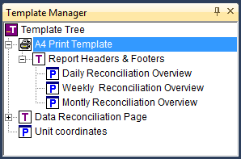

.. _sec:print.pages:

Print templates and pages
=========================

.. _printpages:

.. rubric:: Printing versus GUI

AIMMS makes a distinction between *end-user* pages that are designed for
interactive use by the end-user of your application and *print* pages
that are specifically designed for printing on paper. While this may
seem puzzling at first, a closer inspection reveals a number of serious
drawbacks associated with printing ordinary end-user pages. The most
important are:

-  usually the screen resolution does not match the size of a sheet of
   paper,

-  in a printed report, you cannot rely on the use of scroll bars on
   either the page itself or within objects if all the available
   information does not fit,

-  the use of background colors may look nice on the screen, but often
   severely hinders the readability of printed reports, and

-  you may want to add header and footer information or page numbers to
   printed pages, which are not part of an end-user page.

.. rubric:: Printing ordinary end-user pages

Through the **File-Print** menu, AIMMS allows you to print a simple
screen dump of the contents of any end-user page that currently is on
the screen in your application. The **File-Print** menu will open the
**Print Page** dialog box illustrated in :numref:`fig:print-dialog`.

.. figure:: prn-dialog-new.png
   :alt: **Print Page** dialog box for end-user pages
   :name: fig:print-dialog

   **Print Page** dialog box for end-user pages

Using this dialog box you can choose the size, border width and
orientation of the screen dump to be produced. Any data that is not
visible on the end-user page will also not appear in the screen dump.

.. rubric:: Print templates and pages

An AIMMS print page, on the other hand, allows you to compose a
customized report with data objects that can automatically be resized to
print all available object data. Print pages are characterized by the
fact that they depend on a special *print template* in the template
tree. You can add a print template via the **New-Print Template** item
in the **Edit** menu of the **Template Manager**. Print templates can
only be placed at the top level of the template tree, i.e. directly
below the root, as illustrated in :numref:`fig:print.template`. All
pages below the print template behave as print pages.

   Example of a print template

.. rubric:: Specifying paper type

Every print template has an associated paper type. The paper type lets
you define properties such as paper size, paper orientation, and the
width of the surrounding margins. By default, AIMMS will create new
print templates with the predefined A4 paper type. You can modify the
paper type by opening the print template and selecting **Paper Type** in
the **View** menu, which will then open the dialog box displayed in
:numref:`fig:print.paper-type`.

.. figure:: paper-type-new.png
   :alt: **Paper Type** dialog box
   :name: fig:print.paper-type

   **Paper Type** dialog box

With it, you can either select one of the predefined paper types, or
define a custom paper type by specifying the paper size, orientation and
margins yourself.

.. rubric:: Page border

When you open a print page (or print template) in edit mode, AIMMS
displays a rectangular box representing the margins corresponding to the
current paper type. An example of an empty print page in landscape
format containing a margin box is illustrated in
:numref:`fig:print.empty-page`.

.. figure:: prn-tmpl-new.png
   :alt: An empty print page in landscape format
   :name: fig:print.empty-page

   An empty print page in landscape format

The margin lines are not displayed when the page is previewed or
printed. In edit mode, however, the margin lines may help you to
position data objects within the printable area.

.. rubric:: Printing pages with margins

In general, AIMMS will print all objects on a print page, regardless of
their placement with respect to the page margins. However, when you have
indicated that a data object should be printed over multiple pages (as
discussed in the next section), AIMMS will always restrict itself to
printing within the indicated page margins.

.. rubric:: Adding objects

You can add data objects and graphical objects to a print page in
exactly the same way as you can add such objects to an ordinary end-user
page. In fact, objects contained on your end-user pages which you want
to be part of a printed report as well, can be copied directly to a
print page by means of a simple copy and paste action.

.. rubric:: Non-printable objects

You should note, however, that not all objects that are placed on a
print page (and are visible on the screen) will be printed on paper.
Specifically, AIMMS will omit all controls such as buttons and drop-down
lists which are intended for interactive use only. Through such controls
you can provide special facilities for your end-users such as allowing
them to make last-minute choices prior to printing, activate the actual
print job, or navigate to a previous or next print page through
navigational controls linked to the page tree (see
:ref:`sec:pagetool.pageman.navigate`). To prevent interference with
printable objects, non-printable controls are best placed in the page
margins. Naturally, you can also place such controls on a separate
dialog page.

.. rubric:: Using additional templates

You can add one or more normal templates below any print template in the
template tree, in exactly the same way as for ordinary end-user pages
(see also :ref:`sec:pagetool.template`). In this way, you can specify
common components such as headers and footers, that are automatically
inherited by all dependent print pages.

.. rubric:: Displaying the page number

Page numbers can be added to a print page by displaying the predefined
AIMMS identifier :any:`CurrentPageNumber` either on the page itself or on
any of its page templates. When printing a single page, AIMMS resets
:any:`CurrentPageNumber` to 1, and will number consecutively for any
additional pages that are created because of a large data object. When
printing a report that consists of multiple print pages (see below),
AIMMS resets :any:`CurrentPageNumber` to 1 prior to printing the report,
and increments it for every printed page.

.. rubric:: Printing print pages

AIMMS allows you to print a print page in several manners:

-  when the page is opened on the screen, you can print it using the
   **File-Print** menu,

-  you can attach the above action to a page or toolbar button, by
   adding the **File-Print** menu action to the button, or

-  you can print the page from within the model using the :any:`PrintPage`
   function.

.. rubric:: Printing complete reports

In addition to printing single print pages, AIMMS also allows you to
print entire reports consisting of multiple print pages. Printing such
reports can be initiated only from within your model, through calls to
the predefined functions :any:`PrintStartReport`, :any:`PrintPage` and
:any:`PrintEndReport`. A multipage report is started by a call to
:any:`PrintStartReport`, and finished by a call to :any:`PrintEndReport`. All
the single print pages constituting the report must be printed through
consecutive calls to the :any:`PrintPage` function in between. Such a
composite report will be sent to the printer as a single print job, and
by default all pages within the report will be numbered consecutively
starting from 1. However, if you so desire, AIMMS allows you to modify
the value of :any:`CurrentPageNumber` between two consecutive calls to the
:any:`PrintPage` function. The print functions in AIMMS are discussed in
more detail in :ref:`sec:gui.functions.print`.

