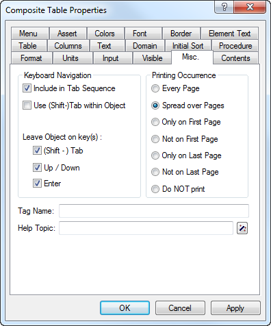

.. _sec:print.multiple-pages:

Printing large objects over multiple pages
==========================================

.. rubric:: Printing large data objects

Print pages are explicitly designed to allow the printing of data
objects that hold large amounts of data and, therefore, do not fit onto
a single page. On a print page you can specify that such large objects
should be split over as many pages as are needed to display all the
underlying data, respecting the specified page margins. In addition,
AIMMS allows you, in a flexible manner, to further restrict printing to
those parts of the print page that are not already occupied by fixed
page components such as headers and footers.

.. rubric:: Required steps

In order to enable multipage printing, only two simple steps are
required. More specifically, you should

-  modify the print properties of both the fixed page components and the
   large data objects contained on the page to specify their desired
   printing behavior, and

-  create a simple subdivision of the print page by means of the resize
   split lines (see also :ref:`chap:resize`) to specify how objects
   should be fixed to particular page positions, or resized as
   necessary.

The remainder of this section discusses both steps in more detail, and
illustrates them on the basis of a realistic example.

.. rubric:: Specify printing occurrence

For every object on a print page or template you can define when and how
the object should be printed. Through the **Misc** tab of the object
**Properties** dialog box (as displayed in :numref:`fig:print.misc`)

   The **Misc** properties tab

you can specify that an object must be

-  printed on every printed page (such as headers or footers),

-  printed on only the first page or the last page,

-  printed on all pages except for the first or the last page (ideal for
   indicating whether the report is continued or not),

-  spread over as many pages as required to display all its associated
   data, or

-  omitted from the printed output.

.. rubric:: Usage

Using these choices, you have the capability of having a single print
page printed over multiple pages where each page component behaves as
desired. For instance, headers and footers can be printed on every page
or, perhaps, on all pages but the first. A report title needs only be
displayed on the first page. Data objects which are expected to become
large can be split over multiple pages.

.. rubric:: Multiple page printing

By default, all objects will be printed the same size as they have been
placed onto the print page during its creation. Thus, without further
action, a large table is split over multiple pages based on the original
table size. As you will see below, objects can be stretched to fill the
entire print page by using AIMMS' resizability features.

.. rubric:: Resizing page objects

Two types of split lines are useful when creating a resizable template
for a printed report. *Fixed distance* split lines can be used to
specify those areas of a page that contain components such as headers
and footers which should keep their original shape and position.
*Adjustable distance* split lines can be used to indicate that the
objects contained in the relevant page area must be adapted to fill the
maximum space within that area.

.. rubric:: Spreading over multiple pages

Whenever a data object does not fit in an adjustable area, AIMMS will
first extend the data object to the border of the adjustable area. This
border may be either the page margin, or a fixed distance split line
that has been placed on the page. When AIMMS runs into the border of an
adjustable area, further printing of the data will continue on a new
page. On the final page, AIMMS will reserve just enough space to contain
the remaining data.

.. rubric:: Multiple splits

By creating multiple adjustable areas just below or alongside each
other, you have the opportunity to place multiple data objects of
varying size within a single report, with each object in its own
resizable area. Once AIMMS has finished printing the object contained in
the first resizable area, it will start printing the next object
directly adjacent to the first, in either a left- to-right or
top-to-bottom fashion, depending on your selected layout.

.. rubric:: Use of templates

If you are creating multiple reports with more or less the same layout
of headers and footers, you should preferably use template pages to
define such fixed page components, together with their appropriate
printing occurrence (e.g. first page only) and resizability properties
for multiple page printing. If you use such templates wisely, creating a
specific print page boils down to nothing more than adding one or more
data objects to the data area of the page (i.e. the page area not
occupied by a header and/or footer), and defining the appropriate print
and resizability properties.

.. rubric:: Example

The print page, and its corresponding configuration of split lines
contained in :numref:`fig:print.split` illustrate AIMMS' capabilities of
printing large data objects over multiple pages.

.. figure:: split.png
   :alt: Print page with in edit and resize edit mode
   :name: fig:print.split

   Print page with in edit and resize edit mode

In this page, the header and footer components are enclosed in areas
which have a fixed size from the top and bottom margin, respectively,
and are printed on every page of the report. The middle part of the page
contains a number of data objects, each enclosed in an adjustable area
from the top down. As a result, AIMMS will split each object
subsequently over as many pages as are necessary.