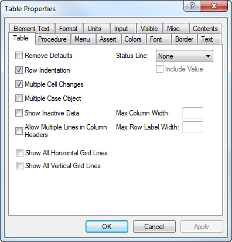
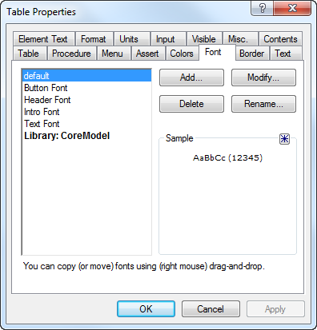

.. _sec:prop.property:

Modifying page and object properties
====================================

.. rubric:: Object properties
   :name: page-prop

In addition to modifying the display properties of groups of objects on
a page, AIMMS also allows you to modify the visual appearance of a page
itself and of all of its individual page objects. When the page is in
edit mode, you can open the **Properties** dialog box of either a page
or a page object by simply double clicking on it, or by selecting
**Properties** from the right-mouse pop-up menu. This will display a
dialog box as illustrated in :numref:`fig:prop.prop`.

   The **Properties** dialog box

The dialog box contains tabs for all visual aspects that are relevant to
that object, and initially displays the current settings of these visual
aspects.

.. rubric:: Properties of multiple objects

You can also modify properties of multiple objects at the same time by
first selecting a group of objects and then selecting the
**Edit-Properties** menu, or selecting **Properties** from the
right-mouse pop-up menu. This will invoke a **Properties** dialog box
containing only those tabs that are common to all the selected objects.
AIMMS will not display an initial value for the corresponding
properties, as each property may hold different initial values for the
various objects. Only the properties that you change are applied to the
selected objects.

.. rubric:: Property types

Through the tabs in the **Properties** dialog box, AIMMS lets you modify
the various properties of pages and page objects. The following
paragraphs provide a brief overview of the modifiable properties. A full
explanation of the various properties of all the available objects can
be found in the help file accompanying the AIMMS system.

.. rubric:: The Contents tab

With the **Contents** tab you can add or remove identifiers from the
list of identifiers that are displayed in the object. With this tab you
can specify, for instance, that a table is to display the values of two
or more identifiers. To modify the contents, AIMMS will open the common
**Identifier Selection** dialog box as explained in
:ref:`sec:page.object`.

.. rubric:: Applying changes

Before you can make changes to the **Contents** tab, AIMMS requires that
you apply any changes you have made to the other object properties
before entering the **Contents** tab. You can apply these changes using
the **Apply** button. Similarly, after you have made changes to the
**Contents** tab, AIMMS requires that you apply these changes before you
can go on to modify other object properties.

.. rubric:: The Procedure tab

With the **Procedure** tab you can specify the particular procedures
that must be executed upon user inputs such as a data change or
selecting a particular value in a data object. The use of procedures
linked to data objects is mostly to perform error checks or update other
identifiers based on a single data change.

.. rubric:: The Action tabs

With the **Action** tab, the counterpart of the **Procedure** tab for
pages, buttons and navigational controls, you can specify the particular
actions that must be executed upon opening a page, pressing a button, or
making a selection in a navigational control. Such actions typically can
be a sequence of running a procedure within the model, executing
predefined AIMMS menu actions, or checking assertions.

.. rubric:: The Menu tab

The **Menu** tab lets you specify which menu bar, toolbar, and
right-mouse pop-up menu should be active on top of either a page or an
object on a page. The menus themselves, as well as the actions linked to
the menus, can be created in the **Menu Builder** tool. The **Menu
Builder** tool is explained in full detail in :ref:`chap:pagetool`.

.. rubric:: Double-click actions

An action type that is used quite frequently, is the double-click
action. You can specify a double-click action either in the **Action**
tab, or through the **Menu** tab. The following rules apply.

-  If a **Double-Click** procedure is specified on the **Action** tab,
   AIMMS will execute that procedure.

-  If no **Double-Click** procedure has been specified, but a pop-up
   menu associated with the page object has a default item, AIMMS will
   execute the default menu item.

-  If neither of the above apply, and the object is a table displaying a
   set, the double-click action will toggle set membership of the set
   element which currently has the focus.

-  In all other cases, double-clicking will be ignored.

.. rubric:: The Assert tab

Through the **Assert** tab you can indicate which assertions already
declared in your model are to be checked upon end-user data changes to a
particular identifier in a data object. AIMMS can perform the assertion
immediately upon every data change, or delay the verification until the
end-user presses a button on the page. Once an immediate assertion
fails, the assertion text will be displayed to the user and the original
value will be restored.

.. rubric:: The Colors tab

With the **Colors** tab you can not only specify the colors that are to
be used for the foreground and background of a page or page object, but
also the color for the user-selected values in a page object. In
addition, you can specify a model-defined (indexed) color parameter to
define the foreground color that will be used for each identifier in a
data object. With such a parameter you can, for instance, color
*individual* values of an object depending on a certain threshold. The
necessary computations for this individual coloring need to be made
inside the model underlying the end-user interface. You will find more
details about assigning color parameters in :ref:`sec:prop.color`.

.. rubric:: The Font tab

The **Font** tab lets you define the font that is to be used for a
particular object. You can choose the font from a list of user-defined
font descriptions as illustrated in :numref:`fig:prop.font`.

   The **Font** tab of a **Properties** dialog box

To add a new font name to the list, you should press the **Add** button.
This will open the standard Windows font selection dialog box, allowing
you to define a new AIMMS font based on the list of available Windows
fonts, font styles and sizes. Once you have made a selection, you will
be requested to provide a description for the newly selected font.

.. rubric:: Choose functional font names

It is strongly recommended that you choose functional names for AIMMS
fonts (i.e. describing their intended use) instead of merely describing
the choices you made. For instance, naming a new font "Button font"
instead of "Arial Regular, 8 pt" will help tremendously in preventing
mistakes when selecting a font for a button.

.. rubric:: Fonts in library projects

AIMMS also allows you to store fonts within a library project. The list
of fonts shown in :numref:`fig:prop.font` displays a single font *Small
Table Font* associated with the library *CoreModel*. You can manage the
list of fonts associated with a library by pressing the buttons on the
right-hand side of the dialog box, while the selection in the listbox on
the left-hand side is in the area associated with the library.

.. rubric:: Use only in library pages

If you have defined fonts within a library project, you should ideally
only use these fonts in pages that are also part of the library project.
If you use the fonts in pages outside of the library, such pages may
fail to display properly after you have removed the library project from
the AIMMS project.

.. rubric:: Font names must be unique

AIMMS requires that all font names be unique across the main project and
all library projects that are included in the main project. If you
include an existing library project, which contains a font name that is
already present in the AIMMS project, AIMMS assumes that both fonts are
the same and will ignore the second font definition.

.. rubric:: The Border tab

With the **Border** tab you can stipulate the border settings for any
particular data object on a page. A border can consist of merely a
surrounding line, or provide an in- or out-of shadow effect.

.. rubric:: The Text tab

With the **Text** tab you can specify for each identifier a single line
of text that is displayed in a page object. With this line of text you
can, for instance, provide descriptions for the data in a table
containing one or more identifiers. In addition, the **Text** tab will
let you define the element description for the (optional) status line
associated with the object. The status line will display the currently
selected value along with its element description. If the element
description contains references to the indices over which the identifier
at hand is defined, these references will be expanded to the currently
selected element names.

.. rubric:: The Element Text tab

By default, any set element in a data object will be displayed by its
name in the model. If you want to display an alternative text for a set
element, you can use the **Element Text** tab to specify a string
parameter holding these alternative element descriptions. You can use
this feature, for instance, to display set elements with their long
description in the end-user interface, whereas the model itself, and
perhaps paper reports, work with short element names.

.. rubric:: The Format tab

The **Format** tab defines the numerical format in which the data of a
particular identifier is displayed. This format can be specified on the
spot, or can use a named format already predefined by you as the
application developer. The display format specifies not only such
properties as the width of a number field and its number of decimal
places, but also their relative alignment, the use of a 1000-separator
for large numbers, and the display of default values.

.. rubric:: The Units tab

The AIMMS modeling language offers advanced support for defining units
of measurement for each identifier in the model. In particular, AIMMS
supports unit conventions which let you define a coherent set of units
(e.g. Imperial or metric units) in a single declaration. In the end-user
interface you can indicate in the **Units** tab whether you want units
to be displayed for every identifier or for every individual value
contained in a particular data object. The displayed units are the units
defined for the identifier at hand, unless the end-user has selected a
current unit convention with alternative units. :numref:`fig:prop.unit`
illustrates an end-user page in which identifier values are displayed
along with their associated units of measurement.

.. figure:: user-win-new.png
   :alt: Use of units in a data object
   :name: fig:prop.unit

   Use of units in a data object

.. rubric:: The Input tab

With the **Input** tab you can specify the read-only properties of every
identifier in a page object separately. The decision as to whether
numbers are read-only can depend on (indexed) identifiers in your model.
Thus, you can arrange it so that particular numbers in, for example, a
table can be edited by the end-user, while other numbers associated with
that same identifier are considered as read-only. In addition to the
properties specified on this tab, the overall read-only behavior of
identifiers is also influenced by the contents of the predefined
identifier :any:`CurrentInputs` (see :ref:`sec:gui.updatability`).

.. rubric:: The Visible tab

You can use the **Visible** tab to hide a particular page object in its
entirety from a page. Whether or not a page object is visible may depend
on a scalar identifier (slice) in your model. The ability to hide page
objects comes in handy when, for instance,

-  you want to hide a page object because a particular end-user has no
   right to modify its data, or

-  a page contains two exactly overlapping page objects-e.g. one holding
   relative numbers, the other holding absolute numbers-and you want to
   display just the one based on the user's choice.

.. rubric:: The Misc. tab

With the **Misc.** tab you can specify various miscellaneous settings
such as

-  whether a page object must be included in the page tab order to
   specify a natural navigation order on the page (see also
   :ref:`sec:prop.select`),

-  whether an object is actually printed or skipped during printing
   (only relevant for print pages, see also :ref:`chap:print`),

-  which end-user help topic should be displayed for the page or page
   object at hand, or

-  a tag name, which is used when you want to refer to the object from
   within the model (see :ref:`sec:gui.functions.page`).

.. rubric:: Help file

Before adding end-user help to a particular page, page object, end-user
menu or toolbar, you must add a help file to your project directory, and
specify its name through the **Options** dialog box (see
:ref:`sec:setting.options`). All the available end-user help associated
with your project must be contained in the specified project help file.

.. rubric:: Help file formats

AIMMS supports several help file formats, allowing you to create a help
file for your project using the tools you are most familiar with. They
are:

-  standard Windows help files (with the ``.hlp`` extension),

-  compiled HTML help files (with the ``.chm`` extension), and

-  PDF files (with the ``.pdf`` extension), which require that Acrobat
   Reader version 4.0 or higher is installed on your machine.

An executable Acrobat Reader installation can be downloaded from the
Adobe website
`www.adobe.com <http://www.adobe.com/products/acrobat/readstep2.html>`__.

.. rubric:: Creating help files

To create a help file in any of the supported formats you will need an
appropriate tool such as RoboHelp, Help & Manual or DocToHelp to create
either a Windows or compiled HTML help file, or Adobe Acrobat to create
a PDF file. To jump to a marked position inside the help file when
providing help for a page, a page object, a menu or a button on a
toolbar you should add:

-  (so called) *K-keywords* to an ordinary Windows help file,

-  *keywords* to a compiled HTML help file, or

-  *named destinations* added to a PDF file.

All of the destinations that you added to the help in this way can serve
as the **Help Topic** inside the **Misc.** tab of a page or page object.

.. rubric:: Object-dependent properties

In addition to the tabs described above, which are common to most
objects, the **Properties** dialog box also has a number of tabs where
you can change properties that are very specific for a particular type
of object. Through such object-dependent options you can specify, for
instance, whether a table should display default values, what should be
displayed along the axes in a graph or chart, or how the arcs and nodes
in a network flow object should be drawn. The contents of these
object-specific tabs are explained in full detail in the online AIMMS
help file.