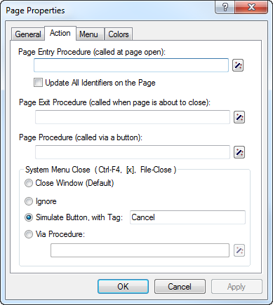

.. _sec:prop.dialog:

Using pages as dialog boxes
===========================

.. rubric:: Use of dialog boxes
   :name: dialog-page

By default all end-user pages behave as normal windows, i.e. whenever
you have multiple windows open, you can freely switch from window to
window simply by clicking in the window that should become active.
Sometimes, however, your application may contain sequential actions
which require the user to make a certain choice or data change before
moving on to the next action. In this case the page should behave as a
dialog box instead of a normal window. While a dialog box is displayed
on the screen, it is impossible to access other windows in the
application without closing the dialog box first for example with an
**OK** or **Cancel** button. By using dialog boxes you can force an
end-user to follow a strict sequence of operations.

.. rubric:: Dialog pages

In AIMMS you can define that a page should behave like a dialog box by
using the page **Properties** dialog box as illustrated in
:numref:`fig:prop.dialog`.

.. figure:: prop-dlg-new.png
   :alt: Creating a dialog page
   :name: fig:prop.dialog

   Creating a dialog page

If such a dialog page is opened using either a button, a menu, a
navigation object or from within the model through a call to the
:any:`PageOpen` procedure, it will behave like a dialog box. *If, on the
other hand, the dialog page is opened from within either the **Page
Manager** or the **Template Manager**, the page will behave as an
ordinary window*. This offers you the possibility of editing the
contents and layout of the page.

.. rubric:: Blocking execution

When a dialog page is called from within a procedure using :any:`PageOpen`,
the execution of the calling procedure will only continue after the
dialog page has been closed by the end-user. In this way, any data
supplied by the end-user in the dialog page will always be available
during the remaining execution of the calling procedure.

.. rubric:: Dialog box result

Note that dialog pages do not offer built-in support to determine
whether an end-user has finished the dialog box for example by pressing
the **OK** or **Cancel** button. However, such control can easily be
modeled in the AIMMS language itself. Perhaps the most straightforward
manner to accomplish this is by introducing

-  a set ``DialogActions`` containing two elements ``'OK'`` and
   ``'Cancel'``,

-  an associated global element parameter ``CurrentDialogAction``, and

-  procedures such as ``ButtonOK`` and ``ButtonCancel`` which set
   ``CurrentDialogAction`` equal to ``'OK'`` or ``'Cancel'``,
   respectively.

.. rubric:: Linking to dialog box buttons

To obtain the result of a dialog page, you can simply add the execution
of the procedures ``ButtonOK`` or ``ButtonCancel`` to the list of
actions associated with the **OK** and **Cancel** buttons, respectively.
In addition, you should link the functionality of the close icon for the
dialog page to that of the **Cancel** button as illustrated in
:numref:`fig:prop.dialog-close`.

   Linking dialog close to **Cancel**

.. rubric:: Obtaining the result

To obtain the end-user choice in the dialog page after the return of the
:any:`PageOpen` procedure, you can simply check for the value of the
element parameter ``CurrentDialogAction``, as illustrated in the
following code excerpt.

.. code-block:: aimms

	! Open the dialog page and stop processing when the user
	! has pressed the 'Cancel' button.

	OpenPage( "Supply input data" );
	return 0 when CurrentDialogAction = 'Cancel';

	! Otherwise perform further data processing based on the supplied input data.

.. rubric:: Create a dialog page template

You may want to create a customized dialog page *template* (see also
:ref:`sec:pagetool.template`) to capture the end-user choices as
described above. Based on such a dialog page template, you can quickly
create as many dialog pages as necessary, all behaving in a similar
fashion when opened in a procedure of your model.