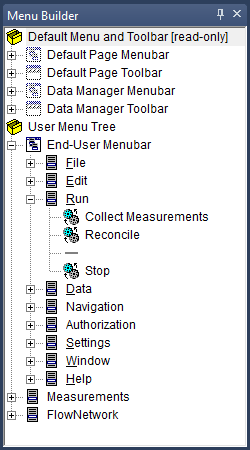
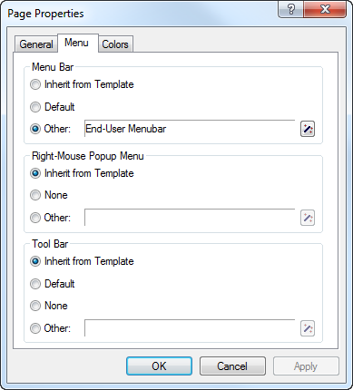

.. _sec:pagetool.menu:

The Menu Builder
================

.. rubric:: The Menu Builder

The last page-related design tool available in AIMMS is the **Menu
Builder**. With the **Menu Builder** you can create customized menu
bars, pop-up menus and toolbars that can be linked to either template
pages or end-user pages in your application. The **Menu Builder** window
is illustrated in :numref:`fig:pagetool.menu`.

In the **Menu Builder** window you can define menus and toolbars in a
tree-like structure in a similar fashion to the other page-related
tools. The menu tree closely resembles the natural hierarchical
structure of menus, submenus and menu items.

.. rubric:: Default menu bar and toolbar

As illustrated in :numref:`fig:pagetool.menu`, the **Menu Builder** will
always display four default nodes. Two nodes representing the standard
end-user menu bar and toolbar. These bars are linked to all end-user
pages by default. And two nodes representing the standard Data Manager
menu bar and toolbar. Although non-editable, you can use these nodes to
copy (or duplicate) standard end-user menus or submenus into your own
customized menu bars and toolbars. The data manager items will allow you
to build your own menu and toolbar for the data manager with the same
functionality as the standard menu and toolbar for the data manager.

   The **Menu Builder** window

.. rubric:: Inserting new nodes

In the *User Menu Tree*, you can add nodes to represent menu bars,
(sub)menus, menu items or toolbars in exactly the same manner as in
other trees such as the model and page trees. Also, you can copy,
duplicate or move existing nodes within the tree in the usual manner
(see :ref:`sec:model.trees`). The names given to menu and menu item
nodes are the names that will be displayed in the end-user menus, unless
you have provided a model-specific menu description in the menu
**Properties** dialog box (e.g. to support multiple languages).

.. rubric:: Menu item properties

For every node in the menu tree you can modify its properties through
the **Properties** dialog box. In the **Properties** dialog box you can
perform tasks such as linking end-user actions or model procedures to a
menu item, provide shortcut keys, tooltips and help, or link a menu item
to model identifiers that specify whether the item should be disabled
within an end-user menu, or even be completely hidden from it. The
**Properties** dialog box for a menu item is shown in
:numref:`fig:pagetool.menu-prop`.

.. figure:: menu-prop-new.png
   :alt: The menu item **Properties** dialog box
   :name: fig:pagetool.menu-prop

   The menu item **Properties** dialog box

.. rubric:: Adding menu actions

Through the **Actions** tab of the **Properties** dialog box, you can
associate a list of actions with a menu item. Such actions can consist
of executing menu items from system menus, navigational commands such as
opening or closing pages, and also running procedures from your model,
verifying assertions or updating identifiers.

.. rubric:: Hiding and disabling items

With the **Control** tab it is possible to provide control over a menu
item from within your model. You can specify scalar 0-1 identifiers from
within your model to determine whether a menu item or submenu should be
disabled (grayed out) or completely hidden from the menu. Thus, you can
prevent an end-user from performing tasks for which he is not
authorized. In addition, you can couple a 0-1 identifier to a menu item
in order to determine whether a menu item is checked, and which
conversely toggles its value when an end-user checks or unchecks the
item.

.. rubric:: Tooltips and help

In the **Help** tab of the **Properties** dialog box, you can provide a
description and help describing the functionality of a menu command. It
lets you specify such things as the tooltips to be displayed for buttons
on the button bar, a descriptive text for to be shown in the status bar,
and a link to a help item in the project related help file.

.. rubric:: Navigation menus

Navigation menus are a special type of menu that can be added to the
menu tree. Navigation menus expand to a number of items in the current
menu, or to one or more submenus, according to the structure of a
particular subtree of the page tree as specified by you. Through
navigation menus you can quickly and easily create menus that help an
end-user navigate through your application. For example, you could
create a menu item which links to the first child page, or to the parent
page, of any page to which the menu is linked. The details of how to
specify which pages are displayed in a navigation menu can be found in
:ref:`sec:pagetool.pageman.navigate`.

.. rubric:: Linking to pages and objects

You can link a single menu bar, toolbar and pop-up menu to any end-user
or template page in your project through the **Menu** tab of the page
**Properties** dialog box, as illustrated in
:numref:`fig:pagetool.menutab`

   Linking menus to pages

For every field in the dialog box, AIMMS lets you select an existing
node in the menu tree. If you do not specify a menu bar or toolbar,
AIMMS will automatically open the default end-user menu bar and toolbar.

.. rubric:: Inherited menus

When you add a menu bar or toolbar to a page template, these bars are
automatically inherited by all pages that use that template. In this
manner, you can quickly add your own customized end-user menu to all, or
groups of, pages in your application. All new end-user pages will, by
default, inherit their menu bar and toolbar from their templates.

.. _sec:pagetool.menu.library:

Menus in Library Projects
~~~~~~~~~~~~~~~~~~~~~~~~~

.. rubric:: Menus in library projects

In addition to the main *User Menu Tree* in the **Menu Builder**, each
library project in AIMMS has a separate menu tree, as illustrated in
:numref:`fig:pagetool.menu`. In this menu tree, you can create the menus
and toolbars that are specific for the pages defined in the library at
hand.

.. rubric:: Accessing private identifiers

When you are specifying the actions associated with a menu item in the
menu tree of a library, you have access to all the identifiers and
procedures declared in the library module of that library. For menu
items in all other menu trees, you can only access the identifiers in
the interface of the library.

.. rubric:: Creating menus

When creating menus and toolbars in a library, you can duplicate menus
and menu items from any other menu tree in the **Menu Builder**.
Likewise, you can duplicate menus and menu items from a library project
into the menu tree of the main project. This enables you to compose
global menu- and toolbars that can be used in the overall application,
yet containing library-specific sub-menus and menu items to dispatch
specific tasks to the appropriate libraries.

.. rubric:: Assigning menus to pages

When you want to assign a menu to a page or template, AIMMS allows you
to choose a user menu of either the main project or of any of its
library projects. You should note, however, that choosing a menu from a
different library project creates an implicit dependency on that project
which is not immediately apparent in the page or template tree. If you
copy or move pages with a user menu or toolbar from one project to
another, AIMMS will not duplicate that menu or toolbar, but still refer
to their original locations as expected.

