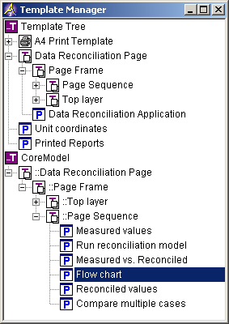
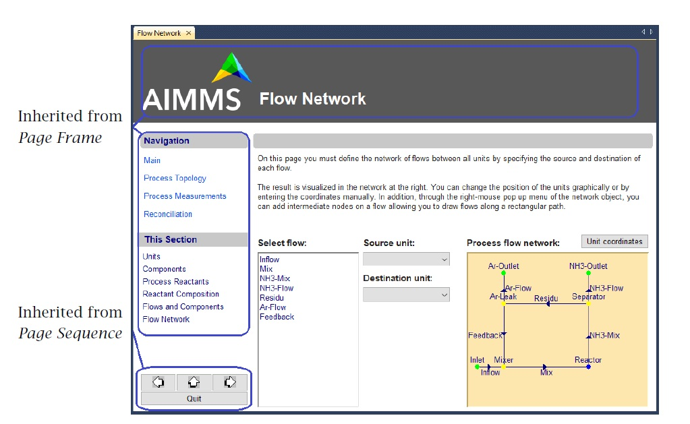

.. _sec:pagetool.template:

The Template Manager
====================

.. rubric:: Consistent look-and-feel
   :name: templ-manager

Complementary to the **Page Manager** is the AIMMS **Template Manager**.
Using the **Template Manager**, you can ensure that all pages are the
same size and possess the same look-and-feel, simply by positioning all
end-user pages in the template tree associated with a project. An
example of a template tree containing both templates and end-user pages
is displayed in :numref:`fig:pagetool.template`.

.. rubric:: Hierarchical template structure

In addition to all the end-user pages, the template tree can contain a
hierarchical structure of template pages. Within the template tree,
template pages behave as ordinary pages, but they are not available to
end-users. Through templates you can define common page objects that are
shared by all the template *and* end-user pages positioned below a
particular template in the template tree.

.. rubric:: Duplicating page templates

When you want to use the same template page at two or more distinct
positions in the template tree, AIMMS lets you duplicate, rather than
copy, the template node containing that component. Changes made to the
duplicated page template at any position in the template tree, are
automatically propagated to all other occurrences. Duplicated templates
can be recognized by the duplication symbol |templ-dup| which is added
to the icon of every duplicate template in the template tree.

   **The Template Manager**

.. rubric:: End-user pages automatically added

Every new end-user page created in the **Page Manager**, is
automatically added to the root node in the template tree. By moving the
page around in the template tree, it will inherit the combined
look-and-feel of all templates above it.

.. rubric:: Common page components

The hierarchical structure of the template tree lets you define layers
of common objects on top of each other. Thus, a first template might
globally define the page size and background color of all underlying
pages, while a second template could define common components such as a
uniformly shaped header and footer areas. As an example,
:numref:`fig:pagetool.template-use` illustrates a template for an
end-user page from the template tree of :numref:`fig:pagetool.template`,
in which the components defined in various templates are identified.

Inherited from
*Page Frame* 2.65cmInherited from
*Page Sequence* 1.25cm

.. rubric:: Modify look-and-feel

You can quickly modify the entire look-and-feel of your application, by
moving a subtree of templates and end-user pages from one node in the
template tree to another. Thus, the entire look-and-feel of page size,
header and footer areas, background color and navigational area(s) of
all pages in an AIMMS application can be changed by a single action.

.. rubric:: Template objects not editable

When you open a template or end-user page in the template manager, it
will be opened in edit mode by default, and inherit all the properties
of, and all objects contained in, the templates above. On any template
or end-user page you can only modify those objects or properties that
are defined on the page itself. To modify objects defined on a template,
you must go to that template and modify the objects there.

   Example of an end-user page using templates

.. rubric:: Combine with navigational components

You can achieve an exceptionally powerful combination by adding
navigational components to a template page. If the reference page
property of such a navigational component is expressed in terms of the
current page, or one of its ancestor pages, then, in end-user mode, the
current page will always refer to the particular end-user page which
uses that template. Thus, given a well- structured page tree, you
potentially only need a *single* template to add navigational control
components to *all* end-user pages. This is particularly true for such
common controls as **Previous** and **Next** buttons.

.. _sec:pagetool.template.library:

Templates in Library Projects
~~~~~~~~~~~~~~~~~~~~~~~~~~~~~

.. rubric:: Templates in libraries

Each library project in AIMMS has a separate template tree, which is
available as a separate root node in the **Template Manager**, as
illustrated in :numref:`fig:pagetool.template`. Pages in a library must
be positioned in the template tree of that library to obtain their
look-and-feel. This allows the developer of a library project to define
the look-and-feel of the pages in the library completely independent of
the main project and other library projects.

.. rubric:: Sharing templates with the main project

If you want the pages of an entire application to share a common
look-and-feel across all library projects included in the application,
AIMMS also allows you to duplicate template pages from the main project
into a library project. Thus, any changes made to the templates in the
main project are automatically inherited by the pages in the library
that depend on the duplicates of these templates.

.. rubric:: Sharing templates across multiple projects

Conversely, you can also use library projects to enable the end-user
GUIs of multiple AIMMS project to share a common look-and-feel. By
defining templates, fonts, and colors in a single library project, and
including this library project into multiple AIMMS projects, the pages
in these projects can depend on a single, shared, collection of page
templates. Thus, changes in a single template library will propagate to
all AIMMS projects that depend on it.

.. rubric:: Moving pages to a library

If you move or copy pages from the main project to a library project (or
between library projects), AIMMS will automatically duplicate the
relevant template structure from the source project to the destination
project. This ensures that the pages have the exact same look-and-feel
at the destination location as they had at their source location.

.. rubric:: Example

The automatic duplication behavior of AIMMS is illustrated by the page
tree in :numref:`fig:pagetool.pageman` and the template tree in
:numref:`fig:pagetool.template`. These trees were created by moving the
*Reconciliation* page and its child pages from the main project to the
*CoreModel* library. Subsequently, AIMMS automatically duplicated the
template structure in the *CoreModel* library to ensure the identical
look-and-feel for the moved pages.

