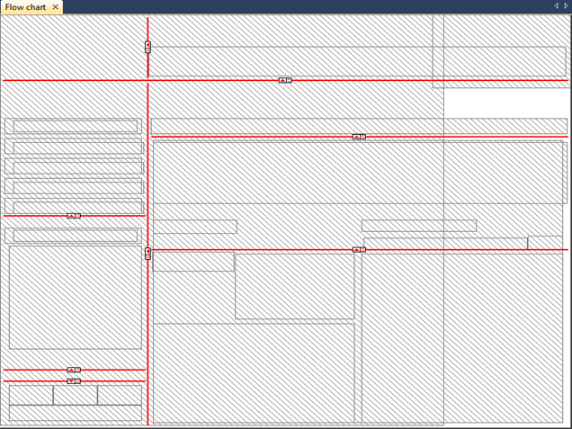
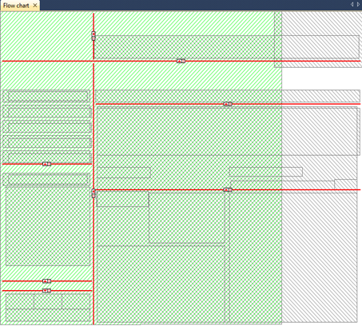

Page resizability
=================

.. rubric:: Choosing a base resolution

When you are developing an end-user interface around an AIMMS-based
application for a large group of end-users, you must decide about the
base screen resolution on which the end-user interface is intended to be
run primarily. Such a decision is based on your expectations about the
screen resolution that most of your end-user will be using. Fortunately,
there is a tendency towards high-resolution screens amongst users.

.. rubric:: Supporting different resolutions

Nevertheless, it is likely that one or more of your end-users will
request to run the application at a different resolution. One reason
could be that they use a notebook which does not support the base
resolution you selected. Another reason could be that some of your
end-users are working with such large data sets that a higher resolution
would help them to have a better overview of their data.

.. rubric:: Resizable pages

To help you support the demands of your end-users, AIMMS provides a
fairly straightforward facility to create resizable pages and page
templates. As you will see later on, the position and type of so-called
*split lines*, placed on a resizable page, determines the manner in
which objects on the page will scale upon resizing the page.

.. rubric:: Non-resizable behavior

When a page has not been made resizable, all objects on that page will
remain in their original position. Whenever such a page is reduced, and
a data object included on the page falls outside the visible page area,
AIMMS will automatically add horizontal or vertical scroll bars. If the
page is increased in size, the bottom and right parts of the page will
remain empty.

.. rubric:: Adding resizability

To make a page resizable, the page should be put into **Resize Edit**
mode, which is available in the **View-Resize Edit** menu of any page
that is already in **Edit** mode. **Resize Edit** mode will replace all
objects on the page by shaded rectangles. :numref:`fig:resize.shaded`
illustrates the **Resize Edit** view of the end-user page shown in
:numref:`fig:pagetool.template-use`.

   
   Page :numref:`fig:pagetool.template-use` in Resize Edit Mode

.. rubric:: Split lines

A page is resizable as soon as it contains one or more horizontal or
vertical *split lines*. The page in :numref:`fig:resize.shaded`
illustrates a number of such split lines. Each split line divides the
rectangle in which it has been placed into two subrectangles. For each
vertical split line you can decide either

-  to keep the width of the left or right subrectangle constant
   (indicated by |rsz-fl| and |rsz-fr| markers),

-  to ensure that the widths of the left and right subrectangles have
   the same ratio (indicated by |rsz-rtio| marker), or

-  to make the ratio between these two widths user-adjustable (indicated
   by |rsz-vl| or |rsz-vr| markers).

Similarly, horizontal split lines are used to indicate the relative
height of the lower and upper subrectangles. On an end-user page, a
user-adjustable split line will be visible as a split bar, which can be
dragged to (simultaneously) resize the areas on both sides of the bar.

.. rubric:: Stacking split lines

By selecting a subrectangle created by a split line, you can recursively
subdivide that rectangle into further subrectangles using either
horizontal or vertical split lines. What results is a specification of
how every part of the page will behave relative to its surrounding
rectangles if the size of the entire page is changed.

.. rubric:: Adding split lines

One way of adding split lines to any subrectangle on a page in **Page
Resize** mode is to select that subrectangle on the page (by clicking on
it), and add a horizontal or vertical split line to it using one of the
buttons |rsz-add| from the **Page Resize** toolbar. Alternatively, if
you want to insert a split line within an existing hierarchy of split
lines, select the line just above where you want to insert a split line,
and use one of the buttons |rsz-ins| to insert a new split line of the
desired type.

.. rubric:: Resize Try mode

By putting a page that is already in **Resize Edit** mode into **Resize
Try** mode (via the **View-Resize Try** menu) and resizing the page,
AIMMS will display the shapes of all page objects according to the
specified resize behavior. :numref:`fig:resize.try`

   
   Resizing a resizable page

illustrates the effect of resizing the page displayed in
:numref:`fig:resize.shaded` to a smaller size. These resized shapes are
determined by calculating the new relative positions of all four corner
points of an object within their respective surrounding rectangles. This
may result in nonrectangular shapes for some page objects, which are
marked red. In such a situation, you should reconsider the placement of
objects and split lines. Non- rectangularly shaped objects may distort
the spacing between objects in end-user mode, because AIMMS will enforce
rectangular shapes in end-user mode by only considering the top-left and
bottom-right corners of every object.

.. rubric:: Example

Consider the configuration of split lines illustrated in
:numref:`fig:resize.shaded`, and its associated end-user page displayed
in :numref:`fig:resize.page`.

.. figure:: user-win-new.png
   :alt: End-user page associated with :numref:`fig:resize.shaded`
   :name: fig:resize.page

   End-user page associated with :numref:`fig:resize.shaded`

As already indicated in :numref:`fig:resize.try`, the particular
combination of split lines results in the following behavior.

-  The header area will have a fixed height at the top of the page
   whatever the page height, but will grow (or shrink) along with the
   page width.

-  Similarly, the entire footer area will remain a fixed distance from
   the bottom of the page, and grow along with the page width.

-  The information on the left-hand side of the data area has a fixed
   width, and the table will only grow/shrink vertically along with the
   page height.

-  The flow chart header on the right-hand side of the data area has a
   fixed height, while the flow chart itself will grow/shrink along with
   both the page height and width.

.. rubric:: Original size only

When entering **Edit** mode, AIMMS will always restore the editable page
area to its original size (as saved at page creation time). This ensures
that objects placed on the page always use the same coordinate system,
preventing pixel rounding problems during a page resize. If the page has
been saved at a different end-user size, AIMMS will open the page frame
at the latest end- user size, and make the parts outside the original
(editable) page size unavailable for editing, as illustrated in
:numref:`fig:resize.edit`. Any split line added to a page (or to its
templates), will be visible in a page in **Edit** mode as a thin line.

.. figure:: resize-edit-new.png
   :alt: Editable area and split lines of a resizable page in Edit mode
   :name: fig:resize.edit
   
   Editable area and split lines of a resizable page in Edit mode
   
.. |rsz-fl| image:: rsz-fl.png

.. |rsz-fr| image:: rsz-fr.png

.. |rsz-vr| image:: rsz-vr.png

