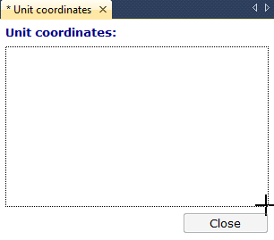
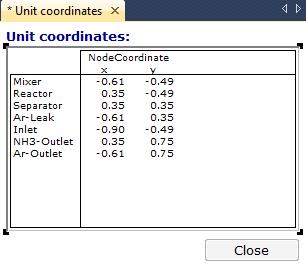

.. _sec:page.object:

Adding page objects
===================

.. rubric:: Page objects

All visible components on a page are instances of the collection of
*page objects* as offered by AIMMS. Such page objects are mostly used to
visualize the input and output data of your model in various ways. They
also include simple drawing objects, such as lines and circles, and
buttons for navigation and execution.

.. rubric:: Edit mode

Before you can add page objects to a page, the page must be in *edit
mode*. When you open a page using the **Page Manager**, it is opened in
*user mode* by default. When you want to open a page in edit mode from
the **Page Manager**, you can do so using the right mouse pop-up menu.
If a page is already opened in user mode, you can reopen it in edit mode
using the |page-edt| button on the page toolbar. When you open the page
from the **Template Manager**, it is opened in edit mode by default.

.. rubric:: Common data objects

AIMMS provides the most common graphical data objects such as

-  row-oriented composite tables,

-  2-dimensional tables,

-  pivot tables,

-  graphs, and

-  charts.

These objects can be used both for displaying and for modifying the data
in your model. The data displayed in such objects are always directly
linked to one or more identifiers in your model.

.. rubric:: Adding an object

Placing a data object onto a page can be done without any programming.
The following straightforward actions are required:

-  select the type of the graphical object to be displayed,

-  drag a rectangle onto the page of the intended size of the object,
   and

-  choose the identifier in the model holding the data that you want to
   display.

.. rubric:: Selecting the object type

You can select the object type that you want to add to the page from the
**Object** menu. Alternatively, you can select any of the most common
object types using the **Page Edit** toolbar, as depicted in
:numref:`fig:page.toolbar`.

.. figure:: page-tb-new.png
   :alt: The **Page Edit** toolbar
   :name: fig:page.toolbar

   The **Page Edit** toolbar

If you move the cursor to one of the buttons of the toolbar, a tooltip
will appear. After you have selected an object type, the page cursor
will change to a cross allowing you to drag the rectangle in which the
object will be contained. :numref:`fig:page.draw` illustrates such a
rectangle just prior to linking it to one or more AIMMS identifiers.

   An identified substructure causing infeasibility

.. rubric:: Object grid and alignment

In order to let you drag object regions in an aligned manner, AIMMS
allows you to associate a grid with a page, and align object regions to
that grid automatically via the **View** menu. Alternatively, you may
align objects later on, or make them the same size via the
**Edit-Alignment** menu (see :ref:`sec:prop.select`).

.. rubric:: Selecting an identifier ...

After you have indicated the object region, you must select an
identifier to be associated with that object. To support you in this
task AIMMS provides an **Identifier Selection** dialog box as
illustrated in :numref:`fig:page.id-select`. You can select any single
identifier from the list on the right.

.. rubric:: ...from a subselection

Additional help is offered for models with many identifiers. By
selecting a subtree of the model tree on the left-hand side of the
dialog box, you can narrow down the selection of identifiers on the
right-hand side to those which are declared within the selected subtree.
With the **Filter...** button you can narrow the selection down even
more, by only displaying those identifier types that you are interested
in.

.. rubric:: Selecting from a library

When your project contains one or more library projects, AIMMS only
allows you to select identifiers that are part of the interface of a
library on any page not included in such a library (see also
:ref:`sec:proj-organization.working`). If the page is part of the page
tree of a library, AIMMS allows you to select from *all* the identifiers
declared in the library.

.. rubric:: Ensuring your freedom

By restricting access from within pages outside of the library to the
identifiers in the library interface only, AIMMS allows you to freely
modify the internal implementation of your library. No other part of the
application will be inflicted if you make changes to identifier
declarations that are not included in the library interface.

.. figure:: id-sel.png
   :alt: The **Identifier Selection** dialog box
   :name: fig:page.id-select

   The **Identifier Selection** dialog box

.. rubric:: Slices and linking

In its simplest form, you can use the **Identifier Selection** dialog
box to select an entire identifier of the appropriate dimension to fill
a selected object. However, the **Identifier Selection** dialog box will
also let you consider selecting *slices* of identifiers, or provide
automatic *links* between objects. These advanced subjects will be
discussed in detail in :ref:`sec:page.slice` below.

.. rubric:: Object properties

After you have selected the identifier(s) necessary to fill the page
object with the appropriate model data, AIMMS will draw the object using
default settings for properties such as fonts, colors and borders. Later
on, you can change these properties (or even modify the defaults) via
the **Properties** dialog box of the object (see also
:ref:`sec:prop.property`).

.. rubric:: Example

If the object region displayed in :numref:`fig:page.draw` is used to
draw a table object, and the identifier selection dialog box in
:numref:`fig:page.id-select` is used to select the identifier
``NodeCoordinate(n,crd)``, the table in :numref:`fig:page.table`
results.

   Example of a newly created table object

.. _sec:page.object.expression:

Displaying Expressions in Page Objects
~~~~~~~~~~~~~~~~~~~~~~~~~~~~~~~~~~~~~~

.. rubric:: Displaying expressions

In addition to indexed identifiers, AIMMS also allows you to display
expressions in a page object. This is convenient, for instance, when you
want to display some data which is not directly available in your model
in the form of an (indexed) identifier, but which can be easily computed
through an expression referring to one or more identifiers in your
model. In such a case, you do not have to create an additional defined
parameter containing the expression that you want to display, but rather
you can directly enter the expression in the **Identifier Selection**
dialog box, as illustrated in :numref:`fig:page.expression-select`.

.. figure:: id-sel-expr-new.png
   :alt: Selecting an expression in a page object
   :name: fig:page.expression-select

   Selecting an expression in a page object

.. rubric:: Entering an expression

When you have indicated that the page object should display an
expression rather than an indexed identifier, AIMMS will display the
**Expression Definition** dialog box illustrated in
:numref:`fig:page.expression-enter`. In this dialog box you must specify
the exact definition of the expression you want to be displayed in the
page object.

.. figure:: id-sel-expr2-new.png
   :alt: Entering an expression for a page object
   :name: fig:page.expression-enter

   Entering an expression for a page object

.. rubric:: Specifying the expression type

In the **Expression Type** field of the **Expression Definition** dialog
box, you must select the type of the expression you entered. AIMMS only
allows the display of

-  numeric,

-  element-valued, and

-  string-valued.

expressions. AIMMS does not allow the display of set expressions. If the
expression type is element-valued, you must also indicate the element
range of the expression, i.e. the set in which the expression will hold
its values.

.. rubric:: Specifying the index domain

Finally, in the **Index Domain** field of the **Expression Definition**
dialog box you must specify the index domain over which the expression
is defined. Contrary to the ``IndexDomain`` attribute in a parameter
declaration form, AIMMS only accepts a list of indices in this field,
i.e. you cannot add a domain condition (see also :ref:`lr:sec:par.decl`
of the Language Reference). If you want to restrict the domain of the
expression, you specify the domain condition as a ``$`` condition within
the expression definition (see also :ref:`lr:sec:expr.cond` of the
Language Reference). This is illustrated in
:numref:`fig:page.expression-enter`, where ``MeasuredFlow(f)`` serves as
a domain condition on the domain ``f``.

.. _sec:page.object.advanced:

Creating Advanced Page Objects
~~~~~~~~~~~~~~~~~~~~~~~~~~~~~~

.. rubric:: Advanced data objects ...

In addition to common graphical data objects such as tables, bar charts
and curves, AIMMS also supports a number of advanced graphical objects.
These objects are designed for specialized, but widely-used, application
areas. The most notable advanced objects available in AIMMS are:

-  an interactive *Gantt chart* for time-phased scheduling and planning
   applications, and

-  a *network flow object* for applications in which two-dimensional
   maps or flows play a central role.

.. rubric:: ...are based on multiple identifiers

Advanced data objects have the characteristic that multiple model
identifiers are required to represent the visual result. For instance,
in the network flow object you need a set identifier to denote the set
of nodes to be displayed and their coordinates in the network, as well
as a parameter to indicate the flow values between these nodes.
:numref:`fig:page.network` illustrates the selection dialog box of a
network flow object.

.. figure:: new-nwob-new.png
   :alt: Identifier selection for the network flow object
   :name: fig:page.network

   Identifier selection for the network flow object

To enter the appropriate identifiers for each required component, you
can open the common **Identifier Selection** dialog box described above
by pressing the wizard button |wizard| at the right of each
individual component.

.. rubric:: Object help

In this `User's Guide <https://documentation.aimms.com/_downloads/AIMMS_user.pdf>`__ you will only find the basic mechanisms for adding
or modifying pages and page objects. Full details of all object types,
and their properties and settings, are described in the on-line help
facility which is always available when you are running AIMMS.

.. rubric:: Non-data objects

In addition to data-related objects, AIMMS also supports various other
types of objects such as:

-  drawing objects (such as line, circle, rectangle, picture and text
   objects), and

-  buttons to initiate model execution and page navigation.

Drawing objects and buttons are positioned on a page in exactly the same
manner as the data objects described above, except that a link to one or
more AIMMS identifiers is not required.

.. |wizard| image:: wizard.png