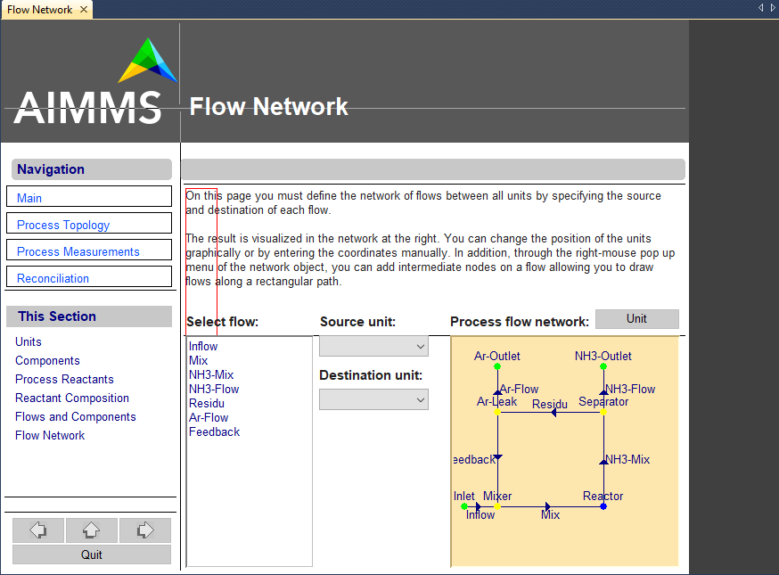

.. _sec:page.intro:

Introduction
============

.. rubric:: What is a page?

A *page* is a window in which the data of an AIMMS model is presented in
a graphical manner. Pages are the main component of an end-user
interface for a model-based decision support application. An example of
an end-user page is given in :numref:`fig:resize-edit-new`.

The page shown here provides a comprehensive graphical overview of the
results of an optimization model by means of a *network flow object* in
which flows which require attention are colored red. By clicking on a
particular flow in the network object, additional information about that
flow is shown in the tables on the left of the page.

.. rubric:: Page design

Pages are fully designed by application developers for use by the
end-users of an application. Thus, you, as a developer, can decide at
what position in the interface particular model data should be presented
to the end-user, and in which format. In addition, by automatically
executing procedures when opening or closing a page or when modifying
data, you can make sure that all the necessary computations are
performed before certain model results are displayed.

   Example of a end-user page
