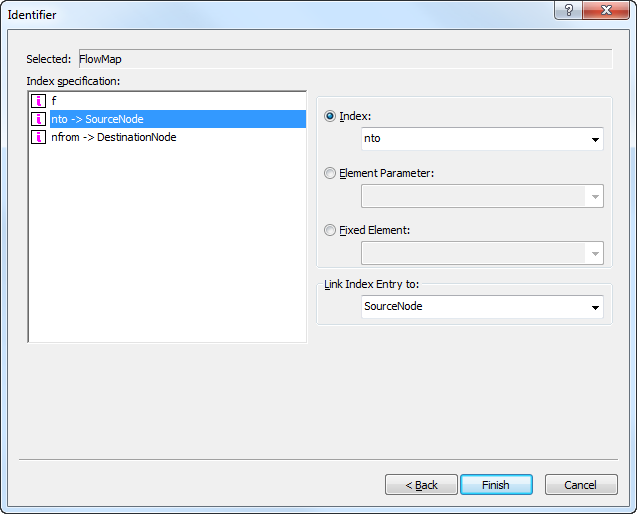
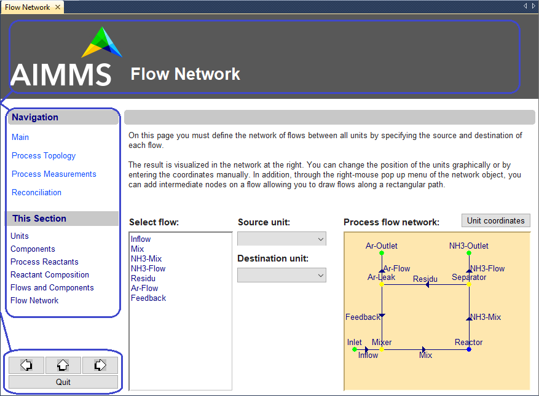

.. _sec:page.slice:

Selecting identifier slices and linking objects
===============================================

.. _slicing_identifiers:

.. rubric:: Advanced identifier selection

After you have selected an indexed identifier (or expression) in the
**Identifier Selection** dialog box, a second dialog box appears, as
illustrated in :numref:`fig:page.id-select2`.

   Advanced **Identifier Selection** options

In this dialog box, you have several options to refine your choice, each
of which will be described in this section.

.. rubric:: Slicing and subset restriction

By default, AIMMS assumes that you want to associate the full identifier
with the object in hand. However, with the dialog box of
:numref:`fig:page.id-select2` AIMMS allows you to modify several
domain-related issues before displaying the identifier. More
specifically, for every individual dimension in the index domain of the
identifier, you can:

-  restrict that dimension to those elements that are included in a
   particular subset associated with the domain set by using a subset
   index,

-  select a slice of the identifier by fixing that dimension to the
   value of a particular scalar element-valued parameter that assumes
   its values into the corresponding domain set, or

-  select a slice of the identifier by fixing that dimension to a
   specific element in the corresponding domain set.

In the dialog box of :numref:`fig:page.id-select2` AIMMS lets you select
specific elements, element parameters or subset indices on the
right-hand side of the dialog box to restrict the dimension that is
selected on the left-hand side.

.. rubric:: Dimension reduction

By fixing a particular dimension to an element parameter or a set
element, the total number of dimensions of the displayed data is reduced
by one. Thus, by fixing one dimension of a two-dimensional parameter,
only a one-dimensional table will be displayed. The number of dimensions
is not reduced when the display is restricted to elements in a subset.
In this case, however, the object will display less data.

.. rubric:: Index order and table split

For a table object, the **Identifier Selection** dialog box also lets
you determine the order of the dimensions and a split of the dimensions.
This allows you to specify which dimensions are shown rowwise and which
columnwise, and in which order. If you do not insert a split manually,
AIMMS will determine a default split strategy.

.. rubric:: Index linking

Finally, the identifier selection options offer you the possibility of
establishing a link between a particular dimension of the selected
identifier and a (scalar) element parameter that assumes its values into
the corresponding domain set. As an example, consider the dialog box of
:numref:`fig:page.id-select2`. In it, the dimension ``nfrom`` of the
identifier ``FlowMap(f,nfrom,nto)`` is linked to the element parameter
``SourceNode``, and the dimension ``nto`` to the element parameter
``DestinationNode``.

.. rubric:: Link notation

In the **Properties** dialog boxes of a linked object, AIMMS displays
the link using a "``->``" arrow. Thus, the parameter ``FlowMap`` from
the example above, will be displayed as

.. code-block:: aimms

	FlowMap( f, nfrom -> SourceNode, nto -> DestinationNode )

This special link notation is only valid in the graphical interface, and
cannot be used anywhere else in the formulation of your model.

.. rubric:: Effect of index linking

When the identifier ``FlowMap(f,nfrom,nto)`` is displayed in, for
instance, a table object, AIMMS will, as a result of the specified index
links, automatically assign the values of ``nfrom`` and ``nto``
associated with the currently selected table entry to the element
parameters ``SourceNode`` and ``DestinationNode``, respectively.

.. rubric:: Use of index linking

Index linking is a very powerful AIMMS feature that allows you to
effectively implement several attractive features in an end-user
interface without any programming effort on your part. Some
representative uses of index linking are discussed below.

-  You can use index links involving one or more element parameters in a
   particular page object as a way of triggering AIMMS to automatically
   update one or more other page objects that contain identifier slices
   fixed to these element parameters. These updates will occur as soon
   as a user clicks somewhere in the particular page object in which the
   indices were linked. An illustrative example of such automatic
   linkage of page objects is shown below.

-  You can use index linking to keep track of the current user selection
   in an object when executing a procedure within your model. This
   allows you to do some additional data processing, or perform some
   necessary error checks for just that tuple in a multidimensional
   identifier, whose value has most recently been modified by the
   end-user of your application.

.. rubric:: Example

Consider the page shown in :numref:`fig:page.link`.

   Example of index linking

The tables and lists underneath the **flow data** text in the center
part of the page display detailed information regarding the currently
selected flow in the network flow object shown in the right part of the
page. This was accomplished as follows. The index ``f`` representing the
flows in the network flow object on the right was linked to a single
element parameter ``FlowEl`` in the set ``Flows``. The tables and lists
on the left of the screen contain identifier slices fixed to the element
parameter ``FlowEl``. Take, for instance, the values in the column named
``Measured`` in the table object on the lower left part of the screen.
This column corresponds to the one-dimensional identifier slice
``MappedMeasuredComposition(c,FlowEl)``. As a result of the link, the
column ``Measured`` automatically displays detailed information for the
flow selected by the end- user in the flow chart on the right.

