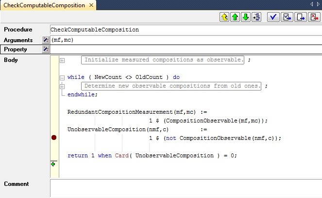
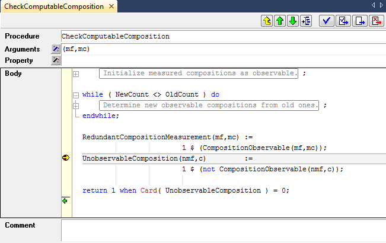
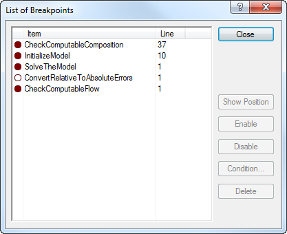
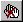

.. _sec:debug.debug:

The AIMMS debugger
==================

.. _debugger:

.. rubric:: Tracking modeling errors

When your model contains logical errors or programming errors, finding
the exact location of the offending identifier declarations and/or
statements may not be easy. In general, incorrect results might be
caused by:

-  incorrectly specified attributes for one or more identifiers declared
   in your model (most notably in the ``IndexDomain`` and ``Definition``
   attributes),

-  logical oversights or programming errors in the formulation of one or
   more (assignment) statements in the procedures of your model,

-  logical oversights or programming errors in the declaration of the
   variables and constraints comprising a mathematical program, and

-  data errors in the parametric data used in the formulation of a
   mathematical program.

.. rubric:: Errors in mathematical programs

If the error is in the formulation or input data of a mathematical
program, the main route for tracking down such problems is the use of
the **Math Program Inspector** discussed in :ref:`chap:mpinspector`.
Using the **Math Program Inspector** you can inspect the properties of
custom selections of individual constraints and/or variables of a
mathematical program.

.. rubric:: The AIMMS debugger

To help you track down errors that are the result of misformulations in
assignment statements or in the definitions of defined parameters in
your model, AIMMS provides a *source debugger*. You can activate the
AIMMS debugger through the **Tools-Diagnostic Tools-Debugger** menu.
This will add a **Debugger** menu to the system menu bar, and, in
addition, add the **Debugger** toolbar illustrated in
:numref:`fig:debug.toolbar` to the toolbar area.

.. figure:: toolbar-dbg-new.png
   :alt: The **Debugger** toolbar
   :name: fig:debug.toolbar

   The **Debugger** toolbar

You can stop the AIMMS debugger through the **Debugger-Exit Debugger**
menu.

.. rubric:: Debugger functionality

Using the AIMMS debugger, you can

-  set conditional and unconditional breakpoints on a statement within
   the body of any procedure or function of your model, as well as on
   the evaluation of set and parameter definitions,

-  step through the execution of procedures, functions and definitions,
   and

-  observe the effect of single statements and definitions on the data
   within your model, either through tooltips within the observed
   definitions and procedure bodies, or through separate data pages (see
   also :ref:`sec:decl.data`)

.. rubric:: Setting breakpoints in the body

Within the AIMMS debugger you can set breakpoints on any statement in a
procedure or function body (or on the definition of a defined set,
parameter or variable) by selecting the corresponding source line in the
body of the procedure or function, and choosing the
**Debugger-Breakpoints-Insert/Remove** menu (or the **Insert/Remove
Breakpoint** button |breakpoint-button-set| on the **Debugger** toolbar). After you
have set a breakpoint, this is made visible by means of red dot in the
left margin of selected source line, as illustrated in
:numref:`fig:debug.breakpoint`.

   Setting a breakpoint in a procedure body

.. rubric:: Setting breakpoints in the model tree

Alternatively, you can set a breakpoint on a procedure, function or on a
defined set, parameter or variable by selecting the corresponding node
in the **Model Explorer**, and choosing the
**Debugger-Breakpoints-Insert/Remove** menu. As a result, AIMMS will add
a breakpoint to the first statement contained in the body of the
selected procedure or function. The name of a node of any procedure,
function or defined set, parameter or variable with a breakpoint is
displayed in red in the model tree, as illustrated in
:numref:`fig:debug.explorer`.

.. figure:: breakpoint-explorer-new.png
   :alt: Viewing procedures with breakpoints in the **Model Explorer**
   :name: fig:debug.explorer

   Viewing procedures with breakpoints in the **Model Explorer**

.. rubric:: Entering the debugger

Once you have set a breakpoint in your model, AIMMS will automatically
stop at this breakpoint whenever a line of execution arrives at the
corresponding statement. This can be the result of

-  explicitly running a procedure within the **Model Explorer**,

-  pushing a button on an end-user page which results in the execution
   of one or more procedures, or

-  opening an end-user (or data) page, which requires the evaluation of
   a defined set or parameter.

Whenever the execution stops at a breakpoint, AIMMS will open the
corresponding procedure body (or the declaration form of the defined
set, parameter or variable), and show the current line of execution
through the breakpoint pointer |breakpoint-pointer|, as illustrated in
:numref:`fig:debug.break`.

   Arriving at a breakpoint

.. rubric:: Interrupting execution

Even when you have not set breakpoints, you can still enter the debugger
by explicitly *interrupting* the current line of execution through the
**Run-Stop** menu (or through the **Ctrl-Shift-S** shortcut key). It
will pop up the **Stop Run** dialog box illustrated in
:numref:`fig:debug.interrupt`

.. figure:: interrupt-new.png
   :alt: The **Stop Run** dialog box
   :name: fig:debug.interrupt

   The **Stop Run** dialog box

When you have activated the AIMMS debugger prior to execution, the
**Debug** button on it will be enabled, and AIMMS will enter the
debugger when you push it. By pushing the **OK** or **Cancel** button,
AIMMS will completely stop or just continue executing, respectively.

.. rubric:: Interrupting slow statements

The above method of interrupting AIMMS will not work when AIMMS is
executing a statement or definition that takes a very long time. In that
case you can interrupt AIMMS via the ``AimmsInterrupt`` tool. This tool
is available from the Windows start All Programs menu. Upon startup, it
will place itself in the system tray. By right-clicking the AIMMS system
tray icon, you'll obtain a menu of running AIMMS instances that can be
interrupted. In developer mode, the interrupted AIMMS will also popup a
debugger showing where it has been interrupted. With that debugger, you
can't continue execution, however; as the consistency of the values of
the identifier(s) being computed during the interrupt can't be
guaranteed. On the other hand, you can start new procedures. In end-user
mode, the interrupted AIMMS will just issue an error message, indicating
the interrupted statement, definition or constraint.

.. rubric:: Stepping through statements

Once AIMMS has interrupted a line of execution and entered the debugger,
you can step through individual statements by using the various step
buttons on the **Debugger** toolbar and follow the further flow of
execution, or observe the effect on the data of your model. AIMMS offers
several methods to step through your code:

-  the **Step Over** |breakpoint-button-step-over| method runs a single statement, and,
   when this statement is a procedure call, executes this in its
   entirety,

-  the **Step Into** |breakpoint-button-step-into| method runs a single statement, but,
   when this statement is a procedure call, sets the breakpoint pointer
   to the first statement in this procedure,

-  the **Step Out** |breakpoint-button-step-out| method runs to the end of the current
   procedure and sets the breakpoint pointer to the statement directly
   following the procedure call in the calling context, and

-  the **Run To Cursor** |breakpoint-button-run-to-cursor| method runs in a single step from
   the current position of the breakpoint pointer to the current
   location of the cursor, which should be *within the current
   procedure*.

In addition, AIMMS offers some methods to continue or halt the
execution:

-  the **Continue Execution** |breakpoint-button-continue| method continues execution,
   but will stop at any breakpoint it will encounter during this
   execution,

-  the **Finish Execution** |breakpoint-button-finish| method finishes the current line
   of execution, ignoring any breakpoints encountered,

-  the **Halt** |breakpoint-button-halt| method immediately halts the current line of
   execution.

.. rubric:: Examining identifier data

Whenever you are in the debugger, AIMMS allows you to interactively
examine the data associated with the identifiers in your model, and
observe the effect of statements in your source code. The most
straightforward method is by simply moving the mouse pointer over a
reference to an identifier (or identifier *slice*) within the source
code of your model. As a result, AIMMS will provide an overview of the
data contained in that identifier (slice) in the form of a tooltip, as
illustrated in :numref:`fig:debug.tooltip`.

The tooltip will provide global information about the identifier slice
at hand, such as

-  its name and indices,

-  the number of elements or non-default data values (in brackets), and

-  the first few elements or non-default data value in the form of a
   list consisting of tuples and their corresponding values.

.. figure:: breakpoint-proc-tooltip-new.png
   :alt: Observing the current data of an identifier through a tooltip
   :name: fig:debug.tooltip

   Observing the current data of an identifier through a tooltip

.. rubric:: Detailed identifier data

If you need to examine the effect of a statement on the data of a
particular identifier in more detail, you can simply open a **Data
Page**, as described in :ref:`sec:decl.data`, or observe the effect on
ordinary end-user pages. Within a debugger session, AIMMS supports data
pages for both global and local identifiers, thereby allowing you to
examine the contents of local identifiers as well. After each step in
the debugger AIMMS will automatically update the data on any open
end-user or data page.

.. rubric:: Breakpoint on data change

If you are not sure which statement in your model is responsible for
changing the data of a (non-defined) set or parameter, you can set a
breakpoint on such a set or parameter. Whenever a statement in your
model changes the set or parameter data at hand, AIMMS will break on
that statement. Notice, however, that breakpoint on data change will not
pick up data changes that are due to set or parameter data becoming
inactive because of changes to sets or parameters included in the domain
or domain condition.

.. rubric:: Viewing the call stack

Whenever you are in the debugger, the **Call Stack** button |breakpoint-button-call-stack|
on the **Debugger** toolbar will display the **Call Stack** dialog box
illustrated in :numref:`fig:debug.call-stack`.

.. figure:: breakpoint-call-stack-new.png
   :alt: The **Call Stack** dialog box
   :name: fig:debug.call-stack

   The **Call Stack** dialog box

With it you get a detailed overview of the stack of procedure calls
associated with the current line of execution. It enables you to observe
the flow of execution at the level of procedures associated with the
current position of the breakpoint pointer. After selecting a procedure
or definition in the **Call Stack** dialog box, the **Show Position**
button will open its attribute window at the indicated line.

.. rubric:: Viewing and modifying breakpoints

After you have inserted a number of breakpoints into your model, you can
get an overview of all breakpoints through the **Show All Breakpoints**
button |breakpoint-button-list|. This button will invoke the **List of Breakpoints**
dialog box illustrated in :numref:`fig:debug.bp-list`.

   The **List of Breakpoints** dialog box

For each breakpoint, AIMMS will indicate whether it is enabled or
disabled (i.e. to be ignored by the AIMMS debugger). Through the buttons
on the right hand side of the dialog box you can

-  disable breakpoints,

-  enable previously disabled breakpoints,

-  delete breakpoints, and

-  create new breakpoints.

Alternatively, you can disable or remove all breakpoints simultaneously
using the **Disable All Breakpoints** button |breakpoint-button-disable| and the
**Remove All Breakpoints** button |breakpoint-button-remove|.

.. rubric:: Conditional breakpoints

In addition, by pushing the **Condition** button on the **List of
Breakpoints** dialog box, you can add a condition to an existing
breakpoint. It will open the **Breakpoint Condition** dialog box
illustrated in :numref:`fig:debug.condition`.

.. figure:: breakpoint-condition-new.png
   :alt: The **Breakpoint Condition** dialog box
   :name: fig:debug.condition

   The **Breakpoint Condition** dialog box

The condition must consist of a simple numerical, element or string
comparison. This simple comparison can only involve scalar identifiers,
identifier slices or constants. Free indices in an identifier slice are
only allowed when they are fixed within the breakpoint context
(e.g. through a for loop). AIMMS will only stop at a conditional
breakpoint, when the condition that you have specified is met during a
particular call. Conditional breakpoints are very convenient when, for
instance, a procedure is called very frequently, but only appears to
contain an error in one particular situation which can be detected
through a simple comparison.

.. |breakpoint-button-set| image:: breakpoint-button-set.png

.. |breakpoint-button-disable| image:: breakpoint-button-disable.png

.. |breakpoint-button-call-stack| image:: breakpoint-button-call-stack.png

.. |breakpoint-button-list| image:: breakpoint-button-list.png

.. |breakpoint-pointer| image:: breakpoint-pointer.png

.. |breakpoint-button-step-over| image:: breakpoint-button-step-over.png

.. |breakpoint-button-continue| image:: breakpoint-button-continue.png

