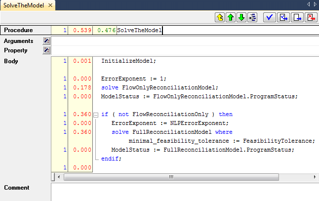
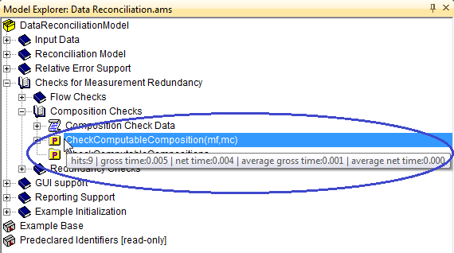
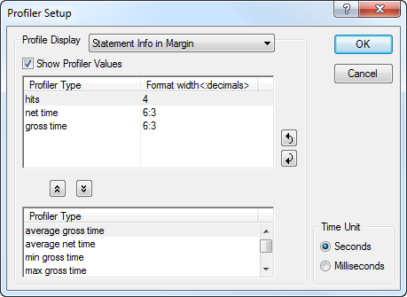

.. _sec:debug.profile:

The AIMMS profiler
==================

.. _profiler:

.. rubric:: Meeting time requirements with solvers

Once your model is functionally complete, you may find that the overall
computational time requirement set for the application is not met. If
your application contains optimization, and most of the time is spent by
the solver, finding a remedy for the observed long solution times may
not be easy. In general, it involves finding a reformulation of the
mathematical program which is more suitable to the selected solver.
Finding such a reformulation may require a considerable amount of
expertise in the area of optimization.

.. rubric:: Meeting time requirements with data execution

It could also be, however, that optimization (if any) only consumes a
small part of the total execution time. In that case, the time required
for executing the application is caused by data manipulation statements.
If total execution time is unacceptably high, it could be caused by
inefficiently formulated statements. Such statements force AIMMS to fall
back to *dense* instead of *sparse* execution. :ref:`lr:chap:sparse` and
:ref:`lr:chap:eff` of the Language Reference discuss the principles of
the sparse execution engine used by AIMMS, and describe several common
pitfalls together with reformulations to remedy them.

.. rubric:: The AIMMS profiler

AIMMS offers a profiler to help you resolve computational time related
issues. The AIMMS profiler enables you to locate the most time-consuming
evaluations of

-  procedures and functions,

-  individual statements within procedures and functions,

-  defined sets and parameters, and

-  constraints and defined variables during matrix generation.

.. rubric:: Activating the profiler

You can activate the AIMMS profiler by selecting the **Tools-Diagnostic
Tools-Profiler** menu, which will add a **Profiler** menu to the default
system menu bar. If the debugger is still active at this time, it will
be automatically deactivated, as both tools cannot be used
simultaneously.

.. rubric:: Gathering timing information

As soon as you have activated the profiler, AIMMS will start gathering
timing information during every subsequent procedure run or definition
evaluation, regardless whether these are initiated by pushing a button
on an end-user page, by executing a procedure from within the **Model
Explorer**, or even by means of a call to the AIMMS API from within an
external DLL.

.. rubric:: Viewing profiler results

After you have gathered timing information about your modeling
application by executing the relevant parts of your application at least
once, you can get an overview of the timing results through the
**Profiler-Results Overview** menu. This will open the **Profiler
Results Overview** dialog box illustrated in
:numref:`fig:debug.prof-res`.

.. figure:: profiler-results-new.png
   :alt: The **Profiler Results Overview** dialog box
   :name: fig:debug.prof-res

   The **Profiler Results Overview** dialog box

In it, you will find a list of all procedures that have been executed
and identifier definitions that have been evaluated since the profiler
was activated.

.. rubric:: Detailed timing information

For each procedure, function, or defined identifier listed in the
**Profiler Results Overview** dialog box, AIMMS will provide the
following information:

-  the number of hits (i.e. the number of times a procedure has been
   executed or a definition has been evaluated),

-  the total gross time (explained below) spent during all hits,

-  the total net time (explained below) spent during all hits,

-  the average gross time spent during each separate hit, and

-  the average net time spent during each separate hit.

.. rubric:: Gross versus net time

The term *gross time* refers to the total time spent in a procedure
*including* the time spent in procedure calls or definition evaluations
within the profiled procedure. The term *net time* refers to the total
time spent *excluding* the time spent in procedure calls or definition
evaluations within the profiled procedure.

.. rubric:: Locating time-consuming procedures

With this timing information you can try to locate the procedures and
identifier definitions which are most likely to benefit from a
reformulation to improve efficiency. To help you locate these procedures
and definitions, the list of procedures and definitions in the
**Profiler Results Overview** dialog box can be sorted with respect to
all its columns. The most likely criterion for this is to sort by
decreasing net time or average net time, which will identify those
procedures and identifier definitions which take up the most time by
themselves, either in total or for each individual call. You can open
the attribute form of any identifier in the **Profiler Results
Overview** dialog box by simply double-clicking on the corresponding
line.

.. rubric:: Locating offending statements

When you have located a time-consuming procedure, you can can open its
attribute form and try to locate the offending statement(s). Whenever
the profiler has been activated, AIMMS will add additional profiling
columns to the body of a procedure, as illustrated in
:numref:`fig:debug.prof-attr`.

Similarly, AIMMS will add these profiling columns to the definition
attributes of defined identifiers.

   Profiling information in an attribute form

.. rubric:: Profiling column information

For each statement in the body of a procedure, AIMMS can display various
types of profiling data in the profiling columns of an attribute form.
As you can see next, this information is even more extensive than for
procedures as a whole. The following information is available:

-  the number of hits (i.e. the number of times a particular statement
   has been executed),

-  the total gross time spent during all hits,

-  the total net time spent during all hits,

-  the average gross time spent during each separate hit, and

-  the average net time spent during each separate hit.

.. rubric:: Gross versus net time for particular statements

In the context of a procedure body, the difference between gross and net
time need not always refer only to the time spent in other procedures
(as in the **Profiler Results Overview** dialog box). For selected
statements both numbers may have a somewhat different, yet meaningful,
interpretation. Some exceptions:

-  in flow control statements such as the ``IF``, ``WHILE`` and ``FOR``
   statement (see also :ref:`lr:sec:exec.flow` of the Language
   Reference), the net time refers to the time required to evaluate the
   statement itself (for instance, its condition) whereas the gross time
   refers to the time required to execute the entire statement,

-  in the ``SOLVE`` statement (see also :ref:`lr:sec:mp.solve` of the
   Language Reference), the net time refers to the time spent in the
   solver, while the gross time refers to the time spent in the solver
   plus the time required to generate the model.

-  in a procedure call itself the net time refers to the time spent in
   argument passing.

.. rubric:: Profiler tooltips

In addition to observing the profiling times in the **Profiler Results
Overview** and through the profiling columns in attribute windows, AIMMS
also provides profiling tooltips in both the **Model Explorer** and in
the attribute windows of procedures and defined identifiers, as long as
the profiler is active. An example of a profiling tooltip is given in
:numref:`fig:debug.prof-tooltip`.

   Observing profiling information through a tooltip

Profiling tooltips can provide a convenient method to quickly observe
the profiling information without requiring any further interaction with
AIMMS. If you do not want AIMMS to display profiling tooltips while
moving your mouse through either the **Model Explorer** or procedure
bodies, you can disable them through the **Profiler Setup** dialog box
described below, by unchecking the **Show Profiler Values** check mark
(see also :numref:`fig:debug.prof-setup`).

.. rubric:: Profiler listing

If you are interested in a profiling overview comprising your entire
modeling application, you can get this through the **Profiler-Create
Listing File** menu. This will create a common source listing file of
your model text extended with profiling information wherever this is
available. Through the **Profiler Setup** dialog box described below you
can determine which profiler information will be added to the profiler
listing.

.. rubric:: Setting up profiling columns

For every new project, AIMMS uses a set of default settings to determine
which profiling information is displayed in the various available
methods to display profiling information. You can modify these settings
through the **Profiler-Setup** menu, which will open the **Profiler
Setup** dialog box illustrated in :numref:`fig:debug.prof-setup`.

   The **Profiler Setup** dialog box

In this dialog box you can, on a project-wide basis, determine

-  which of the profiling display methods described are enabled (through
   the **Show Profiler Values** check mark), and

-  per such display method, which profiling information is to be
   displayed, their order, and their corresponding display format.

The settings selected in the **Profiler Setup** dialog box are saved
along within the project file, and will be restored when you reopen the
project in another AIMMS session.

.. rubric:: Pausing and continuing the profiler

Through the **Profiler-Pause** menu, you can temporarily halt the
gathering of profiling information by AIMMS, while the existing
profiling information will be retained. You can use this menu, for
example, when you only want to profile the core computational procedures
of your modeling application and do not want the profiling information
to be cluttered with profiling information that is the result of
procedure calls and definition evaluations in the end-user interface.
You can resume the gathering of profiling information through the
**Profiler- Continue** menu.

.. rubric:: Resetting the profiler

With the **Profiler-Reset** menu, you can completely reset all profiling
counters to zero. You can use this menu, if the profiling information of
your application has become cluttered. For instance, some procedures may
have been executed multiple times and, thus, disturb the typical
profiling times required by your entire application. After resetting the
profiling counters, you can continue to gather new profiling information
which will then be displayed in the various profiling displays.

.. rubric:: Exiting the profiler

You can completely disable the AIMMS profiler through the
**Profiler-Exit Profiler** menu. As a result, the gathering of profiling
information will be completely discontinued, and all profiling counters
will be reset to zero. Thus, when you restart the profiler, all
profiling information of a previous session will be lost.

