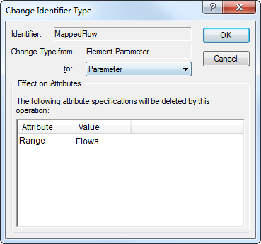
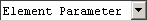

.. _sec:decl.commit:

Committing attribute changes
============================

.. rubric:: Syntax checking 
   :name: check.attrib

The modifications that you make to the attributes of a declaration are
initially only stored locally within the form. Once you take further
action, the changes in your model will be checked syntactically and
committed to the model. There are three ways to do this.

.. rubric:: Saving the model

In addition to committing the changes in a single attribute form
manually as above, the changes that you have made in any attribute form
are also committed when you save the model (through the **File-Save**
menu), or recompile it in its entirety (through the **Run-Compile All**
menu).

.. rubric:: Renaming identifiers

It is quite common to rename an existing identifier in a modeling
application because you consider that a new name would better express
its intention. In such cases, you should be aware of the possible
consequences for your application. The following questions are relevant.

-  Are there references to the (old) identifier name in other parts of
   the model?

-  Are there case files that contain data with respect to the (old)
   identifier name?

-  Are there pages in the end-user interface that display data with
   respect to the (old) identifier name?

If the answer to any of these questions is yes, then changing the
identifier name could create problems.

.. rubric:: Automatic name changes

AIMMS helps you in dealing with the possible consequences of name
changes by offering the following support:

-  AIMMS updates all references to the identifier throughout the model
   text, and in addition,

-  AIMMS keeps a log of the name change (see also
   :ref:`sec:start.files`), so that when AIMMS encounters any reference
   to the old name in either a page or in a case file, the new name will
   be substituted.

.. rubric:: Beware of structural changes

Problems arise when you want to change the index domain of an
identifier, or remove an identifier, while it is still referenced
somewhere in your application. Such changes are called *structural*, and
are likely to cause errors in pages and cases. In general, these errors
cannot be recovered automatically. To help you locate possible problem
areas, AIMMS will mark all pages and cases that contain references to
changed or deleted identifiers. To check how a change really affects
these pages and cases, you should open them, make any required
adaptations to deal with the errors, and resave them.

.. rubric:: Modifying identifier type

You can modify the type of a particular identifier in the model tree via
the identifier type drop-down list |id-type| in the attribute window
of the identifier. The drop-down list lets you select from all
identifier types that are compatible with the current identifier type.
Alternatively, you can change the identifier type via the **Edit-Change
Type** menu.

.. rubric:: Incompatible attributes

Before a change of identifier type is actually committed, AIMMS displays
the dialog box illustrated in :numref:`fig:decl.change-type`, which
lists all the attributes of the identifier that are not compatible with
the newly selected type.

   The **Change Identifier Type** dialog box

If you do not want such attributes to be deleted, you should cancel the
operation at this point. When you allow AIMMS to actually perform the
type change, the incompatible attributes will be deleted.

