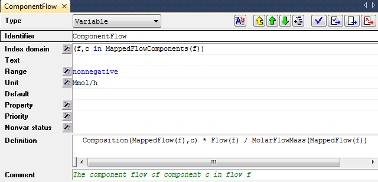
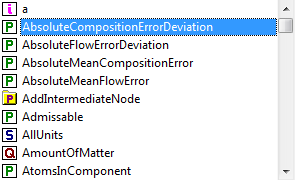
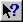

.. _sec:decl.attr:

Identifier attributes
=====================

.. rubric:: Identifier attributes

The attributes of identifier declarations specify various aspects of the
identifier which are relevant during the further execution of the model.
Examples are the index domain over which the identifier is declared, its
range, or a definition which expresses how the identifier can be
uniquely computed from other identifiers. For the precise interpretation
of particular attributes of each identifier type, you are referred to
the AIMMS Language Reference, which discusses all identifier types in
detail.

.. rubric:: Attribute window

The attributes of an identifier are presented in a standard form. This
form lists all the relevant attributes together with the current values
of these attributes. The attribute values are always presented in a
textual representation, consisting of either a single line or multiple
lines depending on the attribute. :numref:`fig:decl.attr-form`
illustrates the attribute form of a variable ``ComponentFlow(f,c)``.

The attributes specify, for instance, that the variable is measured in
``Mmol/h``, and provide a definition in terms of other parameters and
variables.

   Identifier attributes

.. rubric:: Default values

You do not need to enter values for all the attributes in an attribute
window. In fact, most of the attributes are optional, or have a default
value (which is not shown). You only have to enter an attribute value
when you want to alter the behavior of the identifier, or when you want
to provide a value that is different to the default.

.. rubric:: Entering attribute text ...

You can freely edit the text of almost every attribute field, using the
mechanisms common to any text editor. Of course, you will then need to
know the syntax for each attribute. The precise syntax required for each
attribute is described in the AIMMS Language Reference book.

.. rubric:: ...or using attribute wizards

To help you when filling in attributes, AIMMS offers specialized wizards
for most of them. These wizards consists of (a sequence of) dialog
boxes, which help you make specific choices, or pick identifier names
relevant for specifying the attribute. An example of an attribute wizard
is shown is :numref:`fig:decl.attr-wizard`.

.. figure:: rang-wiz-new.png
   :alt: Example of an attribute wizard
   :name: fig:decl.attr-wizard

   Example of an attribute wizard

In this wizard, the numerical range of a particular parameter or
variable is specified as the user-defined interval
``[0,MaxFlowErrorBound]``. After completing the dialog box, the result
of filling in the wizard is copied to the attribute window with the
correct syntax.

.. rubric:: Mandatory use of wizards

Some of the attribute fields are not editable by hand, but require you
to always use the associated wizard. AIMMS requires the use of wizards,
whenever this is necessary to keep the model in a consistent state.
Examples are (non-empty) ``Index`` and ``Parameter`` attributes of sets,
as well ass the ``BaseUnit`` attribute of quantities.

.. rubric:: Identifier reference support

Even when you decide to enter an attribute into a field manually, AIMMS
still offers support to help you enter such a field quickly and easily.
If your application contains a large number of identifiers and/or if the
names of these identifiers are long, then it may be difficult to
remember all the exact names. There are two ways to let AIMMS help you
in filling in the appropriate names in an attribute field:

-  you can drag and drop the names from the model tree into the field,
   or

-  with the name completion feature you can let AIMMS fill in the
   remainder of the name based on only the first few characters typed.

.. rubric:: Dragging identifiers

When filling in an attribute field, you can drag any identifier node in
the model tree to a particular location in the attribute field. As a
result, AIMMS will copy the identifier name, with its index domain, at
the location where you dropped the identifier.

.. rubric:: Name completion ...

When you use the **Ctrl-Spacebar** combination anywhere in an attribute
field, AIMMS will complete any incomplete identifier name at the current
cursor position wherever possible. With the **Ctrl-Shift-Spacebar**
combination AIMMS will also complete keywords and predefined procedure
and function names. When there are more than one possibilities, a menu
of choices is presented as in :numref:`fig:decl.name-completion`. 
In this menu the first possible extension will be selected and the
selection will be updated as you type. When an identifier name is
complete, applying name completion will cause AIMMS to extend the
identifier by its index domain as specified in its declaration.

   Name completion

.. rubric:: ... applied to the ``::`` and ``.`` characters

By pressing **Ctrl-Spacebar** in a string that contains the ``::`` or
``.`` characters, AIMMS will restrict the list of possible choices as
follows.

-  If the name in front of the ``::`` character is a module or library
   module prefix, AIMMS will show all the identifiers contained in the
   module, or all identifiers contained in the interface of the library
   module, respectively.

-  If the string to complete refers to a property in a ``PROPERTY``
   statement, and the name in front of the ``.`` character is an
   identifier, AIMMS will show all properties available for the
   identifier (based on its type).

-  If the string to complete refers to an option in an ``OPTION``
   statement, and the string in front of the ``.`` character refers to
   an element of the set :any:`AllSolvers`, AIMMS will show all options
   available for that solver.

-  In all other cases, if the name in front of the ``.`` character is an
   identifier, AIMMS will show all the suffices available for the
   identifier (based on its declaration).

.. _sec:decl.attr.navigate:

Navigation Features
~~~~~~~~~~~~~~~~~~~

.. rubric:: Navigation features

From within an attribute window, there are several menus and buttons
available to quickly access related information, such as the position in
the model tree, identifier attributes and data, and context help on
identifier types, attributes and keywords.

.. rubric:: Browsing the model tree

From within an attribute window you can navigate further through the
model tree by using the navigation buttons displayed at the top of the
window.

-  The **Parent** |parent|, **Previous** |prev| and **Next
   Attribute Window** |next| buttons will close the current
   attribute window, and open the attribute window of the parent,
   previous or next node in the model, respectively.

-  The **Location in Model Tree** |locate| button will display the
   model tree and highlight the position of the node associated with the
   current attribute window.

.. rubric:: Viewing identifier details

When an identifier attribute contains a reference to a particular
identifier in your model, you may want to review (or maybe even modify)
the attributes or current data of that identifier. AIMMS provides
various ways to help you find such identifier details:

-  by clicking on a particular identifier reference in an identifier
   attribute, you can open its attributes window through the
   **Attributes** item in the right-mouse pop-up menu,

-  you can locate the identifier declaration in the model tree through
   the **Location in Model Tree** item in the right-mouse pop-up menu,
   and

-  you can view (or modify) the identifier's data through the **Data**
   item in the right-mouse pop-up menu (see :ref:`sec:decl.data`).

.. rubric:: Context help

.. rubric:: Context sensitive help

Through either the **Context Help** button |help| on the toolbar,
or the **Help on** item in the right-mouse pop-up menu, you can get
online help for the identifier type, its attributes and keywords used in
the attribute fields. It will open the section in one of the AIMMS books
or help files, which provides further explanation about the topic for
which you requested help.

.. |parent| image:: parent.png

.. |prev| image:: prev.png

.. |locate| image:: locate.png

