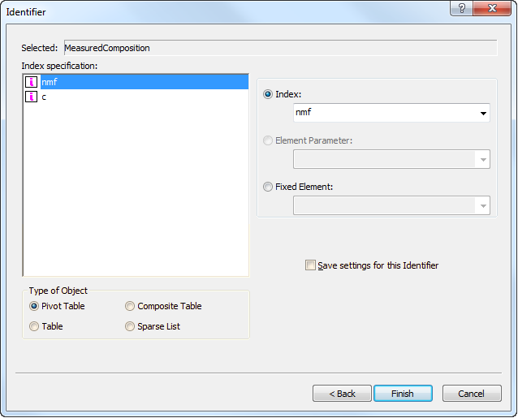
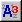

.. _sec:decl.data:

Viewing and modifying identifier data
=====================================

.. rubric:: Viewing identifier data

When you are developing your model (or are reviewing certain aspects of
it later on), AIMMS offers facilities to directly view (and modify) the
data associated with a particular identifier. This feature is very
convenient when you want to enter data for an identifier during the
development of your model, or when you are debugging your model (see
also :ref:`sec:debug.debug`) and want to look at the results of
executing a particular procedure or evaluating a particular identifier
definition.

.. rubric:: The Data button

Via the **Data** button |data| available in the attribute window of
every global identifier (see, for instance,
:numref:`fig:decl.attr-form`), AIMMS will pop up one of the *data pages*
as illustrated in :numref:`fig:decl.data-page`.

.. figure:: nam-comp-new-cumul.png
   :alt: Data pages of a set and a 2-dimensional parameter
   :name: fig:decl.data-page

   Data pages of a set and a 2-dimensional parameter

Data pages provide a view of the *current contents* of the selected
identifier. Which type of data page is shown by AIMMS depends on the
type of the identifier. The data page on the left is particular to
one-dimensional root sets, while the data page on the right is
appropriate for a two-dimensional parameter.

.. rubric:: Data pages for variables and constraints

For variables (and similarly for constraints), AIMMS will display a
pivot table containing all the indices from the index domain of the
variable plus one additional dimension containing all the suffices of
the variable that contain relevant information regarding the solution of
the variable. Depending on the properties set for the variable, this
dimension may contain a varying number of suffices containing
sensitivity data related to the variable.

.. rubric:: Viewing data in the Model Explorer

Data pages can also be opened directly for a selected identifier node in
the model tree using either the **Edit-Data** menu, or the **Data**
command in the right-mouse pop-up menu. Additionally, you can open a
data page for any identifier referenced in an attribute window by
selecting the identifier in the text, and applying the **Data** command
from the right-mouse pop-up menu.

.. rubric:: Multidimensional identifiers

For multidimensional identifiers, AIMMS displays data using a default
view which depends on the identifier dimension. Using the |view-type|
button on the data page you can modify this default view. As a result,
AIMMS will display the dialog box illustrated in
:numref:`fig:decl.data-page-select`.

   Selecting a data page type

In this dialog box, you can select whether you want to view the data in
a sparse list object, a composite table object, a pivot table object or
in the form of a (rectangular) table. Additionally, you can indicate
that you want the view to be *sliced* (see also :ref:`sec:page.slice`),
by selecting fixed elements for one or more dimensions. For every sliced
dimension, AIMMS will automatically add a floating index to the data
page, allowing you to view the data for every element in the sliced
dimension.

.. rubric:: Saving your choice

If you want to always use the same data page settings for a particular
identifier, you can save the choices you made in
:numref:`fig:decl.data-page-select`. As a result, AIMMS will save the
data page as an ordinary end-user page in the special **All Data Pages**
section of the **Page Manager** (see also :ref:`sec:pagetool.pageman`).
If you so desire, you can further edit this page, and, for instance, add
additional related identifiers to it which will subsequently become
visible when you view the identifier data in the **Model Explorer**.

.. rubric:: End-user page as data page

Whenever there is a page in the **All Data Pages** section of the page
manager with the fixed name format ``[Data Page]`` followed by the name
of an identifier of your model, AIMMS will use this page as the data
page for that identifier. This enables you to copy a custom end-user
page, that you want to use as a data page for one or more identifiers,
to the **All Data Pages** section of the page manager, and rename it in
the prescribed name format. When you remove a page from the **All Data
Pages** section, AIMMS will again open a default data page for that
identifier. If you hold down the **Shift** key while opening a data
page, AIMMS will always use the default data page.

.. rubric:: Global and local identifiers

Normally, AIMMS will only allow you to open data pages of global
identifiers of your model. However, within the AIMMS debugger (see also
:ref:`sec:debug.debug`), AIMMS also supports data pages for local
identifiers within a (debugged) procedure, enabling you to examine the
contents of local identifiers during a debug session.

.. |view-type| image:: view-type.png