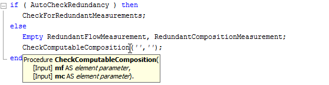

Specifying the body
===================

.. rubric:: Statements

In the **Body** attribute of a procedure or function you can specify the

-  assignments,

-  execution statements such as :any:`solve <solve>` or :any:`read <read>`/ :any:`write <write>`

-  calls to other procedures or functions in your model, and

-  flow control statements such as :any:`for`, :any:`while` or
   :any:`if-then-else <if>`

which perform the actual task or computation for which the procedure or
function is intended. The precise syntax of all execution statements is
discussed in detail in the AIMMS Language Reference book.

.. rubric:: Automatic outlining

When you are constructing a procedure or function whose execution
consists of a large number of (nested) statements, it may not always be
easy or natural to break up the procedure or function into a number of
separate procedures. To help you maintain an overview of such large
pieces of execution code, AIMMS will automatically add outlining support
for common flow control statement and multiline comments. The minus
button |btn-outlining-minus| that appears in front of the statement allows you to
collapse the statement to a single line block and the and plus button
|btn-outlining-plus| allows you to expand the statement to its full extent again.

.. rubric:: Execution blocks

In addition, you can break down the body of a procedure or function into
manageable pieces using one or more execution blocks. Any number of
AIMMS statements enclosed between :any:`block <block>` and :any:`endblock <endblock>` keywords
can be graphically collapsed into a single block. The text in the single
line comment following the :any:`block <block>` keyword is used as display text for
the collapsed block.

An example of a procedure body containing two collapsed execution blocks
is given in :numref:`fig:proc-body`.

.. figure:: breakpoint-at-active-new.png
   :alt: Example of a procedure body with execution blocks
   :name: fig:proc-body

   Example of a procedure body with execution blocks

.. rubric:: Identifier references

When you are entering statements into a body of a procedure or function,
AIMMS can help you to add identifier references to the body quickly and
easily:

-  you can drag and drop the names from the model tree into text

-  with the name completion feature you can let AIMMS complete the
   remainder of the name based on only the first characters typed.

The precise details of drag-and-drop support and name completion of
identifiers are discussed in :ref:`sec:model.trees` and
:ref:`sec:decl.attr`.

.. rubric:: Viewing identifier details

When you are entering the body of a procedure or function, you may want
to review the attributes or current data of a particular identifier
referenced in the body. AIMMS offers various ways to help you find such
identifier details:

-  through a text based search in the model tree, you can locate the
   specific identifier node and open its attribute form (see
   :ref:`sec:model.trees`),

-  by clicking on a particular identifier reference in the body, you can
   open its attributes form through the **Attributes** item in the
   right-mouse pop-up menu,

-  you can locate the identifier declaration in the model tree through
   the **Location in Model Tree** item in the right-mouse pop-up menu,
   and

-  you can view (or modify) the identifier's data through the **Data**
   item in the right-mouse pop-up menu (see :ref:`sec:decl.data`).

.. rubric:: Viewing procedure details

Similarly, while you are referencing a procedure or function inside the
body of another procedure or function, AIMMS will provide prototype
information of such a procedure or function as soon as you enter the
opening bracket (or when you hover with the mouse pointer over the
procedure or function name). This will pop up a window as illustrated in
:numref:`fig:proc.proc-info`.

   Prototype info of a procedure

This tooltip window displays all arguments of the selected procedure or
function, their respective data types, as well as their *Input*-*Output*
status. The latter enables you to assess the (global) effect on the
actual arguments of a call to the procedure.

.. |btn-outlining-minus| image:: btn-outlining-minus.png

.. |btn-outlining-plus| image:: btn-outlining-plus.png
