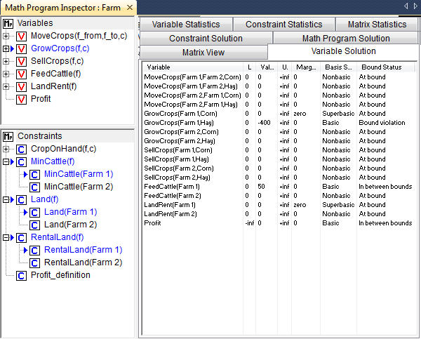
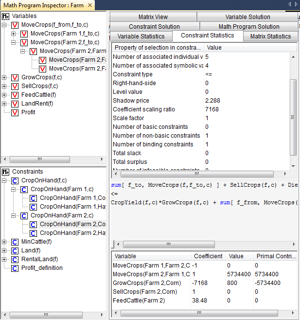

A worked example
================
.. rubric:: This section

The example in this section is adapted from McCarl (:cite:`bib:Mc98`), and is
meant to demonstrate the tools that were discussed in the previous
sections. The example model is used to illustrate the detection of
infeasibility and unboundedness. In addition, the example is used to
find the cause of an unrealistic solution.

Model Formulation
~~~~~~~~~~~~~~~~~

.. rubric:: A Farm planning model

The model considers a collection of farms. For each of these farms
several decisions have to be made. These decisions are

-  the amount of cattle to keep,

-  the amount of land to grow a particular crop,

-  the amount of additional land to rent, and

-  the amount of inter-farm crop transport.

The objective of the farm model is to maximize a social welfare
function, which is modeled as the total profit over all farms.

.. rubric:: Notation

The following notation is used to describe the symbolic farm planning
model.

.. math::
  
   \begin{aligned}
   & \textbf{Indices:} \\
   &&& \text{$f, \hat{f}$} & & \text{farms}  \\
   &&& \text{$c$} & & \text{crops}  \\[0.5pc]
   & \textbf{Parameters:} \\
   &&& \text{$C^g_{fc}$} & & \text{unit cost of growing crop $c$ on farm $f$}  \\
   &&& \text{$C^c_{f}$} & & \text{unit cost of keeping cattle on farm $f$}  \\
   &&& \text{$C^m_{c}$} & & \text{unit transport cost for moving crop $c$}  \\
   &&& \text{$C^r_{f}$} & & \text{rental price for one unit of land on farm $f$}  \\
   &&& \text{$P^s_{fc}$} & & \text{unit profit of selling crop $c$ grown on farm $f$}  \\
   &&& \text{$P^c_{f}$} & & \text{unit profit of selling cattle from farm $f$}  \\
   &&& \text{$L_{f}$} & & \text{amount of land available on farm $f$}  \\
   &&& \text{$Q$} & & \text{amount of land needed to keep one unit of cattle}  \\
   &&& \text{$Y_{fc}$} & & \text{crop yield per unit land for crop $c$ on farm $f$}  \\
   &&& \text{$D_{fc}$} & & \text{consumption of crop $c$ by one unit of cattle on farm $f$}  \\
   &&& \text{$M^c_{f}$} & & \text{minimum required amount of cattle on farm $f$}  \\
   &&& \text{$M^r_{f}$} & & \text{maximum amount of land to be rented on farm $f$}  \\[0.5pc]
   & \textbf{Variables:} \\
   &&& \text{$p$} & & \text{total profit} \\
   &&& \text{$c_{f}$} & & \text{amount of cattle on farm $f$}  \\
   &&& \text{$m_{f\hat{f}c}$} & & \text{amount of crop $c$ moved from farm $f$ to farm $\hat{f}$} \\
   &&& \text{$g_{fc}$} & & \text{amount of land used to grow crop $c$ on farm $f$}  \\
   &&& \text{$s_{fc}$} & & \text{amount of crop $c$ sold by farm $f$} \\
   &&& \text{$r_{f}$} & & \text{amount of extra land rented by farm $f$}
   \end{aligned}
   

.. rubric:: Land requirement

The *land requirement* constraint makes sure that the total amount of
land needed to keep cattle and to grow crops does not exceed the amount
of available land (including rented land).

.. math:: Q c_f + \sum_c g_{fc} \leq L_f + r_f, \qquad \forall f

.. rubric:: Upper bound on rental

The total amount of rented land on a farm cannot exceed its maximum.

.. math:: r_f \leq M^r_{f}, \qquad \forall f

.. rubric:: Crop-on-hand

The *crop-on-hand* constraint is a crop balance. The total amount of
crop exported, crop sold, and crop that has been used to feed the cattle
cannot exceed the total amount of crop produced and crop imported.

.. math::

   \sum_{\hat{f}} m_{f\hat{f}c} + s_{fc} + D_{fc} c_{f}
       \leq
       Y_{fc} g_{fc} + \sum_{\hat{f}} m_{\hat{f}fc}, \qquad \forall (f,c)

.. rubric:: Cattle requirement

The cattle requirement constraint ensures that every farm keeps at least
a pre- specified amount of cattle.

.. math:: c_f \geq M^c_f, \qquad \forall f

.. rubric:: Profit definition

The total profit is defined as the net profit from selling crops, minus
crop transport cost, minus rental fees, plus the net profit of selling
cattle.

.. math::

   p = \sum_f \biggl( \sum_c \biggl( P^s_{fc} s_{fc} - \texttt{C}^g g_{fc} - \sum_{\hat{f}} \texttt{C}^m m_{f\hat{f}c} \biggr) -
         \texttt{C}^r_f r_f + ( P^c_{f} - \texttt{C}^c_{f} ) c_f \biggr)

.. rubric:: The generated problem

Once the above farm model is solved, the math program inspector will
display the variable and constraint tree plus the matrix block view as
illustrated in :numref:`fig:MPI-matview-new`. The solution of the particular
farm model instance has already been presented in
:numref:`fig:MPI-solution-new`.

Investigating Infeasibility
~~~~~~~~~~~~~~~~~~~~~~~~~~~

.. rubric:: Introducing an infeasibility

In this section the math program inspector will be used to investigate
an artificial infeasibility that is introduced into the example model
instance. This infeasibility is introduced by increasing the land
requirement for cattle from 0.5 to 10.

.. rubric:: Locating infeasible constraints

By selecting the **Infeasible Constraints** command from the **Actions**
menu, all violated constraints as well as all variables that do not
satisfy their bound conditions, are bookmarked. Note, that the solution
values used to identify the infeasible constraints and variables are the
values returned by the solver after infeasibility has been concluded.
The exact results of this command may depend on the particular solver
and the particular choice of solution method (e.g. primal simplex or
dual simplex).

.. rubric:: Substructure causing infeasibility

By selecting the **Substructure Causing Infeasibility** command from the
**Actions** menu a single constraint is bookmarked. In this example, one
artificial violation variable could not be reduced to zero by the solver
used, which resulted in a single infeasibility.
:numref:`fig:MPI-infeasibility-substructure-new` indicates that this infeasibility can be
resolved by changing the right-hand-side of the 'MinCattle' constraint
for 'Farm 1'. A closer investigation shows that when the minimum
requirement on cattle on 'Farm 1' is decreased from 50 to 30, the
infeasibility is resolved. This makes sense, because one way to resolve
the increased land requirement for cattle is to lower the requirements
for cattle.

.. figure:: MPI-infeasibility-substructure-new.png
   :name: fig:MPI-infeasibility-substructure-new

   An identified substructure causing infeasibility

.. rubric:: Locating an IIS

By selecting the **Irreducible Inconsistent System** command from the
**Actions** menu, an IIS is identified that consists of the three
constraints 'RentalLand', 'Land' and 'MinCattle', all for 'Farm 1' (see
:numref:`fig:MPI-infeasibility-iis-new`).

   An identified IIS

.. rubric:: Resolving the infeasibility

The above IIS provides us with three possible model changes that
together should resolve the infeasibility. These changes are

#. increase the availability of land for 'Farm 1',

#. change the land requirement for cattle on 'Farm 1', and/or

#. decrease the minimum requirement on cattle on 'Farm 1'.

It is up to the producer of the model instance, to judge which changes
are appropriate.

Investigating Unboundedness
~~~~~~~~~~~~~~~~~~~~~~~~~~~

.. rubric:: Introducing unboundedness

The example model is turned into an unbounded model by dropping the
constraints on maximum rented land, and at the same time, by multiplying
the price of cattle on 'Farm 1' by a factor 100 (representing a unit
error). As a result, it will become infinitely profitable for 'Farm 1'
to rent extra land to keep cattle.

.. rubric:: Substructure causing unboundedness

By selecting the **Substructure Causing Unboundedness** command from the
**Actions** menu four individual variables are bookmarked, and all of
them are related to 'Farm 1'. Together with all constraints that contain
two or more bookmarked variables these bookmarked variables form the
problem structure that is subject to closer investigation. From the
optimal solution of the auxiliary model it becomes clear that the
'FeedCattle' variable, the two 'GrowCrops' variables and the 'LandRent'
variables tend to get very large, as illustrated in
:numref:`fig:MPI-unboundedness-new`.

.. rubric:: Resolving the unboundedness

Resolving the unboundedness requires you to determine whether any of the
variables in the problem structure should be given a finite bounds. In
this case, specifying an upper bound on the 'RentalLand' variable for
'Farm 1' seems a natural choice. This choice turns out to be sufficient.
In addition, when inspecting the bookmarked variables and constraints on
the Matrix View tab, the red color of the objective function coefficient
for the 'FeedCattle' variable for 'Farm 1' indicates a badly scaled
value.

.. figure:: MPI-unboundedness-new.png
   :name: fig:MPI-unboundedness-new

   An identified substructure causing unboundedness

Analyzing an Unrealistic Solution
~~~~~~~~~~~~~~~~~~~~~~~~~~~~~~~~~

.. rubric:: Introducing an unrealistic solution

The example model is artificially turned into a model with an
unrealistic solution by increasing the crop yield for corn on 'Farm 2'
from 128 to 7168 (a mistake), and setting the minimum cattle requirement
to zero. As a result, it will be unrealistically profitable to grow corn
on 'Farm 2'.

.. rubric:: Inspecting the unrealistic solution

Once the changes from the previous paragraph have been applied, the
solution of the model is shown in :numref:`fig:MPI-unrealistic-solution-new`.
From the Variable Solution tab it can indeed be seen that the profit is
unrealistically large, because a large amount of corn is grown on
'Farm 2', moved to 'Farm 1' and sold on 'Farm 1'. Other striking numbers
are the large reduced cost values associated with the 'FeedCattle'
variable on 'Farm 2' and the 'GrowCrops' variable for hay on 'Farm 2'.

.. figure:: MPI-unrealistic-solution-new.png
   :name: fig:MPI-unrealistic-solution-new

   An unrealistic solution

.. rubric:: Badly scaled matrix coefficients

When investigating an unrealistic solution, an easy first step is to
look on the Matrix View tab to see whether there exist matrix
coefficients with unrealistic values. For this purpose, first open the
Matrix View tab in symbolic view. Blocks that are colored red indicate
the existence of badly scaled values. By double clicking on such a
block, you will zoom in to inspect the matrix coefficients at the
individual level. In our example, the symbolic block associated with the
'GrowCrops' variable and the 'CropOnHand' constraint is the red block
with the largest value. When you zoom in on this block, the data error
can be quickly identified (see :numref:`fig:MPI-unrealistic-scaling-new`). You
can also use the **Scale Model** command from the **Actions** menu to
let AIMMS calculate scaling factors that can be used to reduce the
amount of badly scaled values in the coefficient matrix.

.. figure:: MPI-unrealistic-scaling-new.png
   :name: fig:MPI-unrealistic-scaling-new

   The Matrix View tab for an unrealistic solution

.. rubric:: Primal and dual contributions :math:`\ldots`

A second possible approach to look into the cause of an unrealistic
solution is to focus on the individual terms of both the primal and dual
constraints. In a primal constraint each term is the multiplication of a
matrix coefficient by the value of the corresponding variable. In the
Math Program Inspector such a term is referred to as the *primal
contribution*. Similarly, in a dual constraint each term is the
multiplication of a matrix coefficient by the value of the corresponding
shadow price (i.e. the dual variable). In the Math Program Inspector
such a term is referred to as the *dual contribution*.

.. rubric:: :math:`\ldots` can be unrealistic

Whenever primal and/or dual contributions are large, they may indicate
that either the corresponding coefficient or the corresponding variable
value is unrealistic. You can discover such values by following an
iterative process that switches between the Variable Solution tab and
the Constraint Solution tab by using either the **Variable Statistics**
or the **Constraint Statistics** command from the right-mouse popup
menu.

.. rubric:: Procedure to resolve unrealistic solutions

The following iterative procedure can be followed to resolve an
unrealistic solution.

-  Sort the variable values retrieved through the Variable Solution tab.

-  Select any unrealistic value or reduced cost, and use the right-mouse
   popup menu to switch to the Variable Statistics tab.

-  Find a constraint with an unrealistic dual contribution.

-  If no unrealistic dual contribution is present, select one of the
   constraints that is likely to reveal some information about the
   construction of the current variable (i.e. most probably a binding
   constraint).

-  Use the right-mouse popup menu to open the Constraint Statistics tab
   for the selected constraint.

-  Again, focus on unrealistic primal contributions and if these are not
   present, continue the investigation with one of the variables that
   plays an important role in determining the level value of the
   constraint.

-  Repeat this iterative process until an unrealistic matrix coefficient
   has been found.

You may then correct the error and re-solve the model.

.. rubric:: Inspecting primal contributions

In the example, the 'Profit' definition constraint indicates that the
profit is extremely high, mainly due to the amount of corn that is sold
on 'Farm 1'. Only two constraints are using this variable, of which one
is the 'Profit' definition itself. When inspecting the other constraint,
the 'CropOnHand' balance, it shows that the corn that is sold on
'Farm 1' is transported from 'Farm 2' to 'Farm 1'. This provides us with
a reason to look into the 'CropOnHand' balance for corn on 'Farm 2'.
When inspecting the primal contributions for this constraint the data
error becomes immediately clear (see
:numref:`fig:MPI-unrealistic-rowsumming-new`).

.. rubric:: Inspecting dual contributions

The same mistake can be found by starting from an unrealistic reduced
cost. Based on the large reduced cost for the 'FeedCattle' variable on
'Farm 2', the dual contributions indicate that the unrealistic value is
mainly caused by an unrealistic value of the shadow price associated
with the 'Land' constraint on 'Farm 2'. While investigating this
constraint you will notice that the shadow price is rather high, because
the 'GrowCrops' variable for corn on 'Farm 2' is larger than expected.
The dual contribution table for this variable shows a very large
coefficient for the 'CropOnHand' constraint for corn on 'Farm 2',
indicating the data error (see :numref:`fig:MPI-unrealistic-budgetting-new`).

   Inspecting primal contributions

.. figure:: MPI-unrealistic-budgetting-new.png
   :name: fig:MPI-unrealistic-budgetting-new
   
   Inspecting dual contributions

.. rubric:: Combining primal and dual investigation

The above two paragraphs illustrate the use of just primal contributions
or just dual contributions. In practice you may very well want to switch
focus during the investigation of the cause of an unrealistic solution.
In general, the Math Program Inspector has been designed to give you the
utmost flexibility throughout the analysis of both the input and output
of a mathematical program.