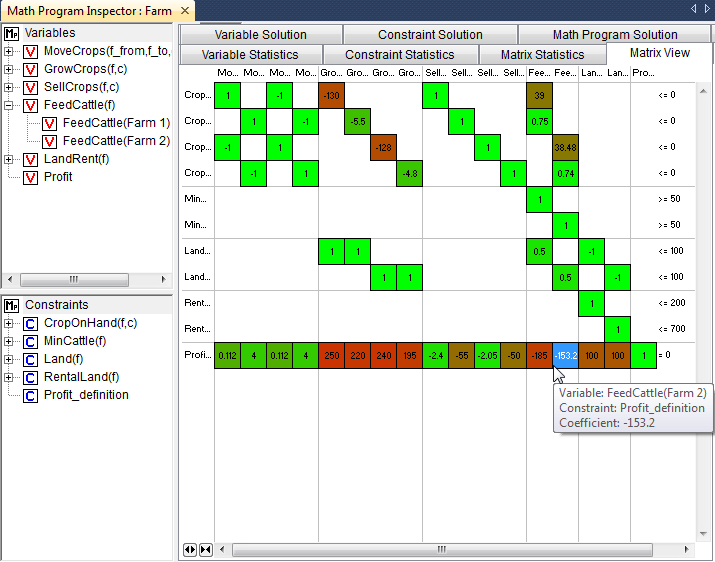

Functional overview
===================

.. rubric:: This section

In this section you will find a description of the functionality
available in the mathematical program inspector. Successively, you will
learn

-  the basics of the trees and windows available in the mathematical
   program inspector,

-  how you can manipulate the contents of the variable and constraint
   trees through variable and constraint properties, but also using the
   **Identifier Selector** tool,

-  how to inspect the contents and properties of the matrix and solution
   corresponding to your mathematical program, and

-  which analysis you can perform using the mathematical program
   inspector when your mathematical program is infeasible.

Tree View Basics
~~~~~~~~~~~~~~~~

.. rubric:: Viewing generated variables and constraints

The math program inspector window displays the set of all generated
variables and all generated constraints, each in a separate tree (see
the left portion of :numref:`fig:MPI-vartab-new`).

In these trees, the symbolic identifiers are the first-level nodes and
on every subsequent level in the tree, one or more indices are fixed. As
a result, the individual variables and constraints in your model appear
as leaf nodes in the two tree view windows.

.. figure:: MPI-vartab-new.png
   :name: fig:MPI-vartab-new

   The math program inspector window

.. rubric:: Tree view selections

The math program inspector contains several tabs (see the right portion
of :numref:`fig:MPI-vartab-new`) that retrieve information regarding the
selection that has been made in the tree views. Common Windows controls
are available to select a subset of variables and constraints (mouse
click possibly in combination with the or key). Whenever you select a
slice (i.e. an intermediate node in the tree) all variables or
constraints in that subtree are selected implicitly. You can use the
**Next Leaf Node** and **Previous Leaf Node** buttons in the toolbar for
navigational purposes. In :numref:`fig:MPI-vartab-new` a single variable has
been selected in the variable tree. In addition, the text on most tabs
can by copied to the Windows clipboard using the familiar **Ctrl-C**
shortcut key.

.. rubric:: Bookmarks

Bookmarks allow you to temporarily tag one or more variables or
constraints. While navigating through the tree you will always change
the current selection, while the bookmarked nodes will not be affected.
Whenever you bookmark a node, all its child nodes plus parent nodes are
also bookmarked. Using the **Bookmarks** menu you can easily select all
bookmarked nodes or bookmark all selected nodes. Bookmarks appear in
blue text. :numref:`fig:MPI-vartab-new` contains a constraint tree with
three bookmarked constraints plus their three parent nodes. You can use
the **Next Bookmark** and **Previous Bookmark** buttons in the toolbar
for navigational purposes. In case your :numref:`fig:MPI-vartab-new` is not
displayed in color, the light-gray print indicates the bookmarked
selection.

.. rubric:: Domain index display order

By default only one index is fixed at every level of the tree views, and
the indices are fixed from the left to the right. However, you can
override the default index order as well as the subtree depth by using
the **Variable Property** or **Constraint Property** dialog on the
first-level nodes in the tree. The subtree depth is determined by the
number of distinct index groups that you have specified in the dialog.

.. rubric:: Finding associated variables/ constraints

The linkage between variables and constraints in your model is
determined through the individual matrix coefficients. To find all
variables that play a role in a particular constraint selection, you can
use the **Associated Variables** command to bookmark the corresponding
variables. Similarly, the **Associated Constraints** command can be used
to find all constraints that play a role in a particular variable
selection. In :numref:`fig:MPI-vartab-new`, the associated constraint
selection for the selected variable has been bookmarked in the
constraint tree.

Advanced Tree Manipulation
~~~~~~~~~~~~~~~~~~~~~~~~~~

.. rubric:: Variable and constraint properties

Using the right-mouse popup menu you can access the **Variable
Properties** and **Constraint Properties**. On the dialog box you can
specify

-  the domain index display order (already discussed above), and

-  the role of the selected symbolic variable or constraint during
   infeasibility and unboundedness analysis.

.. rubric:: Variable and constraint statistics

The math program inspector tool has two tabs to retrieve statistics on
the current variable and constraint selection. In case the selection
consists of a single variable or constraint, all coefficients in the
corresponding column or row are also listed. You can easily access the
variable and constraint statistics tabs by double-clicking in the
variable or constraint tree. :numref:`fig:MPI-vartab-new` shows the variable
statistics for the selected variable.

.. rubric:: Popup menu commands

In addition to **Variable Properties** and **Constraint Properties**,
you can use the right-mouse popup menu to

-  open the attribute form containing the declaration of an identifier,

-  open a data page displaying the data of the selected slice,

-  make a variable or constraint at the first level of the tree inactive
   (i.e. to exclude the variable or constraint from the generated matrix
   during a re-solve), and

-  bookmark or remove the bookmark of nodes in the selected slice.

.. rubric:: Interaction with identifier selector

Using the identifier selector you can make sophisticated selections in
the variable and/or constraint tree. Several new selector types have
been introduced to help you investigate your mathematical program. These
new selector types are as follows.

element-dependency selector
   The element-dependency selector allows you to select all individual
   variables or constraints for which one of the indices has been fixed
   to a certain element.

scale selector
   The scale selector allows you to find individual rows or columns in
   the generated matrix that may be badly scaled. The selection
   coefficient for a row or column introduced for this purpose has been
   defined as

   .. math::

      \frac{\text{largest absolute (nonzero) coefficient}}
           {\text{smallest absolute (nonzero) coefficient}}.

   The **Properties** dialog associated with the scale selector offers
   you several possibilities to control the determination of the above
   selection coefficient.

status selector
   Using the status selector you can quickly select all variables or
   constraints that are either basic, feasible or at bound.

value selector
   The value selector allows you to select all variables or constraints
   for which the value (or marginal value) satisfies some simple
   numerical condition.

type selector
   With the type selector you can easily filter on variable type
   (e.g. continuous, binary, nonnegative) or constraint type
   (e.g. less-than- or-equal, equal, greater-than-or-equal). In
   addition, you can use the type selector to filter on nonlinear
   constraints.

Inspecting Matrix Information
~~~~~~~~~~~~~~~~~~~~~~~~~~~~~

.. rubric:: Variable Statistics tab

Most of the statistics that are displayed on the Variable Statistics tab
are self-explanatory. Only two cases need additional explanation. In
case a single symbolic (first-level node) has been selected, the *Index
domain density* statistic will display the number of actually generated
variables or constraints as a percentage of the full domain (i.e. the
domain without any domain condition applied). In case a single variable
(a leaf node) has been selected, the statistics will be extended with
some specific information about the variable such as bound values and
solution values.

.. rubric:: Column coefficients

In case a single variable :math:`x_j` has been selected, the lower part
of the information retrieved through the Variable Statistics tab will
contain a list with all coefficients :math:`a_{ij}` of the corresponding
rows :math:`i`, together with the appropriate shadow prices :math:`y_i`
(see :numref:`fig:MPI-vartab-new`). The last column of this table will
contain the dual contributions :math:`a_{ij} y_j` that in case of a
linear model together with the objective function coefficient
:math:`c_j` make up the reduced cost :math:`\bar{c}_j` according to the
following formula.

.. math:: \bar{c}_j = c_j - \sum_i a_{ij} y_i

.. rubric:: Nonlinear coefficients

Coefficients of variables that appear in nonlinear terms in your model
are denoted between square brackets. These numbers represent the
linearized coefficients for the current solution values.

.. rubric:: Constraint Statistics tab

The Constraints Statistics tab and the Variable Statistics tab retrieve
similar statistics. :numref:`fig:MPI-contab-new` shows the constraint statistic
for the selection consisting of a single constraint. Note that in this
particular case the symbolic form of the constraint definition will also
be displayed. In case the selected constraint is nonlinear, the
individual nonlinear constraint as generated by AIMMS and communicated
to the solver is also displayed.

.. figure:: MPI-contab-new.png
   :name: fig:MPI-contab-new

   The math program inspector window

.. rubric:: Row coefficients

In case a single row :math:`i` has been selected, the lower part of the
Constraint Statistics tab will contain all coefficients :math:`a_{ij}`
in the corresponding columns :math:`j`, together with their level values
:math:`x_j`. The last column of this table lists the primal
contributions :math:`a_{ij} x_j` that together in case of a linear model
with the right-hand-side make up either the slack or surplus that is
associated with the constraint according to the following formula.

.. math:: \mathrm{slack}_i - \mathrm{surplus}_i = \mathrm{rhs}_i - \sum_j a_{ij} x_j

.. rubric:: Nonlinear constraints

As is the case on the Variable Statistics Tab, all coefficients
corresponding to nonlinear terms are denoted between square brackets.
For these coefficients, the last column displays all terms that
contribute to the linearized coefficient value.

.. rubric:: Matrix Statistics tab

The Matrix Statistics tabs retrieves information that reflects both the
selection in the variable tree and the selection in the constraint tree.
Among these statistics are several statistical moments that might help
you to locate data outliers (in terms of size) in a particular part of
the matrix.

.. rubric:: Matrix View tab

The Matrix View tab contains a graphical representation of the generated
matrix. This view is available in two modes that are accessible through
the right-mouse popup menu. The symbolic block view displays at most one
block for every combination of symbolic variables and symbolic
constraints. The individual block view allows you to zoom in on the
symbolic view and displays a block for every nonzero coefficient in the
matrix. It is interesting to note that the order in which the symbolic
and individual variables and constraints are displayed in the block view
follows the order in which they appear in the trees.

.. rubric:: Block coloring

The colors of the displayed blocks correspond to the value of the
coefficient. The colors will vary between green and red indicating small
and large values. Any number with absolute value equal to one will be
colored green. Any number for which the absolute value of the logarithm
of the absolute value exceeds the logarithm of some threshold value will
be colored red. By default, the threshold is set to 1000, meaning that
all nonzeros :math:`x \in (- \infty,-1000] \;\cup\; [-
\frac{1}{1000},\frac{1}{1000}] \;\cup\; [1000,\infty)` will be colored
red. All numbers in between will be colored with a gradient color in the
spectrum between green and red.

.. rubric:: Block patterns

Any block that contains at least one nonlinear term will show a hatch
pattern showing diagonal lines that run from the upper left to the lower
right of the block.

   The matrix view (individual mode)

.. rubric:: AIMMS option

The value of the threshold mentioned in the previous paragraph is
available as an AIMMS option with name ``bad_scaling_threshold`` and can
be found in the **Project** - **Math program inspector** category in the
**AIMMS Options** dialog box.

.. rubric:: Block tooltips

While holding the mouse inside a block, a tooltip will appear displaying
the corresponding variables and constraints. In the symbolic view the
tooltip will also contain the number of nonzeros that appear in the
selected block. In the individual view the actual value of the
corresponding coefficient is displayed.

.. rubric:: Block view features

Having selected a block in the block view you can use the right-mouse
popup menu to synchronize the trees with the selected block. As a
result, the current bookmarks will be erased and the corresponding
selection in the trees will be bookmarked. Double-clicking on a block in
symbolic mode will zoom in and display the selected block in individual
mode. Double-clicking on a block in individual mode will center the
display around the mouse.

.. rubric:: Block coefficient editing

When viewing the matrix in individual mode, *linear* coefficient values
can be changed by pressing the **F2** key, or single clicking on the
block containing the coefficient to be changed.

Inspecting Solution Information
~~~~~~~~~~~~~~~~~~~~~~~~~~~~~~~

.. rubric:: Solution tabs

The tabs discussed so far are available as long as the math program has
been generated. As soon as a solution is available, the next three tabs
reveal more details about this solution.

.. rubric:: Variable Solution tab

The Variable Solution tab shows the following seven columns

-  Variable Name,

-  Lower Bound,

-  Value (i.e. solution/level value),

-  Upper Bound,

-  Marginal (i.e. reduced cost),

-  Basis (i.e. *Basic*, *Nonbasic* or *Superbasic*), and

-  Bound (i.e. *At bound* or *In between bounds*).

.. figure:: MPI-solution-new.png
   :name: fig:MPI-solution-new

   The variable solution

By clicking in the header of a column you can sort the table according
to that specific column.

.. rubric:: Constraint Solution tab

A similar view is available for the constraints in your mathematical
program. The Constraint Solution tab contains the following five columns

-  Constraint Name,

-  Value (i.e. solution),

-  Marginal (i.e. shadow price),

-  Basis (i.e. *Basic*, *Nonbasic* or *Superbasic*), and

-  Bound (i.e. *Binding* or *Nonbinding*).

.. rubric:: Solution related AIMMS options

By default AIMMS will only store marginal solution values if explicitly
specified in the **Property** attribute (through the *ReducedCost* or
*ShadowPrice* property). An more convenient way to ensure that all
marginal solution information is available to the math program inspector
is by setting the option ``Store_complete_solver_solution_tree`` to
*yes*. When the nonlinear presolver has been activated (by setting the
``Nonlinear_presolve`` option (in the ``Solvers General`` category) to
*on*), the option ``Store_nonlinear_presolve_info`` has to be set *yes*
to make sure that the math program inspector is able to display
information about the reductions that have been achieved by the
nonlinear presolver.

.. rubric:: Math Program Solution tab

The Math Program Solution tab retrieves solution information about the
mathematical program that has been solved. This information is similar
to that in the AIMMS **Progress** window.

.. rubric:: Logging messages

The lower part of the information retrieved by this tab is used to
display logging messages resulting from the **Bound Analysis** and
**Unreferenced Identifiers** commands in the **Actions** menu.

.. rubric:: Solving MIP models

Whenever your linear model is a mixed-integer model, the solver will
most probably use a tree search algorithm to solve your problem. During
the tree search the algorithm will encounter one or more solutions if
the model is integer feasible. Once the search is completed, the optimal
solution has been found.

.. rubric:: MIP Search Tree tab

With the MIP Search Tree tab you can retrieve branching information
about the search tree. Only CPLEX and GUROBI provide this information.
In addition the option ``Show_branch_and_bound_tree`` has to be set to
*on* (before the solve) to instruct AIMMS to store search tree
information during the solve.

.. rubric:: Improving the search process

The size and shape of the search tree might give you some indication
that you could improve the performance of the solver by tuning one or
more solver options. Consider the case in which the search tree
algorithm spends a considerable amount of time in parts of the tree that
do not seem interesting in retrospect. You might consider to use
priorities or another branching rule, in an attempt to direct the search
algorithm to a different part of the tree in an earlier stage of the
algorithm.

.. rubric:: Controlling search tree memory usage

Because all structural and statistical information is kept in memory,
displaying the MIP search tree for large MIPs might not be a good idea.
Therefore, you are able to control to the and size of the stored search
tree through the option ``Maximum_number_of_nodes_in_tree``.

.. rubric:: Search tree display

For every node several solution statistics are available. They are the
sequence number, the branch type, the branching variable, the value of
the LP relaxation, and the value of the incumbent solution when the node
was evaluated. To help you locate the integer solutions in the tree,
integer nodes and their parent nodes are displayed in blue.

.. rubric:: Incumbent progress

The lower part of the MIP Search Tree tab retrieves all incumbent
solutions that have been found during the search algorithm. From this
view you are able to conclude for example how much time the algorithm
spend before finding the optimal solution, and how much time it took to
proof optimality.

Performing Analysis to Find Causes of Problems
~~~~~~~~~~~~~~~~~~~~~~~~~~~~~~~~~~~~~~~~~~~~~~

.. rubric:: Unreferenced identifiers

One of the causes of a faulty model may be that you forgot to include
one or more variables or constraints in the specification of your
mathematical model. The math program inspector helps you in identifying
some typical omissions. By choosing the **Unreferenced Identifiers**
command (from the **Actions** menu) AIMMS helps you to identify

-  constraints that are not included in the constraint set of your math
   program while they contain a reference to one of the variables in the
   variable set,

-  variables that are not included in the variable set of your math
   program while a reference to these variables does exist in some of
   the constraints, and

-  defined variables that are not included in the constraint set of your
   math program.

The results of this action are visible through the Math program solution
tab.

.. rubric:: A priori bound analysis

In some situations it is possible to determine that a math program is
infeasible or that some of the constraints are redundant even before the
math program is solved. The bound analysis below supports such
investigation.

.. rubric:: Implied constraint bounds

For each linear constraint with a left-hand side of the form

.. math:: \sum_j a_{ij} x_j

the minimum level value :math:`\underline{b_i}` and maximum level value
:math:`\overline{b_i}` can be computed by using the bounds on the
variables as follows.

.. math::

   \begin{aligned}
      \underline{b_i} & = & \sum_{j|a_{ij}>0} a_{ij} \underline{x_j} + \sum_{j|a_{ij}<0} a_{ij} \overline{x_j} \\
      \overline{b_i}  & = & \sum_{j|a_{ij}>0} a_{ij} \overline{x_j}  + \sum_{j|a_{ij}<0} a_{ij} \underline{x_j}\end{aligned}

.. rubric:: Performing bound analysis

By choosing the **Bound Analysis** command (from the **Actions** menu)
the above implied bounds are used not only to detect infeasibilities and
redundancies, but also to tighten actual right-hand-sides of the
constraints. The results of this analysis can be inspected through the
Math Program Solution tab. This same command is also used to perform the
variable bound analysis described below.

.. rubric:: Implied variable bounds :math:`\ldots`

Once one or more constraints can be tightened, it is worthwhile to check
whether the variable bounds can be improved. An efficient approach to
compute implied variable bounds has been proposed by Gondzio :cite:`bib:Go94`,
and is presented without derivation in the next two paragraphs.

.. rubric:: :math:`\ldots` for :math:`\leq` constraints

For :math:`i` in the set of constraints of the form
:math:`\sum_j a_{ij} x_j \leq b_i`, the variable bounds can be tightened
as follows.

.. math::

   x_k & \leq \underline{x_k} + \min_{ i | a_{ik} > 0} \frac{b_i - \underline{b_i}}{a_{ik}} \\
      x_k & \geq \overline{x_k}  + \max_{ i | a_{ik} < 0} \frac{b_i - \underline{b_i}}{a_{ik}}

.. rubric:: :math:`\ldots` and :math:`\geq` constraints

For :math:`i` in the set of constraints of the form
:math:`\sum_j a_{ij} x_j \geq b_i`, the variable bounds can be tightened
as follows.

.. math::

   
   x_k & \leq \underline{x_k} + \min_{ i | a_{ik} < 0} \frac{b_i - \overline{b_i}}{a_{ik}} \\
      x_k & \geq \overline{x_k}  + \max_{ i | a_{ik} > 0} \frac{b_i - \overline{b_i}}{a_{ik}}
   

.. rubric:: Phase 1 analysis

In case infeasibility cannot be determined a priori (e.g. using the
bound analysis described above), the solver will conclude infeasibility
during the solution process and return a phase 1 solution. Inspecting
the phase 1 solution might indicate some causes of the infeasibility.

.. rubric:: Currently infeasible constraints

The collection of currently infeasible constraints are determined by
evaluating all constraints in the model using the solution that has been
returned by the solver. The currently infeasible constraints will be
bookmarked in the constraint tree after choosing the **Infeasible
Constraints** command from the **Actions** menu.

.. rubric:: Substructure causing infeasibility

To find that part of the model that is responsible for the
infeasibility, the use of slack variables is proposed. By default, the
math program inspector will add slacks to all variable and constraint
bounds with the exception of

-  variables that have a definition,

-  zero variable bounds, and

-  bounds on binary variables.

.. rubric:: Adapting the use of slack variables

The last two exceptions in the above list usually refer to bounds that
cannot be relaxed with a meaningful interpretation. However these two
exceptions can be overruled at the symbolic level through the Analysis
Configuration tab of the **Properties** dialog. These properties can be
specified for each node at the first level in the tree. Of course, by
not allowing slack variables on all variable and constraint bounds in
the model, it is still possible that the infeasibility will not be
resolved.

.. rubric:: Slack on variable bounds

Note that to add slacks to variable bounds, the original simple bounds
are removed and (ranged) constraints are added to the problem
definition.

.. math:: \underline{x_j} \leq x_j + s^+_j - s^-_j \leq \overline{x_j}

.. rubric:: Elastic model

After adding slack variables as described above, this adapted version of
the model is referred to as the elastic model.

.. rubric:: Minimizing feasibility violations

When looking for the substructure that causes infeasibility, the sum of
all slack variables is minimized. All variables and constraints that
have positive slack in the optimal solution of this elastic model, form
the substructure causing the infeasibility. This substructure will be
bookmarked in the variable and constraint tree.

.. rubric:: Irreducible Inconsistent System (IIS)

Another possibility to investigate infeasibility is to focus on a
so-called *irreducible inconsistent system* (IIS). An IIS is a subset of
all constraints and variable bounds that contains an infeasibility. As
soon as at least one of the constraints or variable bounds in the IIS is
removed, that particular infeasibility is resolved.

.. rubric:: Finding an IIS

Several algorithms exist to find an *irreducible inconsistent system*
(IIS) in an infeasible math program. The algorithm that is used by the
AIMMS math program inspector, if the option ``Use_IIS_from_solver`` is
disabled, is discussed in Chinneck (:cite:`bib:Ch91`). Note that since this
algorithm only applies to linear models, the menu action to find an IIS
is not available for nonlinear models. While executing the algorithm,
the math program inspector

#. solves an elastic model,

#. initializes the IIS to all variables and constraints, and then

#. applies a combination of *sensitivity* and *deletion* filters.

.. rubric:: Deletion filtering

Deletion filtering loops over all constraints and checks for every
constraint whether removing this constraint also solves the
infeasibility. If so, the constraint contributes to the infeasibility
and is part of the IIS. Otherwise, the constraint is not part of the
IIS. The deletion filtering algorithm is quite expensive, because it
requires a model to be solved for every constraint in the model.

.. rubric:: Sensitivity filtering

The sensitivity filter provides a way to quickly eliminate several
constraints and variables from the IIS by a simple scan of the solution
of the elastic model. Any nonbasic constraint or variable with zero
shadow price or reduced cost can be eliminated since they do not
contribute to the objective, i.e. the infeasibility. However, the
leftover set of variables and constraint is not guaranteed to be an IIS
and deletion filtering is still required.

.. rubric:: Combined filtering

The filter implemented in the math program inspector combines the
deletion and sensitivity filter in the following way. During the
application of a deletion filter, a sensitivity filter is applied in the
case the model with one constraint removed is infeasible. By using the
sensitivity filter, the number of iterations in the deletion filter is
reduced.

.. rubric:: Substructure causing unboundedness

When the underlying math program is not infeasible but unbounded
instead, the math program inspector follows a straightforward procedure.
First, all infinite variable bounds are replaced by a big constant
:math:`M`. Then the resulting model is solved, and all variables that
are equal to this big :math:`M` are bookmarked as being the
*substructure causing unboundedness*. In addition, all variables that
have an extremely large value (compared to the expected order of
magnitude) are also bookmarked. Any constraint that contains at least
two of the bookmarked variables will also be bookmarked.

.. rubric:: Options

When trying to determine the cause of an infeasibility or unboundedness,
you can tune the underlying algorithms through the following options.

-  In case infeasibility is encountered in the presolve phase of the
   algorithm, you are advised to turn off the presolver. When the
   presolver is disabled, solution information for the phase 1 model is
   passed to the math program inspector.

-  During determination of the substructure causing unboundedness or
   infeasibility and during determination of an IIS, the original
   problem is pertubated. After the substructure or IIS has been found,
   AIMMS will restore the original problem. By default, however, the
   solution that is displayed is the solution of the (last) pertubated
   problem. Using the option
   ``Restore_original_solution_after_analysis`` you can force a resolve
   after the analysis has been carried out.

-  Solvers like CPLEX and GUROBI have their own algorithm to calculate
   an IIS. If the option ``Use_IIS_from_solver`` is switched on, its
   default setting, then AIMMS will retrieve an IIS calculated by the
   solver. If this option is switched off then AIMMS will use its own
   algorithm based on Chinneck (:cite:`bib:Ch91`), as described above.

.. rubric:: Scaling

A coefficient matrix is considered badly scaled if its nonzero
coefficients are of different magnitudes. Scaling is an operation in
which the variables and constraints in the model are multiplied by
positive numbers resulting in a matrix containing nonzero
coefficients of similar magnitude. Scaling is used prior to solving a
model for several reasons, the most important being (1) to improve
the numerical behavior of the solver and (2) to reduce the number of
iterations required to solve the model.

.. rubric:: Scale model

Solvers like CPLEX and GUROBI use their own algorithms to scale a
model but in some cases it might be beneficial to use a different
scaling algorithm that uses symbolic information. The scaling tool in
the math program inspector can be used to find scaling factors for
all symbolic variables and constraints in the model by selecting the
**Scale Model** command from the **Actions** menu. The scaling
factors will be displayed in the Scaling Factors tab. Once the
scaling tool is finished you can select the **Resolve** command from
the **Actions** menu to resolve the model which then automatically
uses these scaling factors. However, to use the scaling factors in
your AIMMS model you have to manually update the **Unit** attribute
of the corresponding variables and constraints.