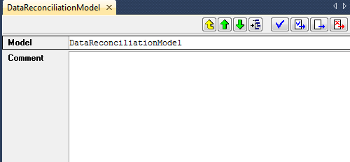
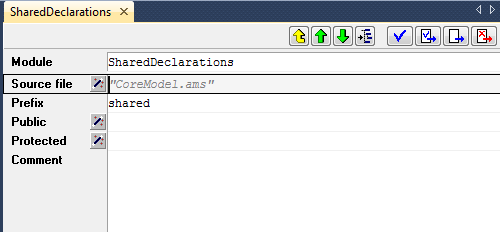
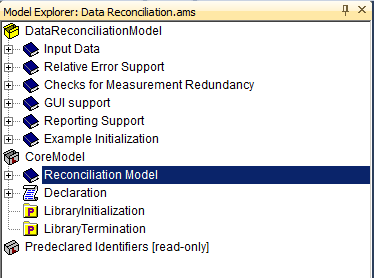

.. _sec:model.manage:

Creating and managing models
============================

.. rubric:: Creating new models

When you begin a new model, AIMMS will automatically create a skeleton
model tree suitable for small applications and student assignments. Such
a skeleton contains the following nodes:

-  a single *declaration section* where you can store the declarations
   used in your model,

-  the predefined procedures ``MainInitialization`` and
   ``PostMainInitialization`` which are called directly after compiling
   your model and can be used to initialize your model,

-  the predefined procedure ``MainExecution`` where you can put all the
   statements necessary to execute the algorithmic part of your
   application, and

-  the predefined procedures ``PreMainTermination`` and
   ``MainTermination`` which are called just prior to closing the
   project.

The model tree also displays the predefined and read-only library module
``Predeclared Identifiers`` (see also :ref:`sec:model.intro`), which
contains all the identifiers predeclared by AIMMS, categorized by
function.

.. rubric:: Changing the skeleton

Whenever the number of declarations in your model becomes too large to
be easily managed within a single declaration section, or whenever you
want to divide the execution associated with your application into
several procedures, you are free (and advised) to change the skeleton
model tree created by AIMMS. You can group particular declarations into
separate declaration sections with meaningful names, and introduce your
own procedures and functions. You may even decide to remove one or more
of the skeleton nodes that are not of use in your application.

.. rubric:: Additional structuring of your model

When you feel that particular groups of declarations, procedures and
functions belong together in a logical manner, you are encouraged to
create a new structuring section with a descriptive name within the
model tree, and store the associated model components within it. When
your application grows in size, a clear hierarchical structure of all
the information stored will help you tremendously in finding your way
within your application.

.. rubric:: Storage on disk

The contents of a model are stored in one or more files with the
"``.ams``" (**m**\ odel **s**\ ource) extension. By default the entire
model is stored as a single file, but for each book section node
|section| or module node |module-icon| in the tree you can indicate that
you want to store the subtree below it in a separate source file. This
is especially useful when particular parts of your application are
shared with other AIMMS applications, or are developed by other persons.
Library modules |library-icon| associated with a library project that you
have included in your project, are always stored in a separate ``.ams``
file.

.. rubric:: Separate storage

To store a module or section of your model in a separate source file,
open the attribute form of that section node by double-clicking on it in
the model explorer. The attribute form of a section is illustrated in
:numref:`fig:model.section`.

By selecting the **Write...** command of the ``SourceFile`` attribute
wizard |wizard| on this form, you can select a file where you want
all information under the section node to be stored. AIMMS will export
the contents of the book section to the indicated file, and enter that
file name in the ``SourceFile`` attribute of the book section. As a
consequence, AIMMS will automatically read the contents of the book
section from that file during every subsequent session.

   
   Attribute form of a section node

.. rubric:: Exporting a book section

Alternatively, when you are in the **Model Explorer** on the book
section node that you want to store in a separate file, you can use the
**Edit-Export** menu, to export the contents of the selected section to
a separate ``.ams`` file. In the latter case, AIMMS will only export a
*copy* of the contents of the selected section to the specified ``.ams``
file, while the original contents is still stored in the main ``.ams``
model file.

.. rubric:: Adding a book section reference

Likewise, if you want a book section to hold the contents of a section
stored in a separate ``.ams`` file, you can use the **Read...** command
of the **SourceFile** wizard |wizard|. This will let you select an
``.ams`` file which will be entered in the ``SourceFile`` attribute. As
a consequence, the contents of this file will be included into the
section during this and any subsequent sessions. Note that any previous
contents of a section at the time of entering the ``SourceFile``
attribute will be lost completely. By specifying a ``SourceFile``
attribute, any changes that you make to the contents of the section
after adding a ``SourceFile`` attribute will be automatically saved in
the corresponding ``.ams``, whenever you save your model.

.. rubric:: Importing a book section

Alternatively, you can import a copy of the contents of a separate
``.ams`` file into your model, by executing the **Edit-Import** menu
command on a selected section node in the **Model Explorer**. This will
completely replace the current contents of the section with the contents
of the ``.ams`` file. In this case, however, any changes that you make
to the section after importing the ``.ams`` file will not be stored in
that file, but only in your main model file.

.. _sec:modeltree.manage.module:

Working with Modules and Libraries
~~~~~~~~~~~~~~~~~~~~~~~~~~~~~~~~~~

.. rubric:: Name clashes

When you import the contents of a book section node into your model, you
may find that particular identifier names in that book section already
have been declared in the remainder of your model. If such a name clash
occurs, AIMMS will refuse to import the specified ``.ams`` file into
your model, and present a dialog box indicating which identifiers would
cause a name clash when imported.

.. rubric:: Avoid name clashes using modules

You can avoid name clashes by using *modules*, which provide their own
namespace. Modules allow you to share sections of model source between
multiple models, without the risk of running into name clashes. The
precise semantics of modules are discussed in full detail in
:ref:`lr:chap:module` of the Language Reference.

.. rubric:: Creating modules

You can create a module anywhere in your model tree by inserting a
*Module* node |module-icon| into your tree, as discussed in
:ref:`sec:model.trees`. For each module you must specify a module prefix
through which you can access the identifiers stored in the module.
:numref:`fig:modeltree.module-attr` illustrates the attributes of a
module.

If this module contains a parameter ``GlobalSettings``, then outside of
the module it can be referenced as ``shared::GlobalSettings``.

   The attributes of a Module node

.. rubric:: AIMMS system modules

AIMMS uses modules to implement those parts of its functionality that
can be best expressed in the AIMMS language itself. The available AIMMS
system modules include

-  a (customizable) implementation of the outer approximation algorithm,

-  a scenario generation module for stochastic programming, and

-  sets of constants used in the graphical 2D- and 3D-chart objects.

You can include these system modules into your model through the
**Settings-Install System Module...** menu.

.. rubric:: Library projects ...

If your model becomes too large for a single developer to maintain and
develop, you may use *library projects* to create a division of your
existing project into sub-projects. The procedure for creating such
library projects is discussed in :ref:`sec:proj-organization.manager`.
For each library included in your project, AIMMS creates a separate
library module node at the root the **Model Explorer**, as illustrated
in :numref:`fig:modeltree.library`.

When creating a new library the associated library module will initially
be empty. In the library module of :numref:`fig:modeltree.library`, one
section from the original model tree in :numref:`fig:modeltree.tree` has
already been moved into the newly created library.

   A library module containing the core model formulation

.. rubric:: ...for modular development

Contrary to modules, whose principle aim is to let you share a common
set of identifier and procedure declarations among multiple models,
library projects allow you to truly divide an AIMMS project into
subprojects. With every library project you cannot only associate a
module in the model tree, but AIMMS lets you also develop pages and
menus for the graphical user interface within a library project. Within
an AIMMS project that includes such a library project, you can use the
model, pages and menus to compose the entire application in a modular
way.

.. rubric:: Moving identifiers to modules and libraries

When you move identifiers from the main model to a module or a library
module, references to such identifiers in the main model may become
invalid because because they become part of a different namespace. In
accordance with the automatic name change support described in
:ref:`sec:decl.attr.navigate`, AIMMS will automatically change all
references to the identifier in the model source, project pages, and
case files to include the module prefix, unless the reference is
included in the module or library itself. In occasional situations,
however, the automatic name change support of AIMMS may fail to detect
such references, for instance, when an identifier name is included in a
data initialization statement of a subset of :any:`AllIdentifiers`.

.. rubric:: Library initialization and termination

Each library may provide four procedures *LibraryInitialization*,
*PostLibraryInitialization*, *PreLibraryTermination* and
*LibraryTermination*. If you specify these procedures, they should
contain all statements necessary to properly initialize the data
associated with a library prior to it first use, and provide the library
with a possibility to save its internal state prior to closing a
project. The exact initialization and termination sequence of AIMMS
models is discussed in :ref:`lr:sec:data.init` of the Language Reference.

.. |wizard| image:: wizard.png

.. |library-icon| image:: library-icon.png

.. |section| image:: section.png
