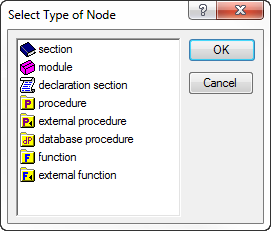

.. _sec:model.trees:

Working with trees
==================

.. rubric:: Working with trees

The trees used in the various developer tools inside AIMMS offer very
similar functionality to the directory tree in the Windows Explorer.
Therefore, if you are used to working with the Windows Explorer, you
should have little difficulty understanding the basic functionality
offered by the trees in the AIMMS tools. For novice users, as well as
for advanced users who want to understand the differences to the Windows
Explorer, this section explains the fine details of working with trees
in AIMMS, using the context of the model tree.

.. rubric:: Expanding and collapsing branches

Branches in a tree (i.e. intermediate nodes with subnodes) have a small
expansion box in front of them containing either a plus or a minus sign.
Collapsed branches have a plus sign +,, and can be expanded one level by
a single click on the plus sign (to show *more* information). Expanded
branches have a minus sign -, and can be collapsed by a single click on
the minus sign (to show *less* information). Alternatively, a node can
be expanded or collapsed by double clicking on its icon. Leaf nodes have
no associated expansion box.

.. rubric:: Double-clicking a node

When you double-click (or press **Enter**) on the name of any node in a
tree, AIMMS will invoke the most commonly used menu command that is
specific for each tree.

-  In the **Model Explorer**, the double-click is identical to the
   **Edit-Attributes** menu, which opens the attribute window for the
   selected node.

-  In the **Identifier Selector**, the double-click is identical to the
   **Edit-Open With** menu, which opens a view window to simultaneously
   display the contents of the selection.

-  In the **Page** and **Template Manager**, the double-click is
   identical to the **Edit-Open** menu, which opens the page or
   template.

-  In the **Menu Builder**, the double-click is identical to the
   **Edit-Properties** menu, which opens the appropriate **Properties**
   dialog box.

Alternatively, you can open the attribute form or **Properties** dialog
box of any node type using the **Properties** button |prop| on the
toolbar.

.. rubric:: Creating new nodes

To create a new node in the model tree you must position the cursor at
the node in the tree *after* which you want to insert a new node. You
can create a new node here:

-  by clicking on one of the node creation icons |nod-cre1| or
   |nod-cre2| on the toolbar

-  by selecting the item **Insert...** from the right-mouse menu, or

-  by pressing the **Ins** key on the keyboard.

The toolbar contains creation icons for the most common node types. You
can select the **New...** icon |new-unkn| to select further node types.

.. rubric:: Selecting a node type

Once you have clicked the **New...** icon |new-unkn| on the toolbar, or
selected the **Insert...** menu from the right-mouse menu, or have
pressed the **Ins** key, a dialog box as shown in
:numref:`fig:modeltree.id-type-select`

   Dialog box for selecting a node type

appears from which you have to select a node type. The dialog box shows
only those node types that are allowed at the particular position in the
tree. You can select a node type by a single mouse click, or by typing
in the first letter of the node type that you want to insert. When there
are more node types that begin with the same letter (as in
:numref:`fig:modeltree.id-type-select`), re-type that letter to
alternate over all possibilities.

.. rubric:: Naming the node

After you have selected a node type, it is inserted in the model tree,
and you have to enter a name for the new node. In the model tree, all
node names must consist only of alphanumeric characters and underscores,
and must start with a letter. In addition, the names of structuring
nodes may contain spaces. For most node types their node names have to
be unique throughout the model. The only, quite natural, exception are
declaration sections which accept either the predefined name
*Declaration* or a name unique throughout the model.

.. rubric:: Expanding branches without subnodes

When you want to add subnodes to a branch, you must first expand the
branch. If you do not do this, a new node will be inserted directly
after the branch, and not as a subnode. Expanding an empty branch will
result in an empty subtree being displayed. After expansion you can
insert a new node in the usual manner.

.. rubric:: Renaming existing nodes

You can rename a selected node by pressing the **F2** button, or single
clicking on the node name. After changing the name, press the **Enter**
key to action the change, or the **Esc** key to cancel. When the node is
an identifier declaration, a procedure, or a function which is used
elsewhere in the model (or displayed on a page in the graphical user
interface), AIMMS will, if asked, automatically update such references
to reflect the name change.

.. rubric:: Multiple selections

Unlike the Windows Explorer, AIMMS lets you make multiple selections
within a tree which you can delete, cut, copy and paste, or drag and
drop. The nodes in a selection do not even have to be within the same
branch. By left-clicking in combination with the **Ctrl** key you can
add or delete single nodes from the selection. By left-clicking in
combination with the **Shift** key you can add all nodes between the
current node and the last selected node.

.. rubric:: Deleting nodes and branches

You can delete all nodes in a selection by selecting **Delete** from the
right-mouse menu, or by pressing the **Del** key. When the selection
contains branch nodes, AIMMS will also delete all child nodes contained
in that branch.

.. rubric:: Cut, copy, paste and duplicate

With the **Cut**, and **Copy** and **Paste** items from the **Edit**
menu, or right-mouse menu, you can cut or copy the current selection
from the tree, and paste it elsewhere. In addition to the usual way of
pasting, which copies information from one position to another, AIMMS
also supports the **Paste as Duplicate** operation in the **Identifier
Selector**, the **Template Manager** and the **Menu Builder**. This form
of pasting makes no copy of the node but only stores a reference to it.
In this way changes in one node are also reflected in the other.

.. rubric:: Drag and drop support

In addition to the cut, and copy and paste types of operation, you can
drag a node selection and drop it onto another position in the model
tree, or in any of the other tools offered by AIMMS. Thus you can, for
instance, easily move a declaration section to another position in the
model tree, or to an existing selection in the selection manager.

.. rubric:: Copying or moving with drag and drop

By pressing the **Shift** or **Ctrl** keys during a drag-and-drop
action, you can alter its default action. In combination with the
**Shift** key, AIMMS will *move* the selection to the new position,
while the **Ctrl** key will *copy* the selection to the new position.
With the **Shift** and **Control** key pressed simultaneously, you
activate the special *find* function explained in the next paragraph.
AIMMS will show the type of action that is performed when you drop the
selection by modifying the mouse pointer, or by displaying a stop sign
when a particular operation is not permitted.

.. rubric:: Searching for identifiers

AIMMS offers several tools for finding model-related information quickly
and easily.

-  When the attribute of an identifier, or the body of a procedure or
   function, contains a reference to another identifier within your
   application, you can pop up the attribute form of that identifier by
   simply clicking on the reference and selecting the **Attributes...**
   item from the right-mouse menu.

-  With the **Find...** item from the **Edit** menu (or the **Find**
   button |find| on the toolbar) you can search for all occurrences
   of an identifier in your entire model or in a particular branch. The
   **Find** function also offers the possibility of restricting the
   search to only particular node attributes.

-  The **Identifier Selector** offers an advanced tool for creating
   identifier selections on the basis of one or more dynamic criteria.
   You can subsequently select a view from the **View Manager** to
   display and/or change a subset of attributes of all identifiers in
   the selection simultaneously. Selections and views are discussed in
   full detail in :ref:`chap:view`.

-  By dragging a selection of identifiers onto any other tree while
   pressing the **Ctrl** and **Shift** key simultaneously, AIMMS will
   highlight those nodes in the tree onto which the selection is
   dropped, in which the identifiers in the selection play a role. This
   form of drag and drop support does not only work with identifier
   selections, but can be used with selections from any other tree as
   well. Thus, for instance, you can easily find the pages in which a
   particular identifier is used, or find all pages that use a
   particular end-user menu or toolbar.

.. |prop| image:: prop.png

.. |nod-cre1| image:: nod-cre1.png

.. |nod-cre2| image:: nod-cre2.png

