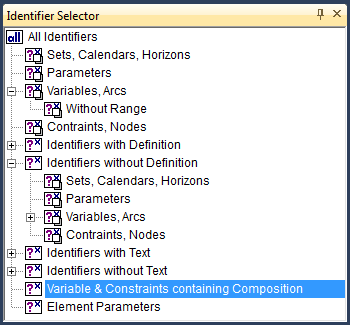
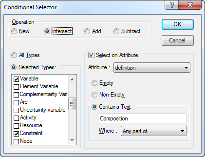

.. _sec:view.selection:

Creating identifier selections
==============================

.. rubric:: Select by similarity
   :name: identifier-selector

When you are developing or managing a large and complicated model, you
sometimes may need an overview of all identifiers that have some sort of
similarity. For example, it may be important to have a simultaneous view
of

-  all the constraints in a model,

-  all variables with a definition,

-  all parameters using a certain domain index, or

-  all identifiers that cover a specific part of your model.

.. rubric:: Identifier selections

In AIMMS, you can create a list of such identifiers using the
configurable **Identifier Selector** tool. This tool helps you to create
a selection of identifiers according to a set of one or more criteria of
varying natures. You can let AIMMS create a once only selection directly
in the **Model Explorer**, or create a compound selection in the
**Identifier Selector**, which allows you to intersect or unite multiple
selections.

.. rubric:: Creating once only selections

If you need a selection only once, then you can create it directly in
the **Model Explorer** by

-  either manually selecting one or more nodes in the tree, or

-  using the **View-Selection** menu to create a custom selection based
   on one or more of the conditional selection criteria offered by AIMMS
   (explained below).

In both cases, the resulting list of selected identifiers will be
highlighted in the model tree. If you like, you can narrow down or
extend the selection by applying one or more subsequent conditional
selections to the existing selection.

.. rubric:: The Identifier Selector

If you need a specific selection more than once, then you can create it
in the **Identifier Selector** tool. The **Identifier Selector**
consists of a tree in which each node contains one of the three types of
identifier selectors described below. :numref:`fig:view.sel-tree`
illustrates an example selector tree.

   The selector tree
   
.. rubric:: Selector types

In the **Identifier Selector** tool, you can add nodes corresponding to
several types of identifier selectors:

-  a *node-based selector* , where all the identifiers below one or more
   user-selected nodes in the model tree are added to the selection,

-  a *conditional selector* , where the list of identifiers is created
   dynamically on identifier type and/or the contents of one of their
   respective attributes,

-  a *set-dependent selector* , where the list of identifiers is created
   dynamically based on a specific set in either the domain or range of
   identifiers, or

-  a *type-based selector* , where the list of identifiers consists of
   all variables of a certain type (e.g. free, nonnegative, binary) or
   all constraints of a certain type (:math:`\leq`, :math:`=` or
   :math:`\geq`). This selector can only be used in combination with the
   Math Program Inspector.

While the above four selectors allow you to define selections based on a
symbolic criteria, the four types of identifier selectors below allow
you to specify selections based on individual criteria. The main purpose
of these selectors is to define selections that can be used in the Math
Program Inspector (see :ref:`chap:mpinspector`).

-  an *element-dependent selector* , where the list of individual
   identifiers is created dynamically based of the occurrence of one or
   more specific elements in the domain,

-  a *scale-based selector* , where the list of identifiers is built up
   from all variables and constraints for which the ratio between the
   largest absolute value and the smallest absolute value in the
   corresponding row or column of the matrix exceeds a given value,

-  a *status-based selector* , where the list of identifiers is built up
   from all variables and constraints for which the solution satisfies
   some property (e.g. feasible, basic, at bound), or

-  a *value-based selector* , where the list of identifiers is built up
   from all variables and constraints for which the level, bound,
   marginal, or bound violation value satisfy satisfy some property.

Through the **View-Selection** menu in the **Model Explorer** you can
only create a new, or refine an existing, selection using a *conditional
selector*.

.. rubric:: Selection dialog box

To create a selector, AIMMS offers special dialog boxes which let you
specify the criteria on which to select. As an example the dialog box
for creating a conditional selector is illustrated in
:numref:`fig:view.cond-sel`.

   The **Conditional Selector** dialog box

In it, you can select (by double clicking) one or more identifier types
that you want to be part of the selection and filter on specific
attributes that should be either empty, nonempty, or should contain a
particular string.

.. rubric:: Compound selections

The tree structure in the **Identifier Selector** defines combinations
of selectors by applying one of the set operators *union*, *difference*
or *intersection* with respect to the identifier selection represented
by the parent node. The root of the tree always consists of the fixed
selection of all model identifiers. For each subsequent child node you
have to indicate whether the node should add identifiers to the parent
selection, should remove identifiers from the parent selection, or
should consider the intersection of the identifiers associated with the
current and the parent selection. Thus, you can quickly compose
identifier selections that satisfy multiple selection criteria. The type
of set operation applied is indicated by the icon of each node in the
identifier selector.

.. rubric:: Refining model tree selections

In the **Model Explorer**, the *union*, *difference* and *intersection*
operations apply to the identifier selection that is currently
highlighted in the model tree. You can use them to add identifiers to
the current selection, to remove identifiers from the current selection,
or filter the current selection by means of an additional criterion.

.. rubric:: Using selections

The list of identifiers that results from a (compound) identifier
selector can be used in one of the following ways:

-  you can display the identifiers in a **View** window of your choice
   (explained in the next section),

-  you can restrict the set of variables and constraints initially
   displayed in the **Math Program Inspector** (see
   :ref:`chap:mpinspector`), or

-  by dragging and dropping a selector into the **Model Explorer**, the
   corresponding identifiers will be highlighted in the model tree.

.. rubric:: Advanced drag and drop

The drag-and-drop features of AIMMS make it very easy to fill a **View**
window with identifiers from either the model tree, the **Identifier
Selector** or other **View** windows. If you drag-and-drop a selection
into any other AIMMS window, AIMMS will interpret this as a special
search action to highlight all occurrences of the selected identifiers
as follows:

-  in the *model tree* all identifiers in the selection will be
   highlighted,

-  in the *page* or *template tree* all pages that contain reference to
   the identifiers in the selection will be highlighted,

-  in an end-user *page*, in edit mode, all objects that contain
   references to the identifiers will be selected, and

-  in the *menu builder tree*, AIMMS will highlight all menu items that
   reference one or more identifiers in the selection.

In addition, AIMMS also supports the 'drag-and-drop-search' action in a
**View** window by pressing both the **Shift** and **Control** key
during the drop operation.
