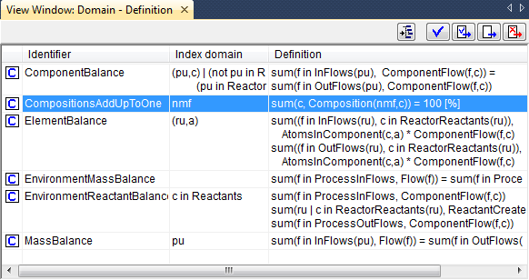
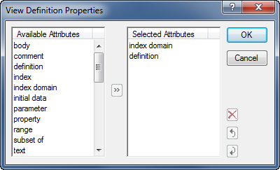

.. _sec:view.view:

Viewing identifier selections
=============================

.. rubric:: Overview of attributes
   :name: view-ident-select

After you have created an identifier selection, in either the **Model
Explorer** or in the **Identifier Selector**, you may want to compare or
simultaneously edit multiple attributes of the identifiers in the
selection. In general, sequential or simultaneous, opening of all the
corresponding single attribute forms is impractical or unacceptable for
such a task. To assist, AIMMS offers special identifier **View**
windows.

.. rubric:: Identifier views

A **View** window allows you to view one or more attributes
simultaneously for a number of identifiers. Such a **View** window is
presented in the form of a table, where each row represents a single
identifier and each column corresponds to a specific attribute. The
first column is always reserved for the identifier name. An example of
an identifier **View** window is given in :numref:`fig:view.view`.

   Example of a View window

.. rubric:: Editing in a View window

In addition to simply viewing the identifier content in a **View**
window, you can also use it to edit individual entries. To edit a
particular attribute of an identifier you can just click on the relevant
position in the **View** window and modify the attribute value. This can
be convenient, for instance, when you want to add descriptive text to
all identifiers for which no text has yet been provided, or when you
want to make consistent changes to units for a particular selection of
identifiers. As in a single attribute form, the changes that you make
are not committed in the model source until you use one of the special
compile buttons at the top right of the window (see also
:ref:`sec:decl.commit`).

.. rubric:: Opening a View window

Using the **Edit-Open with** menu, or the **Open with** item in the
right- mouse pop-up menu, you can open a particular **View** window for
any identifier selection in the model explorer or in the identifier
selector. Selecting the **Open with** menu will open the **View
Manager** dialog box as displayed in :numref:`fig:view.dialog`.

.. figure:: view-sel-new.png
   :alt: The **View Manager** dialog box
   :name: fig:view.dialog

   The **View Manager** dialog box

In the **View Manager** you must select one of the available *view
window definitions*, with which to view the given identifier selection.
For every new project, the **View Manager** will automatically contain a
number of basic view window definitions that can be used to display the
most common combinations of identifier attributes.

.. rubric:: Creating a view window definition

Using the **Add**, **Delete** and **Properties** buttons in the **View
Manager**, you can add or delete view window definitions to the list of
available definitions, or modify the contents of existing definitions.
For every view window definition that you add to the list or want to
modify, AIMMS will open the **View Definition Properties** dialog box as
illustrated in :numref:`fig:view.view-prop`.

   **View Definition Properties** dialog box

With this dialog box you can add or remove attributes from the list of
attributes that will be shown in the **View** window, or change the
order in which the particular attributes are shown.

.. rubric:: Changing the View window contents

After opening a **View** window, with the contents of a particular
identifier selection, you can add new identifiers to it by dragging and
dropping other identifier selections from either the **Model Explorer**
or the **Identifier Selector**. Using the **Edit-Delete** menu or the
**Del** key, on the other hand, you can delete any subselection of
identifiers from the **View** window. At any time you can save the
modified identifier selection as a new node in the identifier selector
tree through the **View-Selection-Save** menu.

.. rubric:: Selecting identifier groups

Besides selecting individual identifiers from the model tree, you can
also select whole groups of identifiers by selecting their parent node.
For example, if you drag-and-drop an entire declaration section into a
**View** window, all the identifiers contained in that section will be
added to the view.

.. rubric:: Specifying a default view

As can be seen at the bottom of the **View Manager** dialog box in
:numref:`fig:view.dialog`, it is possible to associate a default view
definition with every selector in the **Identifier Selector**. As a
consequence, whenever you double-click on such an identifier selector
node, AIMMS will immediately open a default **View** window with the
current contents of that selection.
