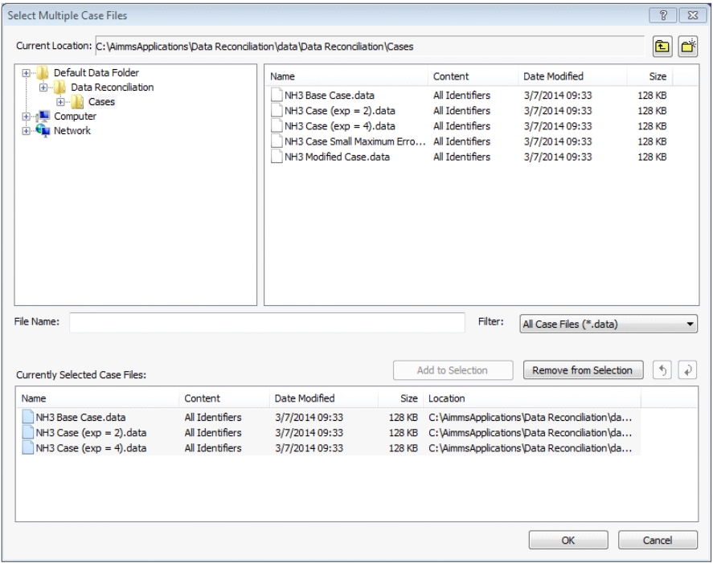
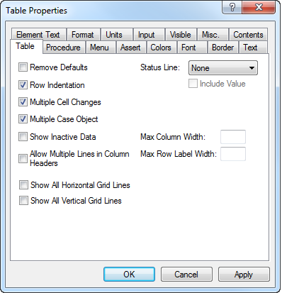

.. _sec:cases.casesel:

Managing multiple case selections
=================================

.. rubric:: Viewing multiple case files

AIMMS allows you to simultaneously view the results of several case
files within the graphical user interface. In addition, it is possible
to reference data from multiple case files from within the modeling
language, enabling you to perform advanced forms of case comparison.

.. rubric:: Multiple case selections

AIMMS offers a tool to construct a selection of cases to which you want
simultaneous access, either from within the graphical user interface or
from within the model itself. You can add one or more selected cases
from within the **Data** menu to the multiple case file selection
through the **Data-Multiple Cases** menu. This will open the **Select
Multiple Case Files** dialog box illustrated in :ref:`MultipleCaseSelection`.

.. _MultipleCaseSelection:

   The **Select Multiple Case Files** dialog box

It shows the current contents of the multiple case file selection. You
can modify the order of the displayed cases, and add cases to or delete
cases from the collection.

.. _sec:cases.casesel.view:

Viewing Multiple Case Data
~~~~~~~~~~~~~~~~~~~~~~~~~~

.. rubric:: Viewing multiple case data

The prime use of multiple case selection takes advantage of AIMMS'
capability of displaying data from multiple cases within its graphical
objects. :ref:`MultipleCaseObject` is an illustration of a
table which displays the contents of a single identifier for all the
cases in the case selection shown in :ref:`MultipleCaseSelection`.

.. _MultipleCaseObject:
.. figure:: MultipleCaseObject.png
   :alt: Example of a multiple case object
   :name: fig:casesel.multiple-case

   Example of a multiple case object

.. rubric:: Creating multiple case objects

A data object on a page in the graphical end-user interface can be
turned into a multiple case object by checking the multiple case
property in the object-specific options in the object **Properties**
dialog box. :ref:`mc-prop-new`. illustrates the
object-specific **Properties** dialog box of a table object.

.. _mc-prop-new:

   Table-specific **Properties** dialog box

As a result of enabling multiple case display, the object will be
extended with one additional virtual dimension, the case index, which
will be displayed in a standard way.

.. rubric:: Restrictions

AIMMS only supports the display of multiple case data in object types
for which the added dimension can be made visible in a well-defined
manner. The most important object types that support multiple case
displays are tables, pivot tables, curves, bar charts and scalar
objects. Because of the extra dimension, the bar chart object is only
able to display multiple case data for scalar and 1-dimensional
identifiers. During a single case display, a bar chart can also be used
to view 2-dimensional identifiers.

.. _sec:cases.casesel.language:

Case Referencing from Within the Language
~~~~~~~~~~~~~~~~~~~~~~~~~~~~~~~~~~~~~~~~~

.. rubric:: Using inactive case data
   :name: multi-case-ref

In addition to viewing data from multiple case files as graphical
objects in the graphical user interface, AIMMS also allows you to
reference the data of case files that are not currently active within
the model. This allows you, for instance, to perform advanced forms of
case file differencing by comparing the current values of particular
identifiers in your model with the corresponding values stored in an
inactive case.

.. rubric:: The set :any:`AllCases`

The collection of all case files referenced via the AIMMS data menu, or
via the intrinsic functions such as :any:`CaseFileLoad`, and
:any:`CaseFileMerge` is available in the AIMMS language through the
predefined integer subset :any:`AllCases`. Each case file is represented by an integer
element in this set, and, as explained in :ref:`sec:gui.functions.case`,
AIMMS offers several built-in functions to obtain additional information
about a case through its case number.

.. rubric:: The set :any:`CurrentCaseSelection`

AIMMS stores the case selection constructed in the **Select Multiple
Case Files** dialog box presented above in the predefined set :any:`CurrentCaseSelection`, which is
a subset of the ever growing set :any:`AllCases`. Through this set you get easy access
within your model to the cases selected by your end-users in the
**Select Multiple Case Files** window.

.. rubric:: Referencing case data

You can reference the values of specific identifiers within a particular
case by simply prefixing the identifier name with an index or element
parameter in the set Allcase or any of its subsets. Thus, if ``cs`` is an index
in the set`CurrentCaseSelection`, the following simple assignment
will inspect every case in the user-selected multiple case selection,
and store the values of the variable ``Transport(i,j)`` stored in that
case in the parameter ``CaseTransport``, which has one additional
dimension over the set of :any:`CurrentCaseSelection`.

.. code-block:: aimms

	CaseTransport(cs,i,j) := cs.Transport(i,j);

.. rubric:: Advanced case comparison

The capability of referencing inactive case data, enables you to perform
advanced forms of case comparison, which would be hard to accomplish
without the AIMMS facilities for case referencing. As an example,
consider the following statement.

.. code-block:: aimms

	RelativeDiff(cs,i,j) := (cs.Transport(i,j) - Transport(i,j)) /$ Transport(i,j);

It computes the relative difference between the current values of the
variable ``Transport(i,j)`` and those values stored for each case
referenced.

.. rubric:: Inactive data

Please note that ``cs.Transport(i,j)`` above, may contain inactive data,
when index ``cs`` refers to the active case. In order to remedy this,
you may want to use the ``CleanUp`` statement, see
:ref:`lr:sec:data.control`, at the start of procedures containing case
referencing.