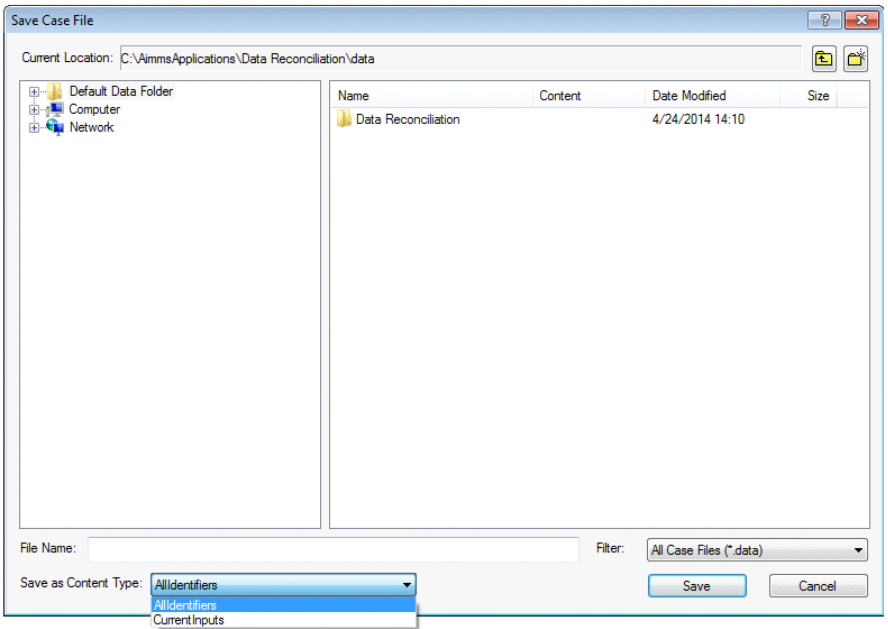

.. _sec:cases.contentType:

Working with selections of identifiers
======================================

.. rubric:: Case content type

Next to saving the contents *all* identifiers in a case file, it is also
possible to save the data of *a selection of* identifiers in a case
file. Such a selection of identifiers to be saved to a case file is
called a *case content type*. A case content type is a subset of :any:`AllIdentifiers`.

.. rubric:: Collection

The set :any:`AllCaseFileContentTypes` contains all case content types. It is a subset of the
predeclared set ``AllSubsetsOfAllIdentifiers``. The set :any:`AllCaseFileContentTypes` is initialized to
contain only the case content type :any:`AllIdentifiers`. By adding additional subsets of
:any:`AllIdentifiers`, you are allowing your end user to decide which
selection of identifiers is to be saved. The predeclared element
parameter :any:`CurrentCaseFileContentType` is used to indicate the case content type selected by the
end-user of your application.

.. rubric:: Example

You may add the predeclared set :any:`CurrentInputs` to the set ``AllCaseContentTypes``, which allows an end-user to
decide whether to save the data of all identifiers in your model, or
just of the collection of current input parameters. This is illustrated
in :ref:`SaveCaseCT` where the **Save Case File** dialog
box allows you to select between the case content types
:any:`AllIdentifiers` and :any:`CurrentInputs`.

.. _SaveCaseCT:

   The **Save Case File** dialog box offering content types

.. rubric:: Use during case load

When loading a case, all identifiers stored in the case file will be
loaded; the current contents of the case content type by which the file
is saved will be ignored.

.. rubric:: Data not stored

Identifiers in an AIMMS model can have the ``NoSave`` property.
Identifiers with this property will not be saved in any case file
regardless of the current case content type. This property can be set
via the attribute forms of the identifiers that can contain data.