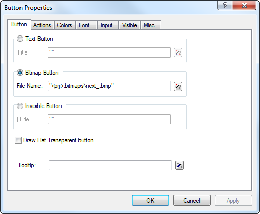

.. _sec:start.files:

Additional files related to an AIMMS project
============================================

.. rubric:: Project-related files
   :name: project-files

In addition to the AIMMS project folders and files associated discussed
in :ref:`sec:start.new`, using an AIMMS project either during
development or in a deployment scenario may actually result in the
creation of a number of files not mentioned before:

-  the name change file (with a ``.nch`` extension),

-  one or more case files (with a ``.data`` extension),

-  a user database file (with a ``.usr`` extension),

-  data backup files (with a ``.bak`` extension),

-  log, error and listing files from both AIMMS and its solvers (with
   ``.log``, ``.err``, ``.lis`` or ``.sta`` extensions).

.. rubric:: Name change file

AIMMS has the capability to keep track of the name changes you performed
on identifiers in your model, and automatically replace an old
identifier name by its new one whenever AIMMS encounters a renamed
identifier. AIMMS keeps track of the list of such name changes in the
name change file (with a ``.nch`` extension). Each name change is listed
in this file on a separate line containing the old name, the new name
and the (GMT) time stamp at which the change was actually performed. The
automatic name change capabilities of AIMMS are explained in full detail
in :ref:`sec:decl.commit`

.. rubric:: ... and version control

If you are using a version control system to manage your AIMMS sources,
it makes sense to also include the name change files under version
control. When you change an identifier name, AIMMS will not directly
refactor all pages to reflect the name change directly, but use the name
change file to refactor a page when it is opened. The same is true when
opening cases that contain data for the identifier the name of which has
been changed. When your changes in a project are merged with another
developer's changes, the merged name change file will actually contain
all name changes made by both developers.

.. rubric:: Case files

Whenever you save a case in your AIMMS project (see also
:ref:`chap:cases`), this will result in the creation of a ``.data`` file
on disk. By default these case files will be stored in the ``data``
subfolder of project's main folder.

.. rubric:: Log, error and listing files

During the execution of your model, all log, error and listing
information from both AIMMS and its solvers (whether visible in the
AIMMS **Message** window or not) is copied to log, error and listing
files, which, by default, are stored in the ``Log`` subdirectory of the
project directory. If you are not interested in this information, you
can reduce the amount of information that is copied to these log files
by modifying the relevant execution options.

.. rubric:: Data backups

Through the **AutoSave & Backups-Data** menu, you can specify that you
want AIMMS to automatically create backups of the data used during a
particular session of your project. The menu will pop up the **Data
Backup** dialog box illustrated in :numref:`fig:start.data-backup`.

.. figure:: data-backup-new.png
   :alt: The **Data Backup** dialog box
   :name: fig:start.data-backup

   The **Data Backup** dialog box

Similarly as with the project backup files, you can indicate whether
AIMMS should automatically create backup backup files of the session
data at regular intervals, as well as how many data backup files should
be retained. Data backup files also have the ``.bak`` extension and
contain a reference to the date/time of the backup.

.. rubric:: Manually creating backup files

Besides the automated backup scheme built into AIMMS, you can also
create backup files of your session data manually. You can create manual
backup files through the **File-Data Backups** menu. When you create a
data backup file manually, AIMMS will request a name of a ``.bak`` file
in which the backup is to be stored.

.. rubric:: Restoring backup files

Through the **File-Data Backups** menu, you can restore the data in your
application back to the state stored in the data backup files.

.. _sec:start.files.user:

Project User Files
~~~~~~~~~~~~~~~~~~

.. warning:: 
  
  The AIMMS WinUI and Project User Files are deprecated, please refer to :doc:`deprecation-table`. 
  You may use the :doc:`webui/index` instead, the :doc:`pro/user-man` and :doc:`Articles/120/120-pro-user-groups`

.. rubric:: Project user files

Along with the project-related files created by AIMMS, you may need to
distribute some other files with your project when deploying it to your
end-users. Such files include, for instance, bitmap files displayed on
buttons or in the background of your end-user pages, or files that
contain project-related configuration data. Instead of having to include
such files as separate files in the project directory, AIMMS also allows
you to save them within the project file itself. Both within the AIMMS
language as well as in the end-user interface, you can reference such
*project user files* as if they were ordinary files on disk.

.. rubric:: Why use project user files?

User project files are convenient in a number of situations. The most
common reasons to store files as project user files are listed below.

-  You want to reduce the number files that you have to ship to your end
   users. This situation commonly occurs, for instance, when the
   end-user interface of your project references a large number of
   bitmap files.

-  You want to hide particular configuration data files from your
   end-users, which might otherwise only confuse them.

-  User project cannot be modified by your end-users.

.. rubric:: Importing project user files

You can import files into the project file through the **Tools-Project
User Files** menu, which will pop up the **Project User Files** dialog
box illustrated in :numref:`fig:start.user-files`.

.. figure:: projectuserfiles-new.png
   :alt: The **Project User Files** dialog box
   :name: fig:start.user-files

   The **Project User Files** dialog box

In this dialog box, you can create new folders to organize the files you
want to import into the project file. The dialog box of
:numref:`fig:start.user-files` already contains a folder **bitmaps**,
which is automatically added to each new AIMMS project and filled by
AIMMS with the bitmaps used on AIMMS' data pages (see
:ref:`sec:decl.data`). When you are inside a folder (or just within the
main project file), you can import a file into it through the **Import
File** button, which will open an ordinary file selection dialog box to
select the disk file to be imported.

.. rubric:: User files in library projects

When your project, next to the main project file, also includes a number
of library project files (see :ref:`sec:proj-organization.manager`),
AIMMS allows you to store user files in the library project files as
well. Thus, if a page defined in a library refers to a particular bitmap
file, you can also store that bitmap as a user file directly into the
corresponding library project file. In the dialog box of
:numref:`fig:start.user-files`, the *CoreModel* node at the root of the
tree refers to a library that is included in the project that serves as
the running example throughout this book. Underneath this node you can
add user files that will be stored in the library project file for the
*CoreModel* library.

.. rubric:: Referencing project user files

You can reference project user files both from within the AIMMS language
and the properties of various objects with the graphical end-user
interface. The basic rule is that AIMMS considers the project file as a
virtual disk indicated by "``<prj>``". You can use this virtual drive
in, for instance, ``READ``, ``WRITE`` and ``PUT`` statements within your
model. Thus, the statement

.. code-block:: aimms

	READ from file "<prj>:config\\english.dat";

reads the model data from the project user file ``"english.dat"``
contained in a (developer-created) **config** folder within the project
file.

.. rubric:: Referencing user files in library projects

You can access project files in library projects by using the virtual
disk notation "``<lib:``\ *library-name*\ ``>``", where *library-name*
is the name of the library project. Thus, to read the same file as in
the previous paragraph from the *CoreModel* library shown in
:numref:`fig:start.user-files`, the following statement can be used.

.. code-block:: aimms

	READ from file "<lib:CoreModel>:config\\english.dat";

.. rubric:: Use in end-user interface

Similarly, you can reference project user files on page objects in the
end-user interface of your project.
:numref:`fig:start.user-project-button` illustrates the use of a bitmap
file stored in the project file on a bitmap button.

   Bitmap button referencing a project user file

For all object properties expecting a file name (such as the **File
Name** property of the bitmap button illustrated in
:numref:`fig:start.user-project-button`), you can easily select a
project user file by pressing the wizard button |wizard|, and
selecting the **Select Project File** menu item. This will pop up a
project user file selection dialog box similar to the dialog box shown
in :numref:`fig:start.user-files`.

.. |wizard| image:: wizard.png

