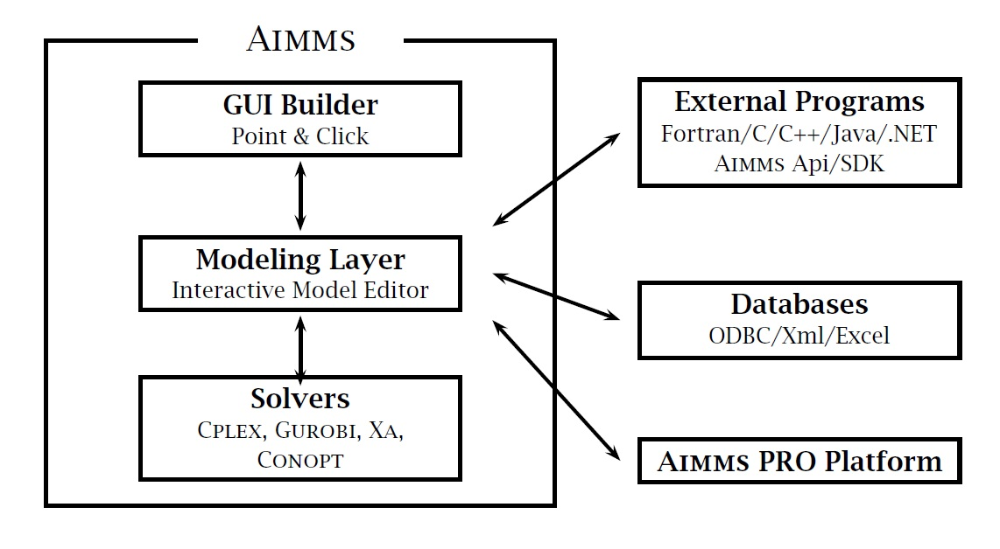

AIMMS as an ADS development environment
=======================================

.. rubric:: AIMMS as ADS development environment

As an ADS development environment, AIMMS possesses a unique combination
of advanced features and design tools which allow you to build complex
ADS applications which are easily maintainable-in a fraction of the time
required with conventional programming languages.
:numref:`fig:intro.aimms` provides a top-level overview of the
components available in AIMMS.

   Graphical overview of AIMMS components

.. rubric:: Multidimensional modeling language

The multidimensional modeling language in AIMMS offers a powerful index
notation which enables you to capture the complexity of real-world
problems in an intuitive manner. In addition, the language allows you to
express very complex relationships in a compact manner without the need
to worry about memory management or sparse data storage considerations.
The combined declarations and procedures using these multidimensional
structures can be organized, edited and displayed using an advanced
interactive model editor.

.. rubric:: Optimization modeling

One of the outstanding features of AIMMS is the capability of specifying
and solving linear and nonlinear constraint-based optimization models.
Using the same compact and rich notation available for procedural
statements, symbolic constraints can be formulated in a simple and
concise manner. With only a single instruction, an optimization model
can be transferred to, and solved by, world- class solvers such as
CPLEX, GUROBI and CONOPT.

.. rubric:: Advanced language features

Selected advanced AIMMS language features include:

-  a rich set of mathematical, statistical and financial functions,

-  a powerful combination of (automatically updated)
   multidimensionaldefinitions and procedural execution,

-  the ability to easily express time-based models through the use of
   calendars and horizons, including support for rolling horizons with
   automatic aggregation and disaggregation, and

-  the ability to associate units of measurement with model identifiers
   assuring unit consistency within expressions.

.. rubric:: Integrated GUI builder

In addition to its versatile modeling language AIMMS offers an
integrated tool for constructing a custom graphical user interface (GUI)
for your decision support application. End-user screens can be created
in an easy point-and-click manner, and can include such common graphical
objects as tables, charts and curves, all closely linked to
multidimensional identifiers in your model. Included, amongst other more
advanced objects, are a Gantt chart for visualizing time-phased
planning/scheduling applications, and a network flow object for
visualizing two-dimensional maps and flows.

.. rubric:: Advanced GUI tools

To support you in creating complete end-user interfaces in a quick and
maintainable fashion, AIMMS offers the following advanced tools:

-  the *template manager* enables you to create a uniform look and feel
   by allowing common objects (such as headers, footers, and navigation
   buttons) to be placed on hierarchically organized templates which can
   be inherited by multiple pages,

-  the *page manager* allows you to specify a natural page order, with
   which you can guide an end-user through your application by adding
   special page manager-driven navigation controls to templates or
   pages,

-  the *menu builder* enables you to create customized end-user menus
   and toolbars to be added to your templates and pages,

-  the *identifier selection wizard* assists you not only in selecting
   complete model identifiers, or slices thereof, for graphical display,
   but also in quickly linking data from various page objects.

.. rubric:: Integrated case management

Case management forms an important part of any decision support
application, and enables end-users to run the model with varying
scenarios. AIMMS also offers advanced data management, which allows you
to create data categories for holding blocks of related data (for
instance topology data, or supply and demand scenarios). Data sets
associated with these data categories can be combined to form a single
case, and thus can be shared by more than one case. In addition, to
perform an extensive what-if analysis, you can select a large number of
cases and run them in batch mode overnight.

.. rubric:: Database connectivity

As data form the life blood of any decision support application, AIMMS
offers extensive facilities to link your application to corporate
databases using ODBC. Specialized wizards help you relate columns in a
database table with the corresponding multidimensional identifiers in
your AIMMS model. Once you have established such relationships, you can
specify straightforward read and write statements to transfer data to
and from the database.

.. rubric:: Linkages to other applications

To facilitate the re-use of existing code, or to speed up
computationally intensive parts of your application, AIMMS allows you to
execute external procedures or functions in a DLL from within your
model. External functions can even be used within the constraints of an
optimization model. In addition, AIMMS offers an in-process Application
Programming Interface (API) for ``C``/C++, as well as the out-of-process
`AIMMS SDK <http://download.aimms.com/aimms/AimmsSDK>`__ for
Java/.Net/C++ which enables you to use your AIMMS model as a component
from within an external application, to communicate data in a sparse
fashion, and to execute procedures written in AIMMS.

.. rubric:: User management

The AIMMS system has integrated facilities to create a database of
end-users and link this database to one or more AIMMS-based
applications. The end-user database contains information on the level of
authorization of all end-users within an application. Through these
authorization levels you can specify whether an end-user is allowed to
access case data, view pages, modify data, and execute particular parts
of the model.

.. rubric:: Protecting your investment

The development of a professional decision support application usually
represents a considerable investment in time and thus money. AIMMS
offers facilities to protect this investment and to prevent unauthorized
use of particular applications. Your project and the source code of your
model can be encrypted using either a password or key based encryption
scheme.

.. rubric:: Extensive documentation

AIMMS comes complete with extensive documentation in the form of three
books:

-  a `User's Guide <https://documentation.aimms.com/_downloads/AIMMS_user.pdf>`__ to explain the overall functionality and use of AIMMS,

-  a `Language Reference <https://documentation.aimms.com/language-reference/index.html>`__ giving a detailed description of the AIMMS
   language, and

-  a `Modeling Guide <https://documentation.aimms.com/aimms_modeling.html>`__ introducing you to both basic and advanced modeling
   techniques.

All of these books are available in hard copy as well as in electronic
form. In addition, each system comes complete with a collection of
example applications elucidating particular aspects of the language and
end-user interface.
