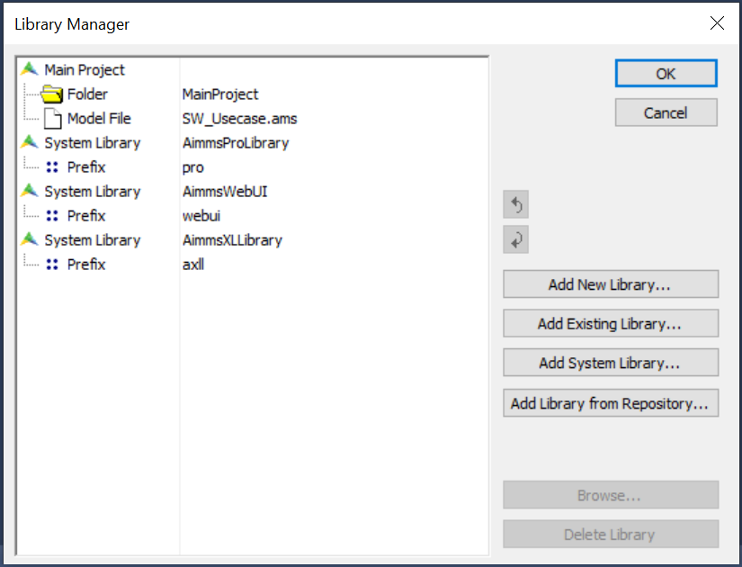

.. _sec:proj-organization.manager:

Library projects and the library manager
========================================

.. rubric:: AIMMS library projects

AIMMS *library projects* allow you to divide a large AIMMS project into
a number of smaller sub-projects. Library projects are especially useful
if you intend to share parts of an application between multiple
projects. Each library project in AIMMS provides

-  a tree of model declarations,

-  a page tree,

-  a template tree, and

-  a menu tree.

In addition, a library project may provide its own collection of user
project files, user colors and fonts.

.. rubric:: Shared templates

Besides enabling multiple developers to work in a single project,
library projects can also be used to define a common collection of
templates that define the look-and-feel of multiple projects. In this
manner, you change the look-and-feel of multiple applications just by
changing the templates in the shared library project.

.. warning:: 
  
  The AIMMS WinUI is deprecated, please refer to :doc:`deprecation-table`. 
  You may use the :doc:`webui/index` instead, and share the :doc:`webui/webui-json` with your fellow developers

.. rubric:: Adding libraries to a project

By adding a library project to the main AIMMS project, the objects
defined by the library, such as identifiers, pages, templates, etc.,
become available for use in the main project. In addition, if a library
project is writable, the contents of the library can also be edited
through an AIMMS project in which it is included.

.. rubric:: The library manager

You can add libraries to an AIMMS project in the **AIMMS Library
Manager** dialog box illustrated in :numref:`fig:library-manager`. You
can open the library manager through the **File-Library Manager...** menu.

   The **AIMMS Library Manager**

Using the library manager AIMMS allows you to

-  create new libraries,

-  add existing libraries to your project,

-  add system libraries (contained within the AIMMS version installed on your computer)

-  add a library from the :doc:`library-repository`

.. rubric:: Library storage

Each library project in AIMMS will be stored in a separate directory,
containing the following files and folders:

-  the ``Project.xml`` file holding a reference to the project's main
   model source file (with an ``.ams`` extension), as well as all
   additional model source files included in the main model source file,
   together containing all identifier declarations, procedures and
   functions that are relevant to the project,

-  ``PageManager.xml``, ``TemplateManager.xml`` and ``MenuBuilder.xml``
   files describing the page, template and menu tree defined in the
   project, with all individual pages and templates being stored in the
   ``Pages`` and ``Templates`` subfolders,

-  ``Settings`` and ``Tools`` subfolders containing the saved settings
   for user colors, fonts, and the various tools in the AIMMS IDE, and

-  the ``User Files`` folder for storing all user files that you store
   within the project.

These files will be automatically created by AIMMS when you create a new
library project. To add an existing library to an AIMMS project, you
just need to select its library project file.

.. rubric:: Library prefix

To avoid name clashes between objects in the library and the main
project or other libraries, all the object names in a library are stored
in a separate namespace. Outside of the library, a global prefix
associated with the library has to be used to access the library
objects. When you create a new library project, AIMMS will come up with
a default library prefix based on the library name you entered. For an
existing library project, you can view and edit its associated library
prefix in the library manager.

.. rubric:: Using library projects

After you have added one or more library projects to your main AIMMS
project, AIMMS will extend

-  the model tree in the **Model Explorer**,

-  the page tree in the **Page Manager**,

-  the template tree in the **Template Manager**, and

-  the menu tree in the **Menu Builder**

with additional root nodes for every library project added to your
project. In general, within any of these tools, you are free to move
information from the main project tree to any of the library trees and
vice versa. In addition, the AIMMS dialog boxes for user project files,
user colors and fonts allow you to select and manage objects from the
main project or any of the libraries. The precise details for working
with library projects in each of these tools are discussed in full
detail in the respective chapters discussing each of the tools.