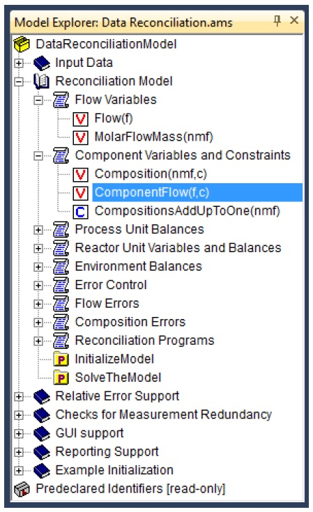

.. _sec:start.new:

Creating a new project
======================

.. rubric:: Project components
   :name: new-project

Every AIMMS application consists of two main components:

-  an AIMMS project file (with a ``.aimms`` extension), which contains
   references to the main application project and all library projects
   contained in your application,

-  for the main project and every library project all source files are
   stored in a separate folder:

   -  the ``Project.xml`` file holding a reference to the project's main
      model source file (with an ``.ams`` extension), as well as all
      additional model source files included in the main model source
      file, together containing all identifier declarations, procedures
      and functions that are relevant to the project,

   -  ``PageManager.xml``, ``TemplateManager.xml`` and
      ``MenuBuilder.xml`` files describing the page, template and menu
      tree defined in the project, with all individual pages and
      templates being stored in the ``Pages`` and ``Templates``
      subfolder,

   -  ``Settings`` and ``Tools`` subfolders containing the options for
      the execution engine, and the saved settings for user colors,
      fonts, and the various tools in the AIMMS IDE, and

   -  the ``User Files`` folder for storing all user files that you
      store within the project.

.. rubric:: Creating a new project

Within an AIMMS session, you can create a new project through the
**File-New Project** menu. Note that this menu is only available when no
other project is currently open. It will open the AIMMS **New Project**
wizard illustrated in :numref:`fig:start.new-project`.

.. figure:: new-prj-new.png
   :alt: The AIMMS **New Project** wizard
   :name: fig:start.new-project

   The AIMMS **New Project** wizard

In this wizard you can enter the name of the new project, along with the
directory in which the project is to be stored, and the model file (with
the ``.ams`` extension) to be associated with the project.

.. rubric:: Project directory

By default, the AIMMS **New Project** wizard suggests that the new
project be created in a new subdirectory with the same name as the
project itself. You can use the wizard button |wizard| to the right
of the location field to modify the location in which the new project is
created. However, as AIMMS creates a number of additional files and
directories in executing a project, you are strongly advised to store
each AIMMS project in a separate directory.

.. rubric:: Model file

By default, the AIMMS **New Project** wizard assumes that you want to
create a new model file with the same name as the project file (but with
a different extension). You can modify the name suggested by the wizard
to another existing or nonexisting model file. If the model associated
with the project does not yet exist, it will be automatically created by
AIMMS.

.. rubric:: The Model Explorer

After you have finished with the **New Project** wizard, AIMMS will open
the **Model Explorer**, an example of which is illustrated in
:numref:`fig:start-model-explorer`.

   The AIMMS Model Explorer

The Model Explorer is the main tool in AIMMS to build an AIMMS model,
the starting point of building any AIMMS application. In the Model
Explorer, the model is presented as a tree of identifier declarations,
allowing you to organize your model in a logical manner and make it
easy-both for you and others who have to inspect your model-to find
their way around. Besides the Model Explorer, AIMMS provides a number of
other development tools for model building, GUI building and data
management. An overview of these tools is given in
:ref:`sec:start.tools`.

.. rubric:: Starting an existing project

You can open an existing AIMMS project in two ways. You can either

-  start AIMMS and open the project via the **File-Open Project** menu,
   or

-  double click on the AIMMS project file (with a ``.aimms`` extension)
   in Windows Explorer.

After opening a project, AIMMS may take further actions (such as
automatically opening pages or executing procedures) according to the
previously stored project settings.

.. |wizard| image:: wizard.png