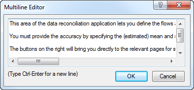
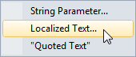

.. _sec:locale.localization:

Localization of end-user interfaces
===================================

.. warning::

  Some items (not all of them) presented in this chapter are related to AIMMS WinUI, which is deprecated. Please refer to :doc:`deprecation-table`. 
  You may use the :doc:`webui/index` instead, and the :doc:`webui/multi-language`.

.. _localization:

.. rubric:: Basic concepts

Conceptually, localization of an end-user application consists of a
number of basic steps. These basic steps are to

-  find all the strings that are used in the pages and menus of your
   end-user interface of your application,

-  store these strings separate from the other interface components, and

-  provide translations in different languages of these separately
   stored strings.

Through the **Tools-Localization** menu, AIMMS offers an integrated
localization tool which can perform the first two steps for you
automatically. The result is a list of strings, each with a description
of its origin, which can be easily translated to other languages. This
section will explain the use of the localization tool built into AIMMS
step by step.

.. rubric:: Localization and libraries

If your application consist of multiple library projects (see also
:ref:`chap:proj-organization`), developed and maintained by different
modelers, each of these libraries can have its own **Localization**
section and identifiers to store its localization strings. When
performing the localization conversion on a library project, all
localized pages and menus in a library project will refer to the
library-specific localization identifiers. This allows a developer of a
library project to introduce localization into his library,
independently of all other libraries and/or the main project.

.. rubric:: Setting up localization support

Before you can start the final localization conversion of your AIMMS
application, AIMMS needs to

-  add a **Localization** section to the main model or library module
   which contains a default setup for working with a localized end-user
   interface of either the main project or library project, and

-  register the names of the identifiers and procedures which are
   necessary for storing, loading and saving the strings used in the
   end-user interface of your application or library.

You can perform these steps through the **Tools-Localization-Setup**
menu. As a result, AIMMS will add the (default) **Localization** section
to your model or library if such a section has not already been added
before. Secondly, through the dialog box presented in
:numref:`fig:locale.setup`,

.. figure:: localesetup-new.png
   :alt: Setting up localization support
   :name: fig:locale.setup

   Setting up localization support

AIMMS will request the names of the identifiers to be used further on in
the localization process to store the strings used in the end-user
interface of the main project or library. By default, AIMMS proposes the
identifiers added for this purpose to the (newly added) **Localization**
section. If you change the names of these identifiers, or want to use
completely different identifiers, you can execute the **Tools-
Localization-Setup** menu again to specify the modified names.

.. rubric:: Selecting the language

If you are adding localization support to a library project, AIMMS lets
you choose whether the language to be used within the library project
should follow the global language selection of the entire application,
or whether you want the language selection for the end-user interface of
your library to be library-specific.

.. rubric:: Localization section

After the localization setup has been executed for the first time, your
model or library module has been extended with a new section called
**Localization**. The contents of this model section is illustrated in
:numref:`fig:locale.tree`.

.. figure:: localetree-new.png
   :alt: Localization section in the model tree
   :name: fig:locale.tree

   Localization section in the model tree

The declaration section contained in it declares the default set and
string parameters used for storing all localization information.

-  The set ``AllLanguages`` contains the names of all languages to which
   you want to localize your application. You can add as many languages
   to its definition as necessary. *However, you should make sure that,
   at any time, the first element in the set is your development
   language*: during the conversion process described below, AIMMS will
   associate all strings in the end-user interface with the first
   language from the set ``AllLanguages``.

-  Associated with the set ``AllLanguages`` is an element parameter
   ``CurrentLanguage``, through which you (or your end-users) can select
   the language in which all texts in the end-user interface are to be
   displayed.

-  The set ``LocalizedTextIndexSet`` is a subset of the predefined set
   :any:`Integers`, and is used to number all strings within your end-user
   interface that are replaced by AIMMS during the conversion process.

-  The string parameter ``LocalizedText`` contains the actual texts for
   all string objects in your end-user interface for one or more
   languages. During the localization conversion process, AIMMS will
   fill this parameter with the texts of your development language.

-  The string parameter ``LocalizedTextDescription`` contains a short
   description of the origin of all converted string objects, and is
   filled by AIMMS during the localization conversion.

.. rubric:: Using other localization identifiers

Through the **Tools-Localization-Setup** menu, you can modify the
localization parameters which AIMMS will use during any subsequent
conversion process. If you choose to select different identifiers, you
should make sure that:

-  the identifier selected for the **Localized Text Identifier** is a
   2-dimensional string parameter, the identifier selected for the
   **Current Language Identifier** is a scalar element parameter, and
   the identifier selected for the **Text Description Identifier** is a
   1-dimensional string parameter.

-  the second index set of the **Localized Text Identifier** and the
   range set of the **Current Language Identifier** coincide. AIMMS will
   interpret the resulting set as the set of all languages.

-  the first index set of the **Localized Text Identifier** and the
   first index set of the **Text Description Identifier** coincide and
   is a subset of the predefined set :any:`Integers`. AIMMS will use this
   set to number all string objects during the conversion process.

.. rubric:: Localization procedures

In addition to the sets and string parameters discussed above, the
**Localization** section also contains a number of procedures added for
your convenience to perform tasks such as:

-  loading and saving the localized text for a single language,

-  loading and saving the localized texts for all languages, and

-  to initialize support for a localized end-user interface.

The statements within these procedures refer to the default localization
identifiers created by AIMMS. If you have chosen different identifiers,
or want to store the localization data in a nondefault manner, you can
modify the contents of these procedures at your will. You must be aware,
however, that the facilities within AIMMS to view and modify the
localized text entries do not use these procedures, and will, therefore,
always use the default storage scheme for localized data (explained
later in this section).

.. rubric:: The initialization procedure

The localization procedure **LocalizationInitialize** added to the
**Localization** section of your model will read the localized text for
a single language. If the element parameter ``CurrentLanguage`` has been
set before the call to ``LocalizationInitialize``, AIMMS will read the
localized strings for the language selected through ``CurrentLanguage``.
If ``CurrentLanguage`` has no value, the procedure will read the
localized strings for the first language (i.e. your development
language).

.. rubric:: Added to ``MainInitialization``

If your model contains the (default) procedure ``MainInitialization``
(see also :ref:`sec:model.manage`), a call to the procedure
**LocalizationInitialize** will be added to the end of the body of
``MainInitialization`` during the first call to the
**Tools-Localization-Setup** menu. This makes sure that the localized
strings on pages and in end-user menus of a converted end-user interface
contain the proper (original or localized) texts when the project is
opened.

.. rubric:: Performing the localization conversion

Through the **Tools-Localization-Convert** menu you can instruct AIMMS
to replace all static string occurrences in your (end-user and print)
pages, templates and end-user menus by references to the localization
identifiers selected during the localization setup. During the
conversion, AIMMS

-  scans all pages, templates and menus for static strings,

-  creates a new localized entry in the **Localized Text Identifier**
   for each such string, and

-  in the interface component where the static string was found,
   replaces it by the corresponding reference to the **Localized Text
   Identifier**. If a localization setup is defined per library, AIMMS
   will use the library-specific **Localized Text Identifier**.

.. rubric:: String description

In addition, AIMMS will, for each localized string, create a description
in the **Localized Text Description Identifier**, initialized with the
name of the page or menu plus the object in which the corresponding
string was found. This may help you to link localization texts to
specific objects and pages.

.. rubric:: Duplicate occurrences

During the localization conversion, AIMMS will warn for any duplicate
string it encounters. For such duplicate strings, you have the
opportunity to create a new entry in the **Localized Text Identifier**
or to re-use an existing entry. Re-using existing entries can be
convenient for common strings such as "``Open``" or "``Close``" that
occur on many pages.

.. rubric:: Editing localized strings

Once you have performed the localization conversion, you can view all
localized strings through the **Tools-Localization-Show Strings** menu,
which will open the dialog box illustrated in :numref:`fig:locale.edit`.

.. figure:: localetext-new.png
   :alt: The **Localized Text** dialog box
   :name: fig:locale.edit

   The **Localized Text** dialog box

In this dialog box, AIMMS displays a numbered list of all localized
strings, along with the description of the origin of each string. The
string numbers exactly correspond to the elements of the set
``LocalizedTextIndexSet`` discussed above.

.. rubric:: Modifying dialog box contents

Through the drop down lists at the top of the **Localized Text** dialog
box of :numref:`fig:locale.edit`, you can select the contents of the
first and second string columns, respectively. For each column, you can
select whether to display the localized text for any language defined in
the set ``AllLanguages``, or the description associated with each
string. By viewing the localized strings for two languages alongside,
you can easily provide the translation of all localized strings for a
new language on the basis of the localized strings of, for example, your
development language.

.. rubric:: Modifying multiline strings

If a localized string consists of multiple lines, you can invoke a
multiline editor dialog box to edit that string through the **Full
Edit** button at the bottom of the **Localized Text** dialog box, as
illustrate :numref:`fig:locale.multiline`.

   The **Multineline Editor** dialog box

To invoke this multiline editor for the string corresponding to a
particular language, click on the localized text for that language, and
press the **Full Edit** button. The multiline editor will now be opened
with the exact string that you selected in the **Localized Text** dialog
box.

.. rubric:: Localizing new texts

If you have added new pages, page objects, or end-user menus to your
project after running the localization conversion procedure for the
first time, you have two options to localize such new interface
components. More specifically, you can

-  localize every new component separately through the **Localized
   Text** wizard present at all text properties of the object, or

-  run the localization conversion procedure again.

.. rubric:: The **Localized Text** wizard

Whenever a string is associated with a property of a page, page object
or menu item, the wizard button |wizard| of such a property in the
**Properties** dialog box provides access to the **Localized Text**
wizard, as illustrated in :numref:`fig:locale.wizard`

   The Localized Text wizard

Invoking this wizard will open the **Localized Text** dialog box
illustrated in :numref:`fig:locale.edit`, in which you can either select
an existing localized string, or create a new entry through the **New
Entry** button. Notice that the **Localized Text** wizard only shows the
localization strings for the main or library project you are currently
editing, and any of the included library projects which have the
localization identifiers in their public interface. After closing the
dialog box, AIMMS will add a reference to the localized text identifier
in the edit field of the property for which you invoked the wizard,
corresponding to the particular string selected in the **Localized
Text** dialog box.

.. rubric:: Performing the conversion procedure again

If you have added several new interface components without worrying
about localization aspects, your safest option is to simply run the
localization conversion procedure again. As a result, AIMMS will re-scan
all pages, templates and menus for strings that are not yet localized,
and add such strings to the list of already localized texts as stored in
the localization identifiers associated with your project. Obviously,
you still have to manually provide the proper translations to all
available languages for all newly added strings.

.. rubric:: Localized text storage

By default, AIMMS stores the localization data as *project user files*
containing standard AIMMS data statements within the project file (see
also :ref:`sec:start.files.user`). The localized strings for every
language, as well as the string descriptions are stored in separate user
project files, as illustrated in :numref:`fig:locale.storage`.

.. figure:: localestorage-new.png
   :alt: Default of localization data as user project files
   :name: fig:locale.storage

   Default of localization data as user project files

The read and write statements in the bodies of the localization
procedures added to the **Localization** section of your model, assume
this structure of project user files for localization support.

.. rubric:: Automatically updated

Whenever you use the **Localized Text** dialog box of
:numref:`fig:locale.edit`, either through the **Tools-Localization-Show
Strings** menu or by invoking the **Localized Text** wizard, AIMMS will
make sure that the contents of appropriate localization data files are
read in before displaying the localization data for a particular
language. Likewise, AIMMS will make sure that the contents of the
appropriate project user files are updated when you close the
**Localized Text** dialog box.

.. rubric:: Manual edits

By using the import and export facilities for project user files (see
also :ref:`sec:start.files.user`), you can also edit the data files
containing the localized strings outside of AIMMS. This can be a
convenient option if you hire an external translator to provide the
localized texts for a particular language, who has no access to an AIMMS
system. Obviously, you have to make sure that you do not make changes to
these files through the **Localized Text** dialog box, while they are
exported. In that case, importing that file again will undo any
additions or changes made to the current contents of the project user
file.

.. rubric:: Static strings in the model

Besides the static strings in the end-user interface of your AIMMS
application, the model itself may also contain references to static
strings or to sets whose elements are defined within the model itself.
Such strings and set elements are left untouched by AIMMS' localization
procedure. If your model contains such string or set element references,
you still have the task to replace them by references to a number of
appropriate localized string and element parameters.

.. |wizard| image:: wizard.png