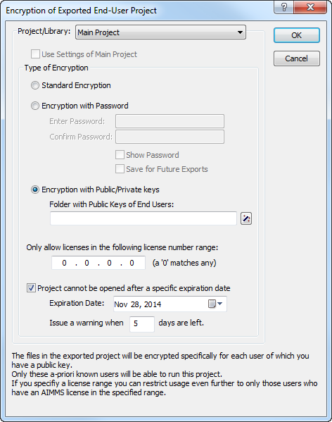

.. _sec:security.encrypt:

Encryption
==========

.. rubric:: Encryption :math:`\ldots`

If you want to protect your investment in model development, the easiest
way to accomplish this protection is to use the encryption scheme
discussed in this section. Note that project access to the project and
model is unconditionally prohibited in an encrypted project, even by the
developer of the model himself.

.. rubric:: Several ways of encryption

AIMMS supports several manners of encryption of project and model source
files, including your model source. Please note that AIMMS will only
encrypt ``.aimms``, ``.libprj``, and ``.ams`` files. All other files
that are exported (including user files that reside in your project
file) are not encrypted. It is up to you to choose the encryption scheme
that works for you.

Standard encryption
   results in an end-user version of your application that can be run by
   everybody.

Password protected encryption
   results in an end-user version of your application that can be run by
   anyone who knows the password. Upon starting of the application the
   user is prompted for the password.

Key-based encryption
   result is an end-user version of your application that can only be
   run by users whose public key was present in the key folder that was
   specified during encryption. The users need to store their private
   key in the ``ApplicationKeys`` folder on their local system or, in
   case a license server is being used, on the system on which the
   license server is running.

.. rubric:: Exporting your project

To ship your application for end-user deployment you should export your
application as a single AIMMSfile file (see also
:ref:`sec:deploy.aimmspack`). By combining the export with one of the
available encryption schemes you simply produce an ready-to-ship version
of your application in which the source of your project and model files
is securely protected.

.. rubric:: Export :math:`\ldots`

You can create such a single AIMMSfile file version of your application
through the **File-Export End User Project** menu, which will open a
**Select Destination .aimmspack file** dialog box. This dialog box
requires you to specify the location and name for the AIMMSfile file.

.. rubric:: :math:`\ldots` and encrypt

Having specified the name for the AIMMSfile file, the **Encryption of
Exported End-User Project** dialog box (as illustrated in
:numref:`fig:security.project-encrypt`) opens and allows you to add
encryption to the exported version of your application.

   The **Encryption of Exported End-User Project** dialog box

Select one of the available encryption schemes and specify all relevant
missing information (e.g. passwords, a folder containing the public keys
of your users).

.. rubric:: Restrict access to a specific license number

In addition to encrypting your application, you can restrict access to
your application such that only users whose AIMMS' license number lies
within a specified range can run the application. This prevent the
application from being run by other AIMMS users, even in case a password
or private key has been compromised.

.. rubric:: Add an expiration date

If you add an expiration date to the encrypted application, AIMMS will
not allow your end-user to run the application after that specific date.
In addition, you can have AIMMS warn your end-user about the expiration
date if the application is started within a specified number of days of
the expiration date.

Public Key Encryption
~~~~~~~~~~~~~~~~~~~~~

.. rubric:: Public vs. private keys

AIMMS' key encryption uses a common public key algorithm which assumes
the presence of two associated keys, a *public key* and a *private key*.
Anyone who has access to a certain public key can encrypt data, but only
the owner of the corresponding private key can decrypt the data. So, if
you want someone to send you encrypted data, you should share your
public key. At all means, a private key should be kept private.

.. rubric:: Creating a key pair

Through the **Tools-License-Generate Public/Private Key Pair** menu, you
can generate two associated key files.

.. rubric:: Encryption using multiple public keys

An application can be encrypted using a collection of public keys. The
resulted encrypted application can then only be run by any private key,
matching one of the public keys in the collection that was used during
decryption.

.. rubric:: Private key folder

When attempting to decrypt an application, AIMMS will look for matching
private keys in the ``AIMMS\ApplicationKeys`` folder. The folder is
located as a subfolder of the folder described by the ``ProgramData``
Windows environment variable. On a typical Windows 7 or Windows 8
system, this private key folder is
``C:\ProgramData\AIMMS\ApplicationKeys``. In case a license is provided
over the network by an AIMMS network license server, the private key to
decrypt the application may also be present on the system that runs the
license server. In case the private key is provided by the license
server, only users that are granted access to a network license on the
server, may use the private key from the server.

Encrypting Your Application: Some Use Cases
~~~~~~~~~~~~~~~~~~~~~~~~~~~~~~~~~~~~~~~~~~~

.. rubric:: Use an existing public key

To encrypt an application for a specific user that has already created
his own key pair, just request the user for a copy of his public key and
use the public key to encrypt your application.

.. rubric:: Use as application license

In case you generate a new public/private key pair yourself and use the
newly generated public key to encrypt your application, the
corresponding private key serves as an *application license*: As soon as
you provide an AIMMS user with this private key (and access to the
encrypted version of your application), he will be able to run the
application. In this scenario, it is even possible to generate a
collection of key pairs in advance and distribute a new *application
license* anytime you get a new user for your application.

.. rubric:: Use in an AIMMS PRO environment

When publishing an application on a AIMMS PRO server, you are advised to
encrypt your application using the public key of the AIMMS network
license server that is used in the PRO configuration. After that, any
user who has been granted access to the PRO server (and the specific
application), is able to run the the encrypted application, without the
need to have a public/private key pair of his own.