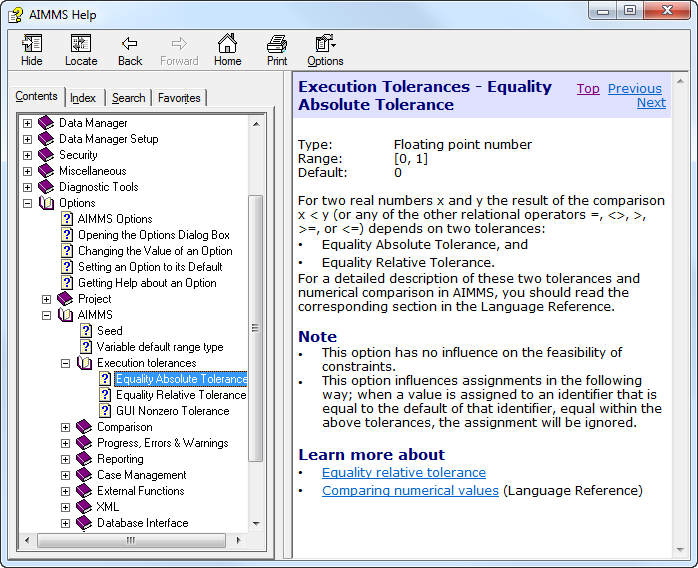

.. _sec:setting.options:

AIMMS execution options
=======================

.. rubric:: Options

Many aspects of the way in which AIMMS behaves during a session can be
customized through the AIMMS execution *options*. Such options can be
set either globally through the options dialog box, or from within the
model using the ``OPTION`` statement. As every project has its own
requirements regarding AIMMS' behavior, option settings are stored per
project in the project file.

.. seealso::  :doc:`procedural-language-components/execution-statements/the-option-and-property-statements`

.. rubric:: Option types

AIMMS offers options for several aspects of its behavior. Globally, the
AIMMS execution options can be categorized as follows.

- **Project options:** how does AIMMS behave during startup, and how does AIMMS appear during a project.

- **Execution options:** how does the AIMMS execution engine with respect to numeric tolerances, reporting, case management and various other execution aspects.

- **General solver options:** how does AIMMS behave during the matrix generation process, and which information is listed.

- **Specific solver options:** how are the specific solvers configured that are used in the project.

.. rubric:: Option dialog box

Through the **Settings-Project Options** menu you can open the global
AIMMS **Options** dialog box illustrated in
:numref:`fig:setting.options`.

.. figure:: options-new.png
   :alt: The AIMMS **Options** dialog box
   :name: fig:setting.options

   The AIMMS **Options** dialog box

In this dialog box, an *option tree* lists all available AIMMS execution
and solver options in a hierarchical fashion.

.. rubric:: Modifying options

After selecting an option category from the left-hand side of the
**Options** dialog box, you can modify the values of the options in that
category on the right-hand side of the dialog box. As illustrated in
:numref:`fig:setting.options`, AIMMS lists the currently selected value
for every option (in the first edit field) along with the allowable
range of all possible option values (in the second field). Option values
can be either integer numbers, floating point numbers or strings, and,
depending on the option, you can modify its value through

-  a simple edit field,

-  radio buttons,

-  a drop-down list, or

-  a wizard in the case where the value of an option is model-related.

.. rubric:: Committing options

With the **Apply** button, you can commit the changes you have made to
the value of a particular option and continue changing other options;
the **OK** button will commit the changes and close the option dialog
box. With the **Default** button at the right-hand side of the dialog
box, you can always reset the option to its default value. It is only
active when the option has a nondefault value.

.. rubric:: Option description

When you have selected an option, and need to know more about its
precise meaning before changing its value, you can press the **Help**
button at the right-hand side of the options dialog box. As illustrated
in :numref:`fig:setting.option-help`,

   Option help

this will open a help window containing a more detailed description of
the selected option.

.. rubric:: Options with nondefault value

To help you quickly identify all the options which you have modified for
a particular project, all modified options are summarized at the end of
the options tree in a special section, **Options with nondefault
value**. You can modify these options either in this section, or in
their original locations. If you set a modified option back to its
default value, it will be removed from the nondefault section. When you
select an option from the **Options with nondefault value** section, the
|locate| **Location in Tree** button will become available. Pressing
this button will select the originating option category in the option
tree.

.. rubric:: Copying solver options

When you add a new version of some solver to the solver configuration
(see :ref:`sec:setting.solver` for a description of how to add a new
solver), the options of this new solver will appear in the **Specific
Solvers** category. To copy solver options from the old solver version
(e.g. Cplex 11.1 to CPLEX 12.6), select the source solver in the option
tree and select the **Copy Option** command from the right-mouse popup
menu. This will open the **Copy Options** dialog box as shown in
:numref:`fig:setting.copy-options`.

.. figure:: copy-options-new.png
   :alt: The **Copy Options** dialog box
   :name: fig:setting.copy-options

   The **Copy Options** dialog box

By default this dialog will only show options that differ between both
solvers plus options that are only available in one of the two solvers.
Once you press the **Ok** button, all options that remain in this list
(and are available in both solvers) are copied from the source to the
destination solver.

.. rubric:: Searching for options

When you know (part of) the name of an option, but do not know where it
is located in the option tree, you can use the search facility in the
lower left- hand part of the option dialog box to help you find it. When
you enter (part of) an option name, AIMMS will jump to the first option
in the tree whose name contains the entered string.

.. rubric:: Setting options within the model

In addition to modifying option values in the options dialog box, you
can also set options from within your model using the ``OPTION``
statement. The ``OPTION`` statement is discussed in :doc:`procedural-language-components/execution-statements/the-option-and-property-statements`. While changes to option values in the options dialog box are
stored in the project file and reused at the beginning of the next
project session, run time option settings are lost when you close the
project. Setting options during run time can be convenient, however, if
different parts of your model need different option settings.

.. |locate| image:: locate.png