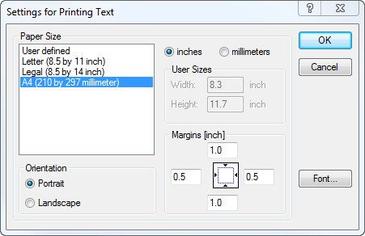

.. _sec:setting.print:

Print configuration
===================

.. rubric:: Print configuration

AIMMS offers two distinct facilities to create printed reports
associated with your model, namely printouts of graphical end-user pages
and print pages (see :ref:`chap:print`), and printouts of text files
such as a text representation of a part of the model tree or the
listing, log and ``PUT`` files. This section explains how you can
configure the printing properties for both types of reports.

.. rubric:: Printing end-user pages

.. warning::

  The AIMMS WinUI is deprecated, please refer to :doc:`deprecation-table`. 
  You may use the :doc:`webui/index` instead.

End-user pages and print pages are printed according to the settings
that you have selected for these pages. These settings include:

-  the selection of the paper type on which pages are printed (see
   :ref:`sec:print.pages`), and

-  the selection of object fonts and colors through the AIMMS font and
   color selection dialog boxes (see :ref:`sec:prop.property`).

These settings must be fixed by you as the application developer, and
cannot be changed by an end-user of your application. An end-user can,
however, still select the printer to which the output must be sent, as
explained below.

.. rubric:: Text printing

Text files can be printed from within AIMMS, either from the
**File-Print** menu inside an AIMMS text editor window, or through a
call to the :any:`FilePrint` procedure from within a procedure in your
model. The print properties of all text files that you want to print, in
either manner, can be modified through the **Settings-Text Printing**
menu. This will invoke the dialog box illustrated in
:numref:`fig:setting.text-print`.

   The **Text Printing** dialog box

.. rubric:: Text printing properties

In the **Text Printing** dialog box you can select the paper type and
font with which you want all text files to be printed. For the paper
type you can select one of the predefined paper types, or specify a user
defined paper type by providing the page height and width, as well as
the margins on each side of the page. By pressing the **Font** button on
the right-hand side of the dialog box, you can select the font with
which you want your text files to be printed. The text printing
properties are stored globally on your machine.

.. rubric:: Printer setup

With the **File-Print Setup** menu you can select the printer on which
print pages and text files associated with your project are printed, and
modify the properties of that printer. This command will invoke the
standard Windows **Print Setup** dialog box illustrated in
:numref:`fig:setting.print-setup`.

.. container:: center

   .. figure:: prn-cfg-new.png
      :alt: The **Print Setup** dialog box
      :name: fig:setting.print-setup

      The **Print Setup** dialog box

.. rubric:: Default settings

The settings selected in this dialog box will only be valid during the
current session of AIMMS. If you want to modify the default print setup
globally, you can do this through the **Printer** section in the Windows
**Control Panel**. There you can

-  select a **Default** printer from the list of all printers available
   on your system, and

-  modify the **Document Defaults** (i.e. the printer settings with
   which each print job is printed by default) for every individual
   printer on your system.

Without a call to the **File-Print Setup** dialog box, AIMMS will use
the default printer selected here, and print according to the document
defaults of that printer.

